# Open Console CAD

**基于 FreeCAD 的开源游戏主机模型库，提供可编辑工程、分层装配、工程图纸和交互式 3D 预览。**

[](https://github.com/tiansongyu/open-console-cad/actions/workflows/pages.yml) [](LICENSE) [](https://www.freecad.org/)

[在线预览](https://tiansongyu.github.io/open-console-cad/) · [模型库](#模型库) · [快速开始](#快速开始) · [开发与维护](#开发与维护) · [参与贡献](#参与贡献)

本项目用于 CAD 建模学习、设备结构观察和三维可视化研究。当前收录 **11 款设备、5,881 个组件与 132 页 A3 图纸**，每款设备均有独立的源码、原生模型、组件清单和验证记录。

- **可继续设计**：提供 FreeCAD 工程、草图与建模历史，以及按轮次组织的 Python 源码。
- **可直接浏览**：网页支持旋转、缩放、组件分组和分层爆炸；3DS 与 NDS 支持开合展示。
- **可下载与核对**：提供 STEP、PDF、SVG 和 GLB，保留组件标识及源文件哈希。

> **模型范围**：本项目为非官方学习模型。主要外形参考公开规格，局部尺寸、孔位、壁厚和内部模块为近似设计，不作为制造或电路设计依据。各型号的来源与限制见设备说明。

## 模型库

点击缩略图打开对应的交互式预览；设备说明中提供完整工程、STEP、组件清单和重建方法。

<table>
  <tr>
    <td align="center" width="33%">
      <a href="https://tiansongyu.github.io/open-console-cad/?device=switch&amp;view=assembled#viewer">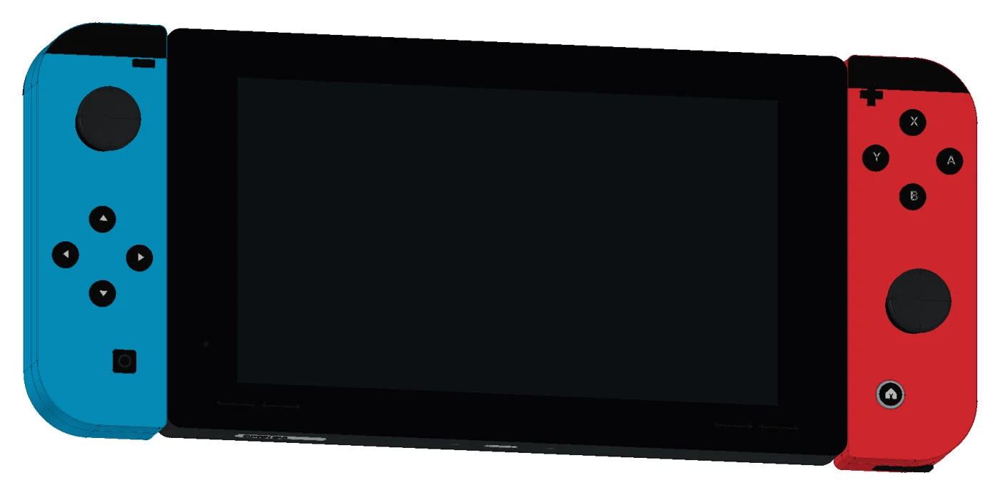</a><br>
      <strong>Nintendo Switch</strong><br>
      <sub>HAC-001</sub><br>
      <a href="https://tiansongyu.github.io/open-console-cad/?device=switch&amp;view=assembled#viewer">在线 3D</a> · <a href="devices/switch/README.md">设备说明</a> · <a href="devices/switch/output/drawings/Switch_Drawings.pdf">A3 图纸</a>
    </td>
    <td align="center" width="33%">
      <a href="https://tiansongyu.github.io/open-console-cad/?device=switch2&amp;view=assembled#viewer">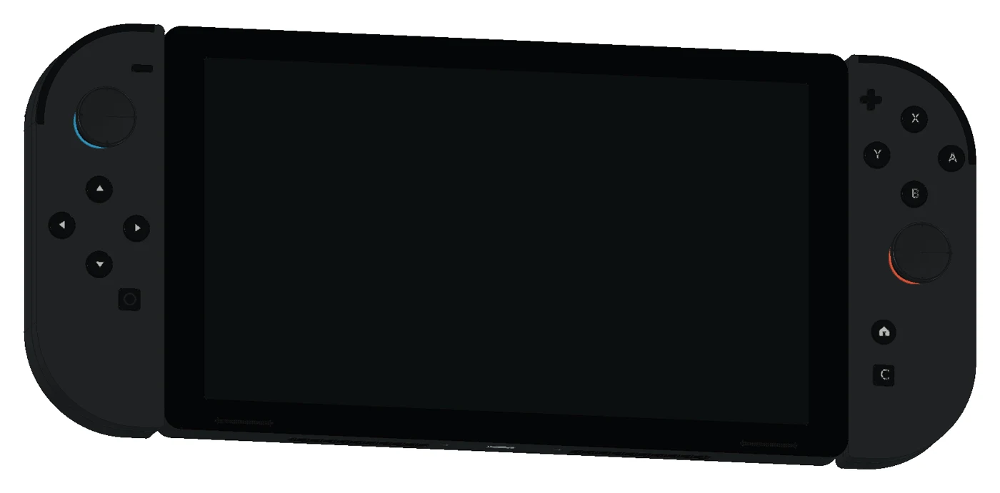</a><br>
      <strong>Nintendo Switch 2</strong><br>
      <sub>BEE-001</sub><br>
      <a href="https://tiansongyu.github.io/open-console-cad/?device=switch2&amp;view=assembled#viewer">在线 3D</a> · <a href="devices/switch2/README.md">设备说明</a> · <a href="devices/switch2/output/drawings/Switch2_Drawings.pdf">A3 图纸</a>
    </td>
    <td align="center" width="33%">
      <a href="https://tiansongyu.github.io/open-console-cad/?device=3ds&amp;view=assembled#viewer">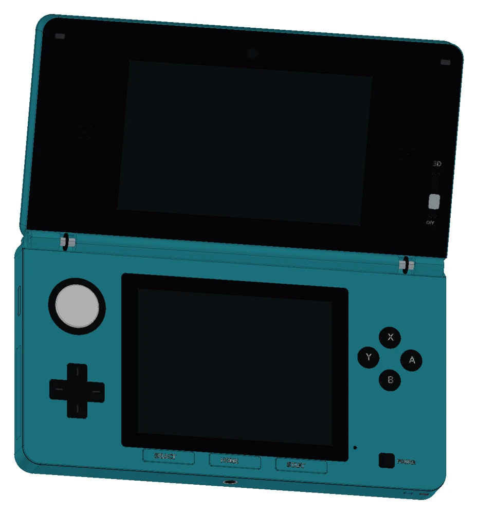</a><br>
      <strong>Nintendo 3DS</strong><br>
      <sub>CTR-001</sub><br>
      <a href="https://tiansongyu.github.io/open-console-cad/?device=3ds&amp;view=assembled#viewer">在线 3D</a> · <a href="devices/3ds/README.md">设备说明</a> · <a href="devices/3ds/output/drawings/Nintendo3DS_Drawings.pdf">A3 图纸</a>
    </td>
  </tr>
  <tr>
    <td align="center" width="33%">
      <a href="https://tiansongyu.github.io/open-console-cad/?device=nds&amp;view=assembled#viewer">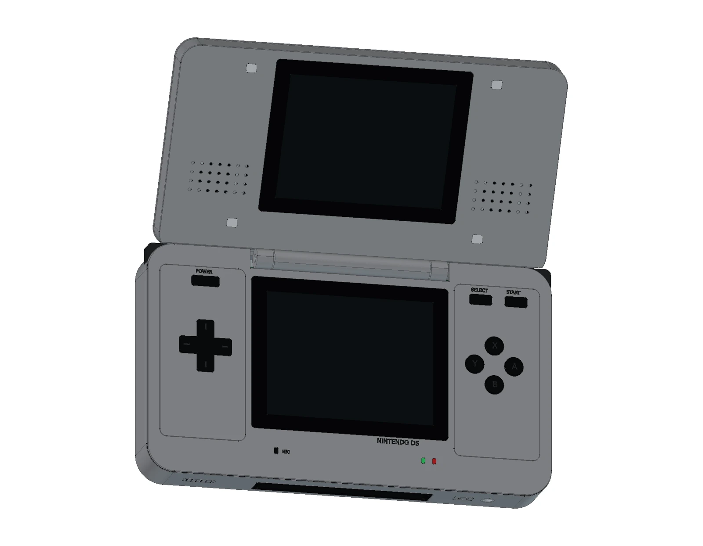</a><br>
      <strong>Nintendo DS</strong><br>
      <sub>NTR-001</sub><br>
      <a href="https://tiansongyu.github.io/open-console-cad/?device=nds&amp;view=assembled#viewer">在线 3D</a> · <a href="devices/nds/README.md">设备说明</a> · <a href="devices/nds/output/drawings/NintendoDS_Drawings.pdf">A3 图纸</a>
    </td>
    <td align="center" width="33%">
      <a href="https://tiansongyu.github.io/open-console-cad/?device=psp&amp;view=assembled#viewer">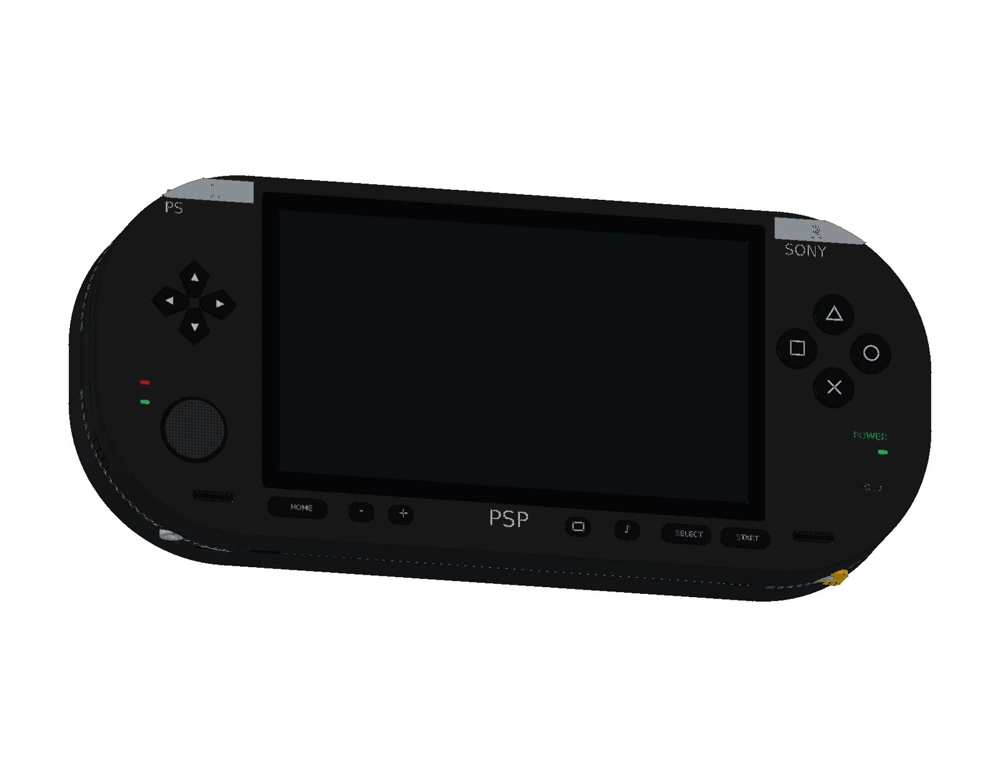</a><br>
      <strong>Sony PSP</strong><br>
      <sub>PSP-1000</sub><br>
      <a href="https://tiansongyu.github.io/open-console-cad/?device=psp&amp;view=assembled#viewer">在线 3D</a> · <a href="devices/psp/README.md">设备说明</a> · <a href="devices/psp/output/drawings/PSP1000_Drawings.pdf">A3 图纸</a>
    </td>
    <td align="center" width="33%">
      <a href="https://tiansongyu.github.io/open-console-cad/?device=psv&amp;view=assembled#viewer">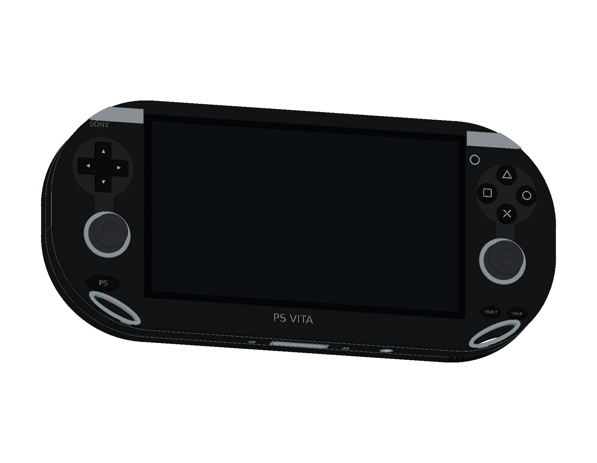</a><br>
      <strong>PlayStation Vita</strong><br>
      <sub>PCH-1000 · Wi-Fi OLED</sub><br>
      <a href="https://tiansongyu.github.io/open-console-cad/?device=psv&amp;view=assembled#viewer">在线 3D</a> · <a href="devices/psv/README.md">设备说明</a> · <a href="devices/psv/output/drawings/PSVita_Drawings.pdf">A3 图纸</a>
    </td>
  </tr>
  <tr>
    <td align="center" width="33%">
      <a href="https://tiansongyu.github.io/open-console-cad/?device=steamdeck&amp;view=assembled#viewer">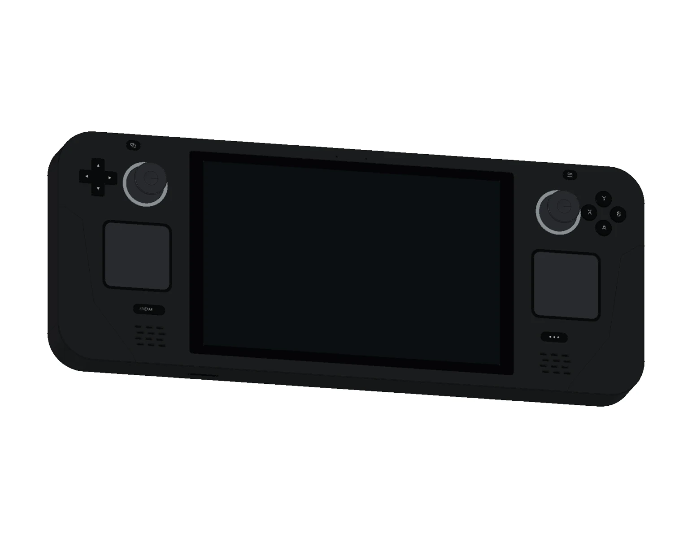</a><br>
      <strong>Steam Deck</strong><br>
      <sub>2022 · LCD</sub><br>
      <a href="https://tiansongyu.github.io/open-console-cad/?device=steamdeck&amp;view=assembled#viewer">在线 3D</a> · <a href="devices/steamdeck/README.md">设备说明</a> · <a href="devices/steamdeck/output/drawings/SteamDeck_Drawings.pdf">A3 图纸</a>
    </td>
    <td align="center" width="33%">
      <a href="https://tiansongyu.github.io/open-console-cad/?device=gameboy&amp;view=assembled#viewer">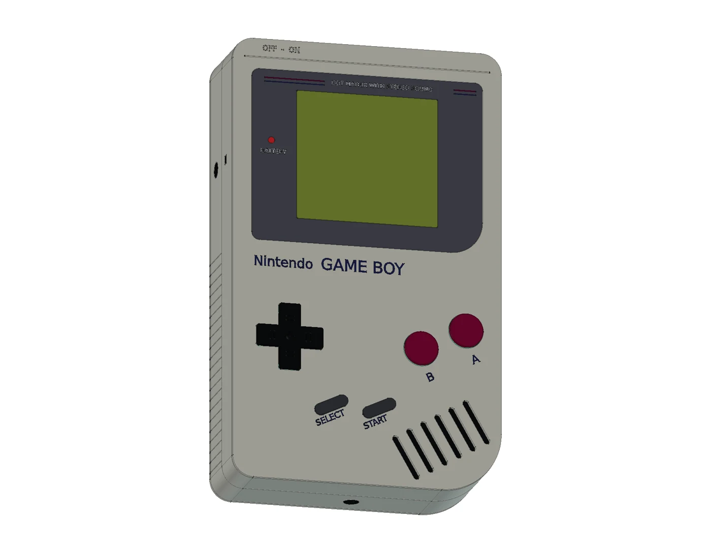</a><br>
      <strong>Nintendo Game Boy</strong><br>
      <sub>DMG-01 · 初代灰色</sub><br>
      <a href="https://tiansongyu.github.io/open-console-cad/?device=gameboy&amp;view=assembled#viewer">在线 3D</a> · <a href="devices/gameboy/README.md">设备说明</a> · <a href="devices/gameboy/output/drawings/GameBoy_Drawings.pdf">A3 图纸</a>
    </td>
    <td align="center" width="33%">
      <a href="https://tiansongyu.github.io/open-console-cad/?device=famicom&amp;view=assembled#viewer">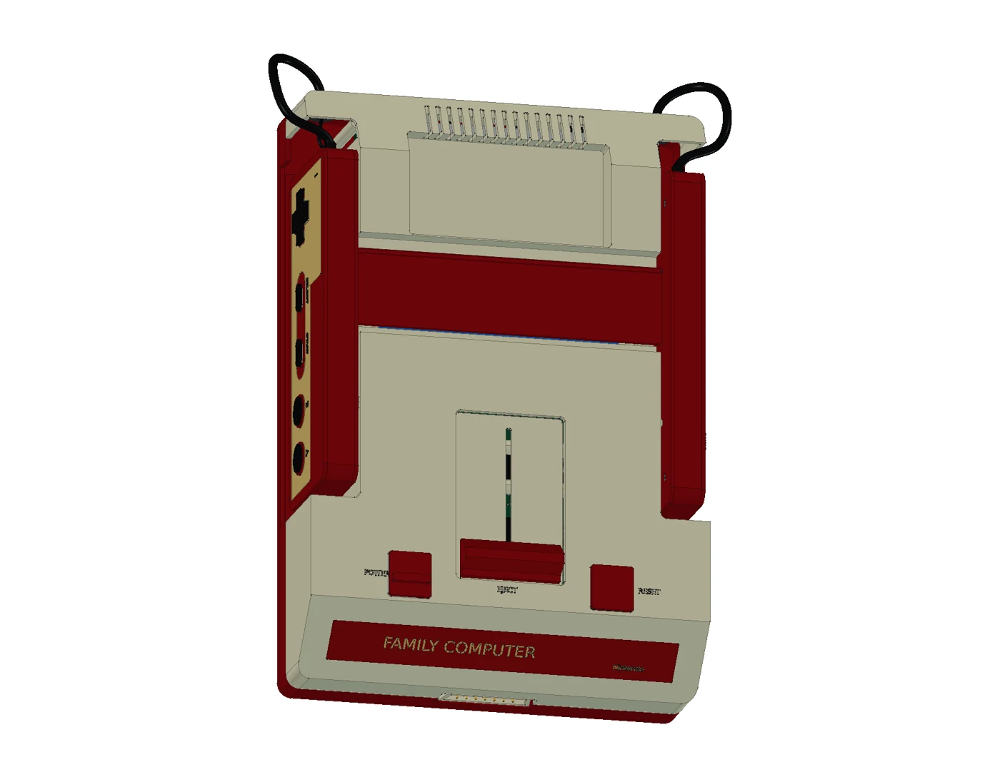</a><br>
      <strong>Nintendo Famicom</strong><br>
      <sub>HVC-001 · 圆形按键红白机</sub><br>
      <a href="https://tiansongyu.github.io/open-console-cad/?device=famicom&amp;view=assembled#viewer">在线 3D</a> · <a href="devices/famicom/README.md">设备说明</a> · <a href="devices/famicom/output/drawings/Famicom_Drawings.pdf">A3 图纸</a>
    </td>
  </tr>
  <tr>
    <td align="center" width="33%">
      <a href="https://tiansongyu.github.io/open-console-cad/?device=atari2600&amp;view=assembled#viewer">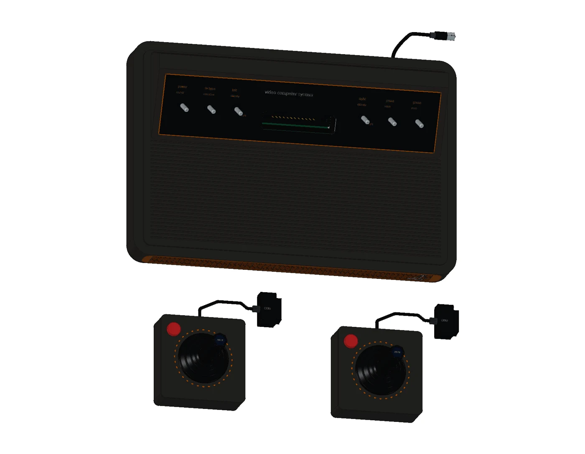</a><br>
      <strong>Atari 2600</strong><br>
      <sub>CX2600 · Heavy Sixer · 1977</sub><br>
      <a href="https://tiansongyu.github.io/open-console-cad/?device=atari2600&amp;view=assembled#viewer">在线 3D</a> · <a href="devices/atari2600/README.md">设备说明</a> · <a href="devices/atari2600/output/drawings/Atari2600_Drawings.pdf">A3 图纸</a>
    </td>
    <td align="center" width="33%">
      <a href="https://tiansongyu.github.io/open-console-cad/?device=megadrive&amp;view=assembled#viewer">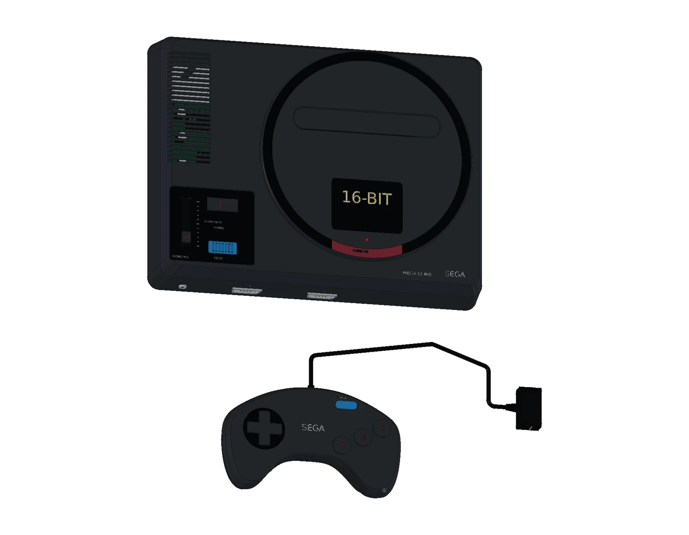</a><br>
      <strong>Sega Mega Drive</strong><br>
      <sub>HAA-2510 · 初代日版</sub><br>
      <a href="https://tiansongyu.github.io/open-console-cad/?device=megadrive&amp;view=assembled#viewer">在线 3D</a> · <a href="devices/megadrive/README.md">设备说明</a> · <a href="devices/megadrive/output/drawings/MegaDrive_Drawings.pdf">A3 图纸</a>
    </td>
    <td width="33%"></td>
  </tr>
</table>

网页还提供各设备的专属视图，例如 Switch 底座与手柄、PSP 的 UMD 光驱、PS Vita 后触控板，Steam Deck 的触控板反馈机构与散热系统，Game Boy 的四节 AA 电池和空白卡带，Famicom 的独立手柄与退卡机构，Atari 2600 的双板结构、CX10 摇杆机构和旋钮控制器，以及 Mega Drive 的三键手柄、VA2 主板与原始连接附件。

制作进度：PlayStation、PlayStation 2、Nintendo 64、Wii、Wii U 与 Sega Saturn 正在扩展清单中，完成验证后加入模型库。详见 [制作范围与进度](docs/CLASSIC_EXPANSION.md)。

## 快速开始

### 在浏览器中查看

访问 **[在线模型库](https://tiansongyu.github.io/open-console-cad/)**，无需安装 FreeCAD。

鼠标拖动旋转，滚轮缩放，右键平移；手机支持触控操作。通过视图标签切换装配分组，拖动“展开程度”查看分层结构。每个视图都有可分享的链接，例如 [Steam Deck 散热系统](https://tiansongyu.github.io/open-console-cad/?device=steamdeck&view=cooling#viewer)。

### 下载并打开 CAD 工程

从上方设备说明下载所需文件，或获取完整仓库：

```bash
git clone https://github.com/tiansongyu/open-console-cad.git
cd open-console-cad
```

也可 [下载 ZIP](https://github.com/tiansongyu/open-console-cad/archive/refs/heads/main.zip)。模型使用 **FreeCAD 1.1.3** 验证。

1. 打开 `devices/<device>/output/*_Complete.FCStd` 查看完整工程。
2. 在 FreeCAD 中运行对应的 `Open_*.FCMacro`，可同时打开整机、爆炸装配与图纸。例如 `devices/switch/Open_Switch.FCMacro`。
3. 运行 `Rebuild_*.FCMacro`，从逐轮源码重建模型，结果写入该设备的 `output/rebuilt/`。

部分外壳尺寸由 `Parameters` 驱动；局部孔位与装配关系仍需结合源码调整并检查。原生图纸是所交付模型的版本快照，修改三维几何后需要重新生成。

### 选择文件格式

| 文件 | 适用场景 |
| --- | --- |
| `.FCStd` | 在 FreeCAD 中查看参数、建模历史并继续编辑 |
| `.step` | 在其他 CAD 软件中使用实体几何与颜色 |
| `.glb` | 在浏览器或支持 glTF 的工具中查看组件网格 |
| `.pdf` / `.svg` | 阅读、打印或编辑工程图纸 |
| `COMPONENTS.csv` | 检索组件编号、装配分组、材质显示角色和尺寸 |

## 开发与维护

### 本地运行网页

需要 **Node.js 24、npm 和 Python 3**。网页开发使用已导出的 GLB；CAD 修改与重新导出另需 FreeCAD。

```bash
npm ci
npm run dev
```

打开终端显示的地址。提交网页改动前运行检查与生产构建：

```bash
npm run check
npm run build
npm run preview
```

`npm run check` 校验组件身份、GLB / FCStd 哈希、下载大小、原生文件完整性、源码语法和 glTF 格式。模型几何、装配配合与图纸仍需执行对应设备的 CAD 检查。

### 更新模型与发布

修改几何后，应同步更新原生文件、STEP、组件清单、图纸和网页资源。在 FreeCAD Python 控制台或 [freecad-mcp](docs/MCP.md) 中执行导出器，例如：

```python
repo = "/absolute/path/open-console-cad"
exec(open(repo + "/tools/export_web_models.py", encoding="utf-8").read())
export_device(repo, "steamdeck", deflection=0.10, angular_deflection=0.15)
```

导出前需更新该设备的 `output/reports/final_manifest.json`。GLB 与其源文件哈希保存在 `site/public/models/`；网页不会自动读取改动后的 FCStd。

推送 `main` 后，[GitHub Actions](.github/workflows/pages.yml) 自动检查、构建并将 `dist/` 发布到 GitHub Pages。Fork 后请在 **Settings → Pages → Source** 选择 **GitHub Actions**，并调整指向原仓库的链接。

完整流程见 **[维护与新增设备指南](docs/MAINTAINING.md)**、[MCP 建模说明](docs/MCP.md) 和各设备 README。PDF 使用 Kami 管线生成，更新后需检查字体、内容与逐页渲染效果。

## 仓库结构

```text
open-console-cad/
├── devices/<device>/
│   ├── README.md / ITERATIONS.md   # 型号说明与迭代记录
│   ├── Open_*.FCMacro              # 打开交付工程
│   ├── Rebuild_*.FCMacro           # 从源码重建
│   ├── scripts/                   # FreeCAD Python 源码
│   ├── references/                # 来源与第三方许可
│   └── output/                    # 原生模型、STEP、组件清单
│       ├── drawings/              # PDF、SVG 与图纸数据
│       ├── previews/              # CAD 效果图
│       └── reports/               # 模型与导出检查记录
├── site/                          # Three.js 查看器与静态资源
├── tools/                         # 导出与验证工具
├── docs/                          # 维护、建模与验收说明
├── licenses/                      # 第三方许可证
└── .github/workflows/pages.yml     # 自动构建与发布
```

已发布的十个设备目录分别为 `switch`、`switch2`、`3ds`、`nds`、`psp`、`psv`、`steamdeck`、`gameboy`、`famicom` 和 `atari2600`。共享工具位于 `tools/`，重建时请保留仓库结构。

经典机型的扩展进度见 [开发记录](docs/CLASSIC_EXPANSION.md)。Game Boy、Famicom 和 Atari 2600 已提供完整模型、图册与在线预览；[PlayStation](devices/ps1/README.md) 正在建模，PlayStation 2 尚待扩展。

## 验证记录

仓库保留已交付版本的验证证据，涵盖原生实体有效性、源码重建、装配干涉、STEP 回读、尺寸核对与图纸检查。修改模型后应重新验证相关内容。

| 验证范围 | 记录 |
| --- | --- |
| 十款设备的原生几何、建模历史与交付文件 | [整库交付核对](docs/collection_delivery_audit.json) |
| 首批七款：线上 GLB、预览图、原生 CAD 与 PDF 的文件一致性 | [35 个线上文件的哈希核对](docs/seven_device_live_audit.json) |
| 首批七款：模型加载、折叠状态与手机布局 | [线上交互核对](docs/seven_device_live_ui.json) |
| 新增 Game Boy：14 个线上文件与桌面/手机预览 | [文件核对](devices/gameboy/output/reports/live_delivery_audit.json) · [交互核对](devices/gameboy/output/reports/live_ui_checks.json) |
| 新增 Famicom：15 个线上文件、九种视图与桌面/手机预览 | [文件核对](devices/famicom/output/reports/live_delivery_audit.json) · [交互核对](devices/famicom/output/reports/live_ui_checks.json) |
| 新增 Atari 2600：15 个线上文件、十一种视图与桌面/手机预览 | [文件核对](devices/atari2600/output/reports/live_delivery_audit.json) · [交互核对](devices/atari2600/output/reports/live_ui_checks.json) |
| 单款设备的详细尺寸与建模过程 | `devices/<device>/output/reports/` 与 `ITERATIONS.md` |

## 参与贡献

欢迎修正模型、补充设备资料、改进文档或优化查看器。

- **报告问题**：通过 [Issues](https://github.com/tiansongyu/open-console-cad/issues) 说明设备型号、复现步骤及预期结果。
- **提交改进**：先阅读 [贡献指南](CONTRIBUTING.md)，在 Pull Request 中附上参考来源、前后对比和相关验证结果。
- **新增设备**：参考 [目录与发布流程](docs/MAINTAINING.md#新增设备)，保持组件标识、来源说明与交付文件的一致性。

## 许可证与致谢

项目原创代码、文档及有权许可的自制模型数据采用 **[MIT License](LICENSE)**。

Nintendo、Sony、Valve 等名称、商标和产品设计，以及第三方参考材料、字体与依赖，保留其原有权利。本项目与相关设备厂商无隶属、赞助或认证关系，具体范围见 [第三方声明](THIRD_PARTY_NOTICES.md)。

感谢 [FreeCAD](https://www.freecad.org/)、[Three.js](https://threejs.org/)、[freecad-mcp](https://github.com/neka-nat/freecad-mcp) 与 [Kami](https://github.com/tw93/Kami) 提供建模、可视化和文档工具。
