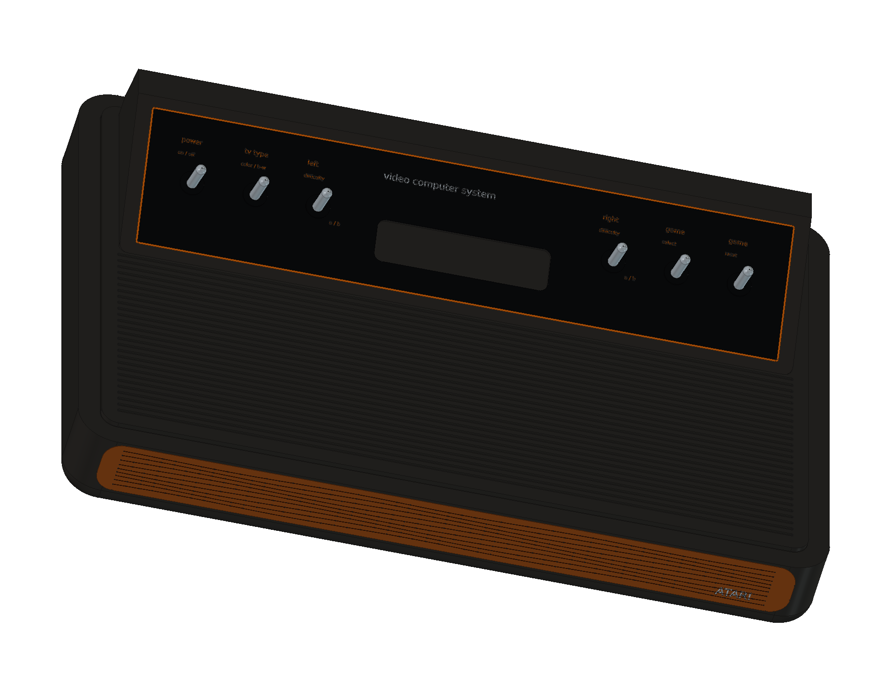

# Atari 2600 · CX2600 Heavy Sixer

原始 1977 年木纹六开关版本，正在按本仓库的完整 CAD、工程图和网页交付标准制作。参考原厂维修手册与实物拆机照片，保留厚壁圆弧底壳、木纹前脸、六枚金属开关、双 PCB 与铸铝屏蔽罩。

已执行前两轮建模，包含 39 个组件；阶段实体有效性与全部候选组件求交通过。当前文件为开发阶段，尚未加入在线模型目录。最终交付将包含可编辑原生模型、主机与附件、爆炸装配、STEP、组件清单、12 页 A3 图纸和交互式网页预览。

工作包络约 346 × 232 × 89 mm。未取得原厂尺寸图或实机测量，整体与局部尺寸均为近似学习尺寸，不作原厂规格或制造尺寸使用。[来源与版本边界](references/SOURCES.md)。

在 FreeCAD 中依次运行 `scripts/iterNN_*.py`；从第一轮开始创建工程，后续轮次复用 `model`。请保留仓库目录结构。阶段成果与检查位于 `output/`，完整交付完成后会补齐打开和重建宏。

