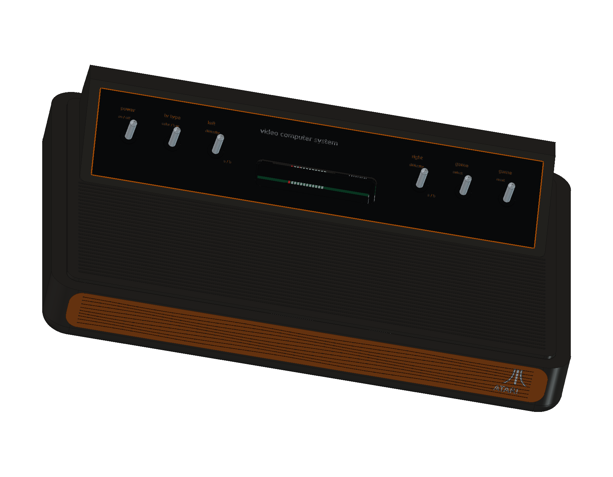
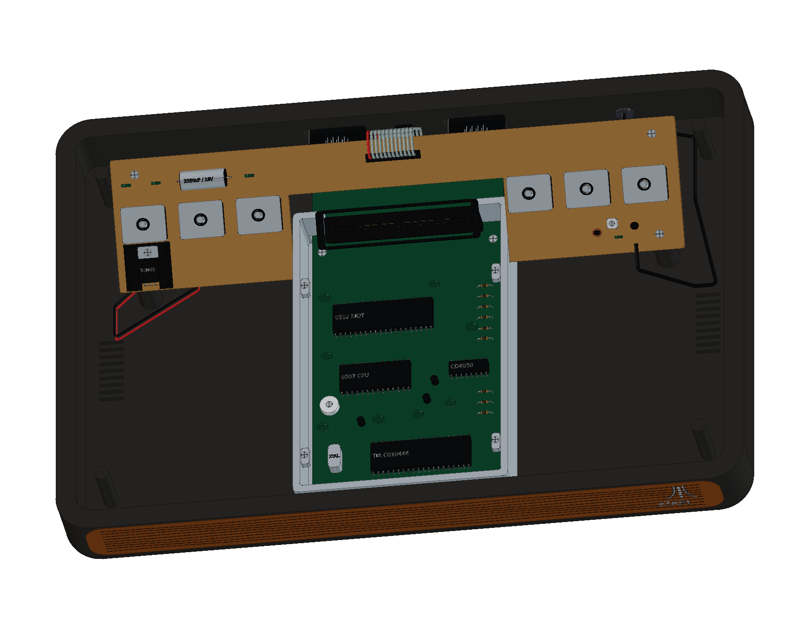

# Atari 2600 · CX2600 Heavy Sixer

原始 1977 年木纹六开关版本，正在按本仓库的完整 CAD、工程图和网页交付标准制作。主机部分已完成 **13 轮建模、330 个组件条目**，保留厚壁圆弧底壳、木纹前脸、六枚金属开关、双 PCB 与铸铝屏蔽罩。

## 当前阶段

主机模型包括 6507、6532 RIOT、TIA、CD4050、24 接点卡座、12 芯排线、六个开关机构、78M05 稳压器与散热片、轴向滤波电容、RF 调谐模块、DE-9 接口及内部线束。

完整套件仍在制作，尚未加入在线模型目录。接下来补齐原始 CX10 摇杆与附件，再交付完整/爆炸 FreeCAD 工程、STEP、组件清单、12 页 A3 图纸和交互式网页预览。

工作包络约 346 × 232 × 89 mm，外伸线缆另计。未取得原厂尺寸图或实机测量，整体与局部尺寸均为近似学习尺寸，不作为原厂规格或制造尺寸使用。[来源与版本边界](references/SOURCES.md)。

## 运行与验证

在 FreeCAD 1.1.3 中依次运行 `scripts/iterNN_*.py`：第一轮创建 `model`，后续轮次复用该对象。请保留完整仓库结构。历史二进制检查点可由编号源码重新生成；完整交付完成后会补齐打开与重建宏。

- 前 12 轮已从新工程执行，并按组件核对有效性、实体数、包围盒和体积：[源码核对](output/reports/stage12_rebuild_verification.json)。
- 第 13 轮主机的全部 **1,414 对候选组件** 完成实体求交，未发现超过 0.000001 mm³ 的干涉：[装配检查](output/reports/stage13_interference_audit.json)。
- 15 条改进后的排线与内部线束均通过严格布尔几何检查：[线束几何](output/reports/stage13_wire_geometry.json)。

早期阶段的检查记录保留了当时发现的问题；后续轮次明确记录修正。第 13 轮使用精确直线和圆弧弯管解决早期扫掠曲面的自相交问题。源码重建和整套导出检查将在完整设备交付前再次执行。

以上为开发阶段的验证范围，不代表尚未交付的附件、工程图或网页资源已通过验收。[逐轮记录](ITERATIONS.md)。原创代码与模型数据的许可范围见根目录 MIT 协议及第三方声明。
