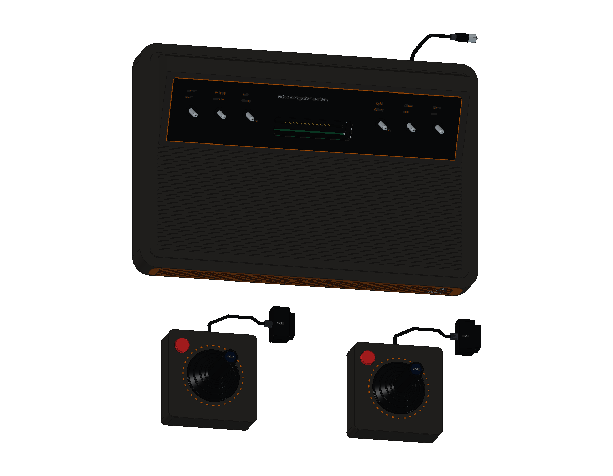
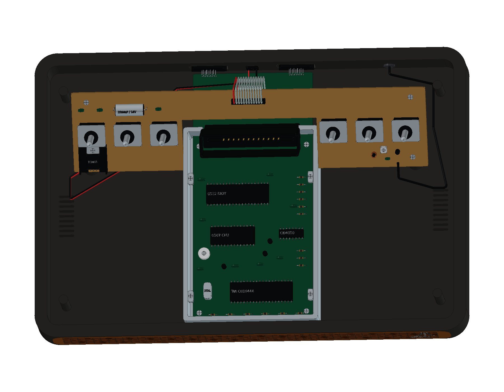

# Atari 2600 · CX2600 Heavy Sixer

本模型以 1977 年木纹六开关 VCS 为研究对象，经过 **23 轮建模，包含 684 个组件条目、1,511 个实体**，提供可编辑工程、12 页 A3 图纸与十一种交互式视图。

[在线 3D 预览](https://tiansongyu.github.io/open-console-cad/?device=atari2600&view=assembled#viewer) · [内部结构](https://tiansongyu.github.io/open-console-cad/?device=atari2600&view=internal#viewer) · [CX10 摇杆机构](https://tiansongyu.github.io/open-console-cad/?device=atari2600&view=mechanism#viewer) · [A3 图册](output/drawings/Atari2600_Drawings.pdf)

## 文件与使用

- [完整 FreeCAD 工程](output/Atari2600_Complete.FCStd) · [爆炸装配](output/Atari2600_Exploded.FCStd)
- [12 页 A3 PDF](output/drawings/Atari2600_Drawings.pdf) · [FreeCAD 原生图纸](output/Atari2600_Drawings.FCStd) · [SVG 图页与图纸数据](output/drawings/)
- [整套 STEP](output/Atari2600_FullKit.step) · [主机与双摇杆 STEP](output/Atari2600_Console.step) · [爆炸 STEP](output/Atari2600_Exploded.step)
- [组件清单](output/COMPONENTS.csv) · [逐轮记录](ITERATIONS.md) · [几何交付核对](output/reports/geometry_delivery_audit.json)

用 FreeCAD 1.1.3 打开原生工程，或运行 [Open_Atari2600.FCMacro](Open_Atari2600.FCMacro) 同时打开整机、爆炸装配和图纸。运行 [Rebuild_Atari2600.FCMacro](Rebuild_Atari2600.FCMacro) 可执行全部源码并重建 CAD 和 STEP，输出写入 `output/rebuilt/`，保留正式文件。入口位于 `scripts/iterNN_*.py`，实现位于 `../../tools/cadlib/atari2600.py`；请保留完整仓库结构。

网页模型由完整原生工程导出，保留全部 684 个组件及装配身份。可切换主机、双摇杆、内部结构、分层爆炸、摇杆机构、主逻辑板、开关与电源、旋钮控制器、空白卡带和整套附件；网页使用无损 gzip 传输，原始 GLB 仍可单独下载。

## 模型内容

主机包含厚壁圆弧底壳、木纹前脸、六开关机构、双电路板、6507 / 6532 RIOT / TIA / CD4050、24 接点卡座、12 芯排线、铸铝屏蔽罩、稳压与 RF 模块，以及原始 DE-9、3.5 mm 电源和固定 RF 输出。

两只 CX10 保留刚性摇杆盘、五组弹簧、独立传动板、PCB 接点、六芯线束、单红按钮及蓝色六角顶标。主机与双摇杆合计 475 个组件；其余 209 个附件组件包括 CX30-04 旋钮控制器及共用线缆、空白学习卡带、适配器和 TV/GAME 切换盒。

## 尺寸与参考边界

本模型主机学习包络约 **346 × 232.443 × 88.304 mm**，包含表面标识，外伸线缆、独立控制器及附件另计。未取得原厂尺寸图或实机测量，整体与局部尺寸均为近似学习尺寸，不作为原厂规格或制造尺寸使用。参数表及清单明确记录这一点。

卡带使用原创 VCS STUDY 标签，不包含游戏 ROM、封面或电路数据。适配器内部采用通用变压器、整流和滤波结构示意；切换盒局部尺寸和触点位置为学习近似。线缆展示收纳片段，不代表原装长度。来源及版本差异见 [SOURCES.md](references/SOURCES.md)。

## 验证记录

- [完整源码重建](output/reports/rebuild_verification.json)：从新工程执行 23 轮，逐项核对 684 个组件的有效性、实体数、包围盒和体积。
- [整套装配求交](output/reports/final_interference_audit.json)：2,016 对候选组件完成检查，无超过 0.000001 mm³ 的干涉。
- [原生与 STEP 回读](output/reports/export_roundtrip_audit.json)：两份原生工程及三份 STEP 通过，STEP 实体逐一匹配；曲面体积积分差异以双向布尔差集进一步核对。
- [尺寸与投影核对](output/reports/drawing_checks.json)：33 项模型测量；[原生图纸](output/reports/native_drawings_audit.json) 含 12 页和 15 个尺寸引用，[保存后重开](output/reports/native_drawings_reload.json) 与打开宏均通过。
- [PDF 视觉验收](output/reports/visual_acceptance.json) · [独立审阅](output/reports/independent_pdf_review.json)：Kami 字体、内容、样式、密度和占位符检查通过，全部 12 页完成逐页审阅。独立审阅的范围和限制见报告。
- [网页预览核对](output/reports/web_preview_checks.json) · [完整交付核对](output/reports/completion_audit.json)。
- [15 个线上文件核对](output/reports/live_delivery_audit.json) · [线上桌面与手机视图](output/reports/live_ui_checks.json)：部署文件与发布版本一致，十一种视图均通过核对。

早期阶段的检查记录保留了当时发现的问题，后续轮次明确记录修正。修改模型后需重新执行相关验证。原生工程保留草图、约束、凸台、圆角和布尔加工历史；局部结构仍由源码坐标控制，调整参数后需要重新检查装配。

原创代码和有权许可的模型内容采用根目录 MIT 协议。第三方名称、产品设计、字体与参考材料保留各自权利，见 [第三方声明](../../THIRD_PARTY_NOTICES.md)。
