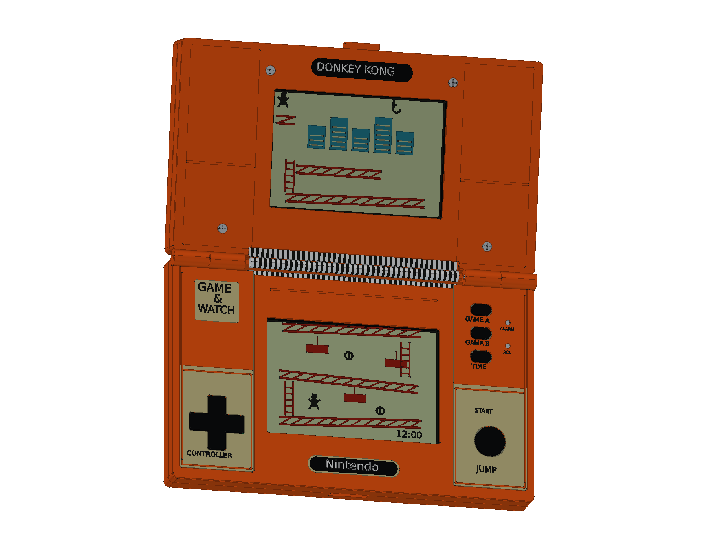
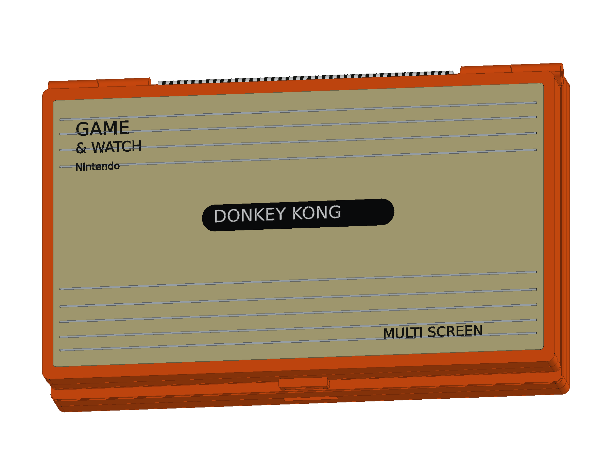
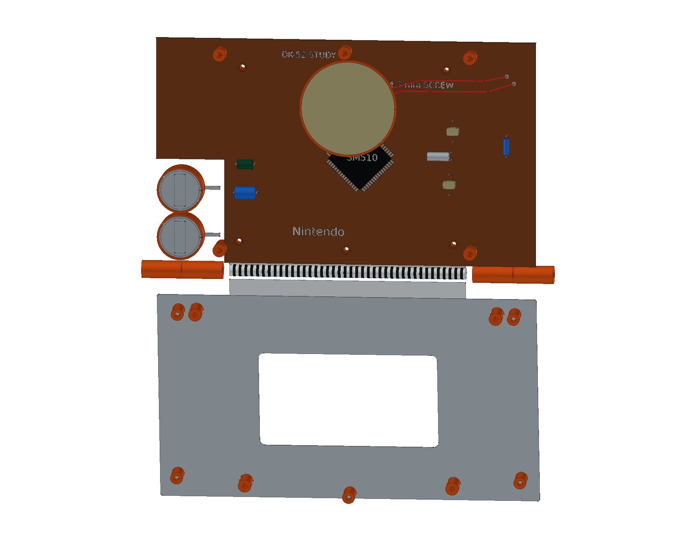
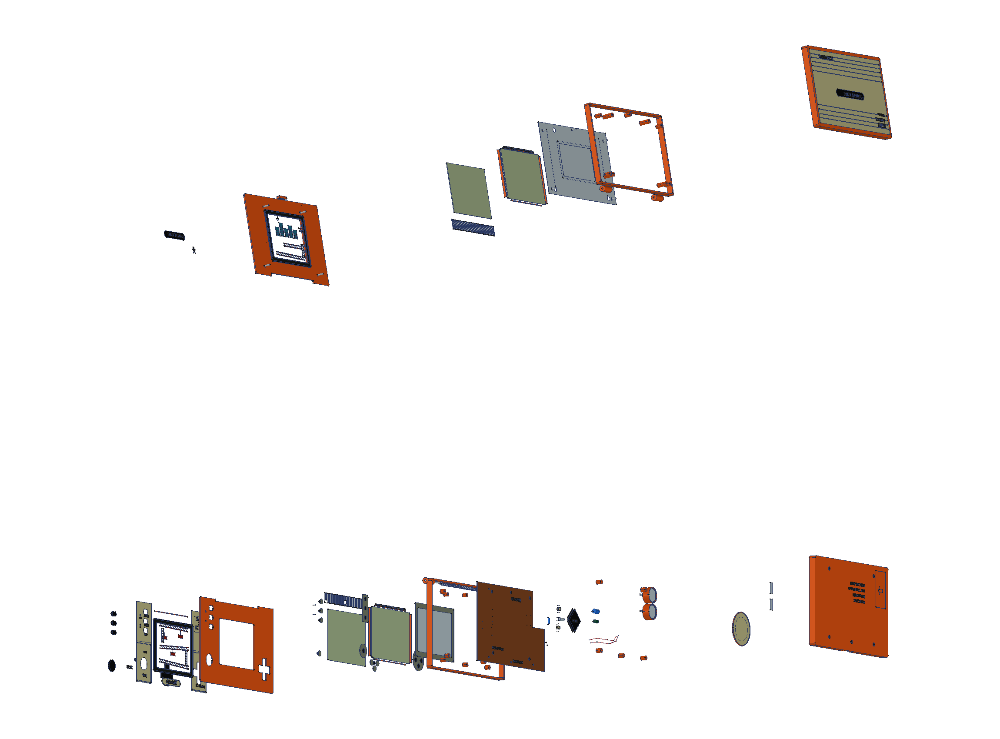
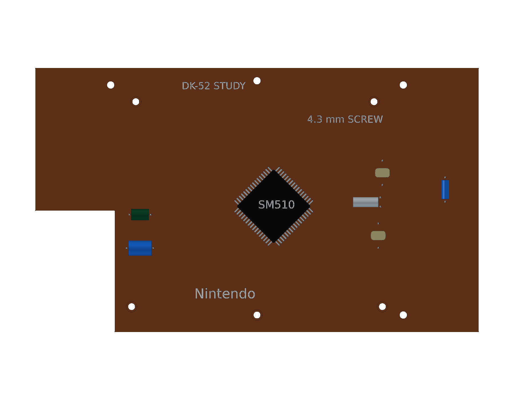
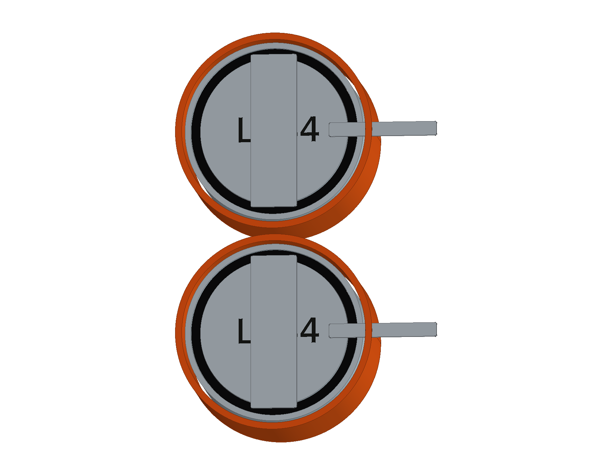

# Nintendo Game & Watch · Donkey Kong DK-52

1982 年橙色原版双屏掌机的结构学习模型，包含 **15 轮源码、592 个组件条目和 778 个实体**：上下分体外壳、两屏反射 LCD、固定图形、十字键和导电胶、SM510 主板、双纽扣电池、压电音片、冲压压板及中央印刷排线。提供完整、合拢和爆炸原生工程、四份 STEP、十二页 A3 图册与十七个网页视图。

<table>
<tr>
<td align="center" width="33%"> 橙色双屏原版总装</td>
<td align="center" width="33%"> 合拢标题板与卡扣</td>
<td align="center" width="33%"> 主板、上屏压板与电池</td>
</tr>
<tr>
<td align="center" width="33%"> 分层爆炸装配</td>
<td align="center" width="33%"> SM510 与分立器件</td>
<td align="center" width="33%"> 双纽扣电池与接点</td>
</tr>
</table>

- [在线 3D 预览](https://tiansongyu.github.io/open-console-cad/?device=gamewatch&view=assembled#viewer)
- [完整工程](output/GameWatchDK52_Complete.FCStd) · [合拢工程](output/GameWatchDK52_Closed.FCStd) · [爆炸工程](output/GameWatchDK52_Exploded.FCStd) · [打开宏](Open_GameWatchDK52.FCMacro)
- [全套 STEP](output/GameWatchDK52_FullKit.step) · [掌机 STEP](output/GameWatchDK52_Handheld.step) · [合拢 STEP](output/GameWatchDK52_Closed.step) · [爆炸 STEP](output/GameWatchDK52_Exploded.step)
- [12 页 A3 PDF](output/drawings/GameWatchDK52_Drawings.pdf) · [HTML 图册](output/drawings/GameWatchDK52_Drawings.html) · [SVG 目录](output/drawings/) · [原生图纸](output/GameWatchDK52_Drawings.FCStd)
- [组件清单](output/COMPONENTS.csv) · [模型清单](output/reports/final_manifest.json) · [逐轮记录](ITERATIONS.md)
- [完整重建宏](Rebuild_GameWatchDK52.FCMacro) · [建模源码](../../tools/cadlib/gamewatch.py) · [资料与边界](references/SOURCES.md)
- [源码重建比对](output/reports/rebuild_verification.json) · [严格实体检查](output/reports/strict_saved_native.json) · [四姿态装配求交](output/reports/assembly_interference.json)
- [STEP 回读](output/reports/export_roundtrip_audit.json) · [参数修改复原](output/reports/parameter_edit_test.json) · [交付核对](output/reports/completion_audit.json)

使用 FreeCAD 1.1.3 打开工程。原生底壳草图、拉伸与布尔历史保留修改入口；`Parameters.Width` 驱动底壳宽度约束。重建宏从空文档执行全部十五轮，输出到 `output/rebuilt/`；局部元件并非一键缩放的制造设计。全套与掌机 STEP 包含相同组件，因为本机没有单独的 AC 适配器或外接控制器。

Museums Victoria 馆藏 HT38633 的合拢实测 **115 × 73 × 23 mm** 用作参考包络，并非原厂制造尺寸。模型含浮起铭文和细脊，实测深度约 23.136 mm。内部结构依据原机拆解与维修照片，SM510 身份依据 MAME 原始逆向代码；没有混用现代纪念版、背光或 USB 部件。

LCD 的玻璃、反射片、间隙、周边偏光层和图形膜分别建模，前偏光层以周边示意便于观察。屏幕图案为非功能几何重绘，没有游戏 ROM。两枚 LR44 / SR44、电池盖、接点和压电音片均独立；十九枚固定螺钉包含五枚下壳、四枚上盖、五枚主板和五枚上屏压板螺钉。

壁厚、曲率、孔位、胶膜、封装引脚、导线及固定图形为学习近似，不提供工作电路、制造公差或真实配合保证。中央排线是原版结构和开合间隙示意，四姿态检查不代表柔性疲劳寿命认证。
