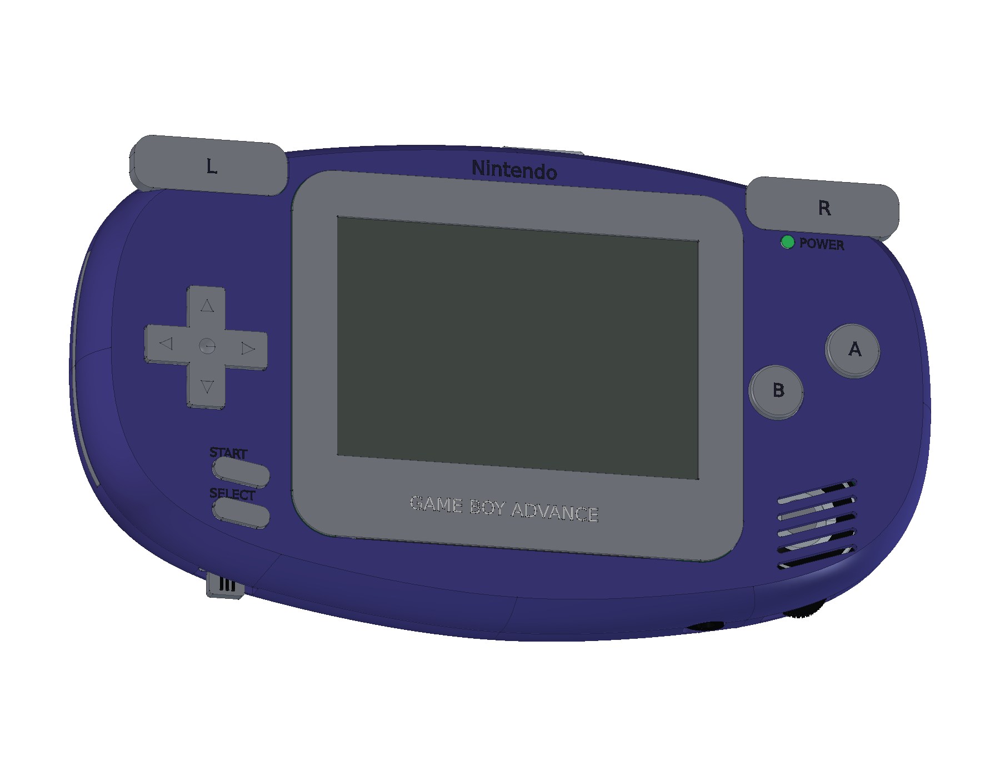
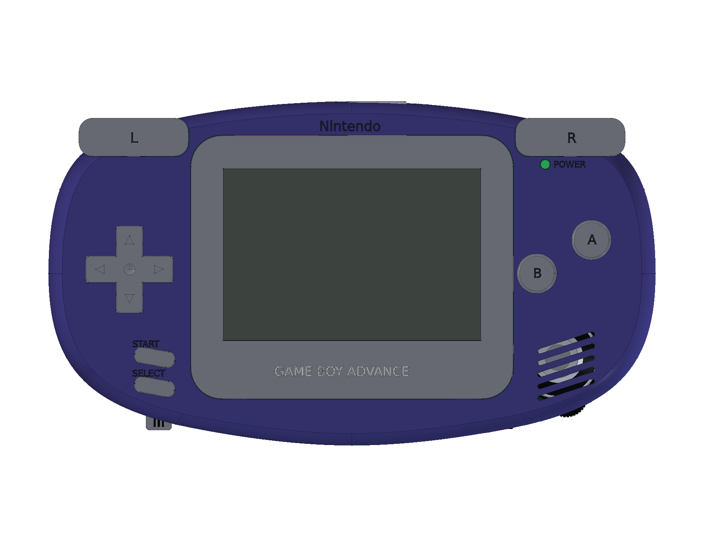
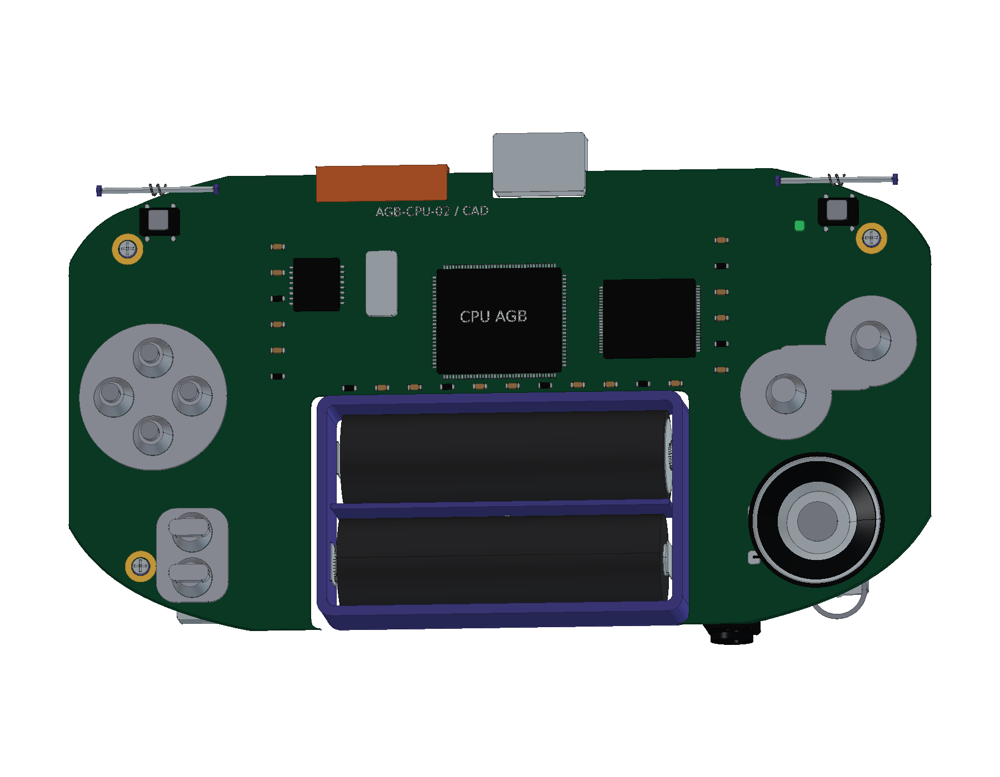
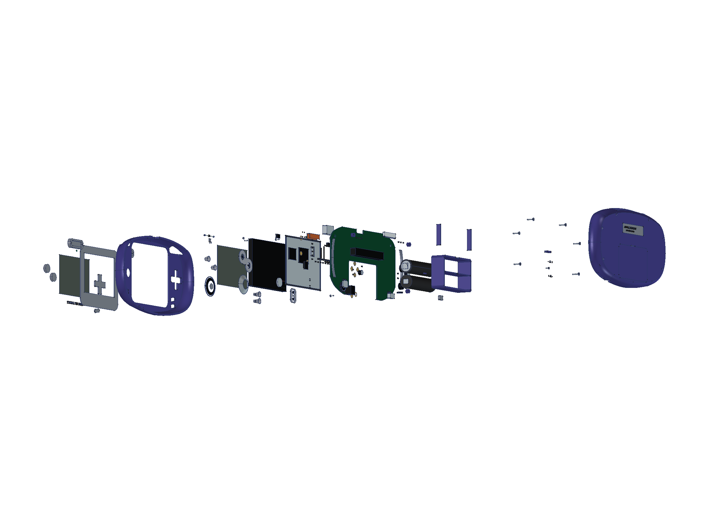
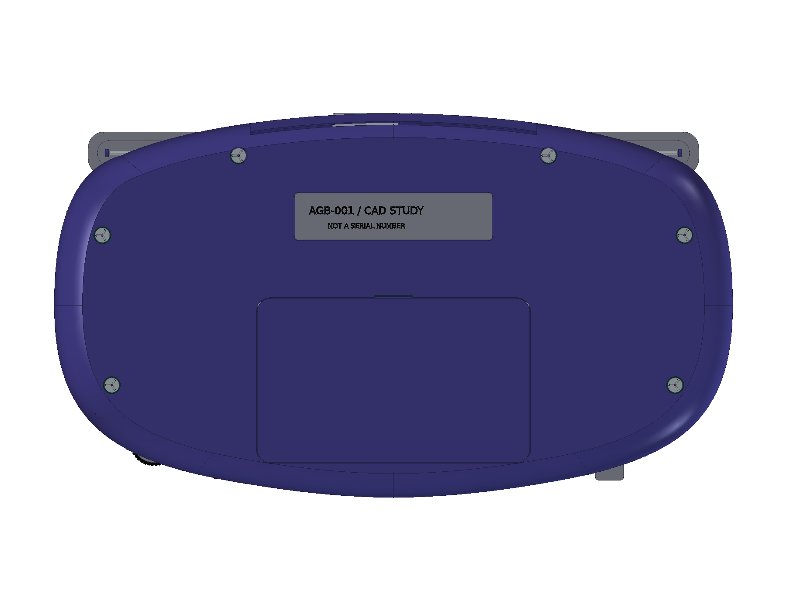
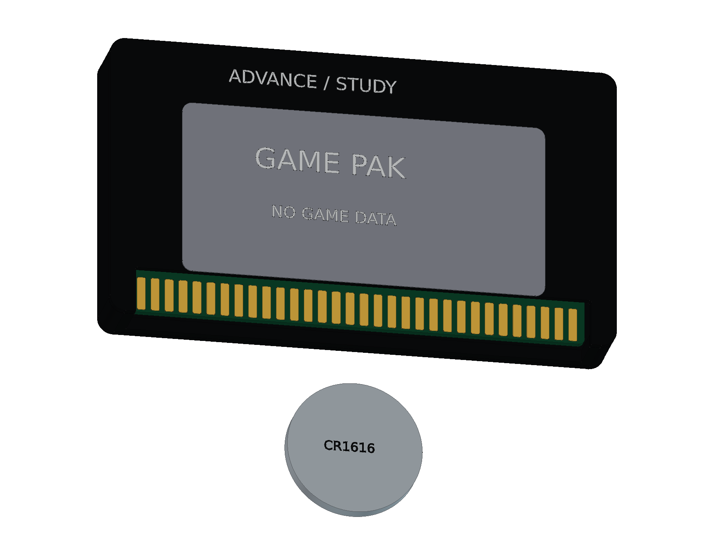

# Nintendo Game Boy Advance · AGB-001

原版 Indigo / 早期 AGB-CPU-02 结构学习模型包含 **17 轮源码、779 个组件条目与 899 个实体**：曲面壳体、无照明反射液晶、双面主板、三组按键膜、肩键机构、单声道扬声器、双 AA 供电与原版连接器；另附不含游戏数据的空白 Game Pak 学习件。提供完整及爆炸原生工程、三份 STEP、12 页 A3 PDF / SVG / 原生图纸和 18 个网页视图。

<table>
<tr>
<td align="center" width="33%"> 原版 Indigo 掌机</td>
<td align="center" width="33%"> 反射 LCD 与原版控制</td>
<td align="center" width="33%"> 早期主板与输入结构</td>
</tr>
<tr>
<td align="center" width="33%"> 分层爆炸装配</td>
<td align="center" width="33%"> 背壳与独立电池盖</td>
<td align="center" width="33%"> 另附空白学习卡带</td>
</tr>
</table>

- [在线 3D 预览](https://tiansongyu.github.io/open-console-cad/?device=gba&view=assembled#viewer)
- [完整 FreeCAD 工程](output/GameBoyAdvance_Complete.FCStd) · [爆炸工程](output/GameBoyAdvance_Exploded.FCStd) · [打开宏](Open_GameBoyAdvance.FCMacro)
- [全套 STEP](output/GameBoyAdvance_FullKit.step) · [掌机 STEP](output/GameBoyAdvance_Handheld.step) · [爆炸 STEP](output/GameBoyAdvance_Exploded.step)
- [12 页 A3 PDF](output/drawings/GameBoyAdvance_Drawings.pdf) · [HTML 图册](output/drawings/GameBoyAdvance_Drawings.html) · [SVG 目录](output/drawings/) · [原生图纸](output/GameBoyAdvance_Drawings.FCStd)
- [组件清单](output/COMPONENTS.csv) · [模型清单](output/reports/final_manifest.json)
- [完整重建宏](Rebuild_GameBoyAdvance.FCMacro) · [逐轮记录](ITERATIONS.md) · [建模源码](../../tools/cadlib/gba.py)
- [源码重建比对](output/reports/rebuild_verification.json) · [严格实体检查](output/reports/strict_saved_native.json) · [装配求交](output/reports/assembly_interference.json)
- [STEP 回读](output/reports/export_roundtrip_audit.json) · [参数编辑复原](output/reports/parameter_edit_test.json) · [资料与边界](references/SOURCES.md)

使用 FreeCAD 1.1.3 打开工程。独立曲线草图、前后壳放样、原生镜框和布尔历史保留修改入口；重建宏从空文档执行全部轮次，并写入 `output/rebuilt/`。`Parameters.Width` 驱动镜框的原生宽度约束，其他局部几何并非一键缩放的制造设计。

Nintendo 官方原版包络为 **144.5 × 82 × 24.5 mm**，反射 TFT 可视区域为 **61.2 × 40.8 mm**。内部以早期 AGB-CPU-02 实机照片为依据，保留 CPU AGB、两侧引脚 RAM、40 针液晶接口和双 AA；未混入 SP、Micro、后期 32 针显示接口或改装 IPS。

空白 Game Pak 是另附结构演示件，参考 2001 年 AGB-E06-01 的器件关系，标签明确写明 NO GAME DATA，CR1616 以移除状态展示。它不含游戏数据，不复制商业标签，也不宣称属于掌机标配。卡带外壳 60 × 34 mm 为学习近似，非官方测绘尺寸。

曲率、壁厚、胶膜行程、孔位、触点、弹簧、元件与走线均为非功能性近似；模型不提供制造公差或工作电路。官方外包络、原版功能依据与学习近似在图册及资料页中分别说明。

全部 779 个组件重建比对、严格实体、955 对装配候选求交、参数复原、三份 STEP 回读和图册/网页检查通过，详细范围见各项报告。

已发布版本 `0756fcb` 的 14 份线上文件哈希、18 个网页视图、三种屏幕布局、键盘滑块及设备切换均核对通过，见 [线上文件](output/reports/live_delivery_audit.json) 与 [线上交互](output/reports/live_ui_checks.json)。
