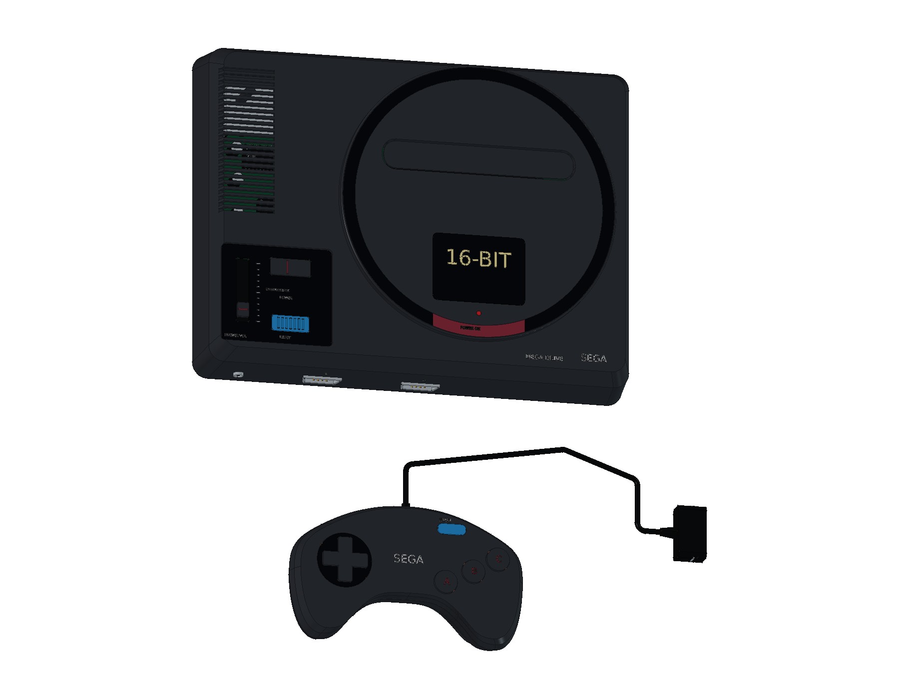
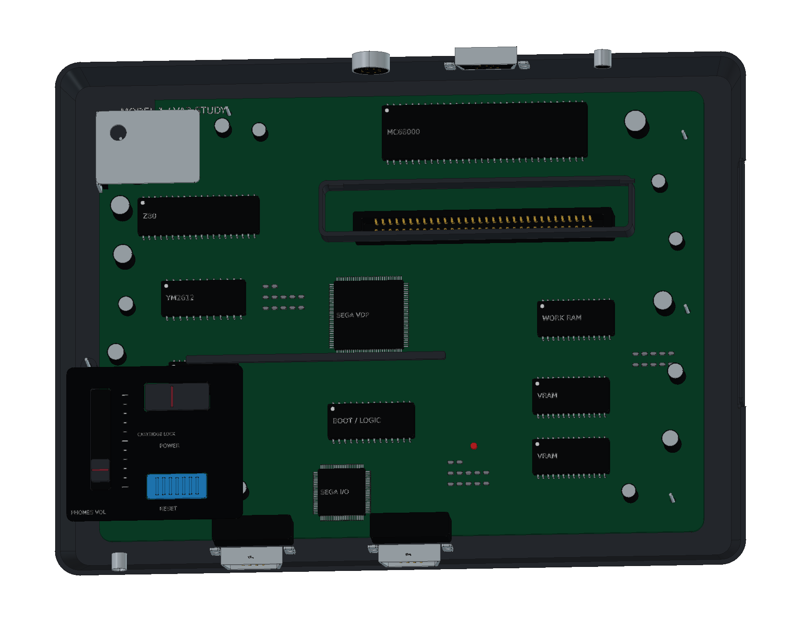

# Sega Mega Drive · HAA-2510

初代日版大机型的 FreeCAD 学习模型，包含 **825 个组件条目、1,209 个实体与 13 轮建模源码**。提供主机、SJ-3500 三键手柄、空白卡带、适配器与连接线，并附 12 页 A3 图纸。

[在线 3D](https://tiansongyu.github.io/open-console-cad/?device=megadrive&view=assembled#viewer) · [内部结构](https://tiansongyu.github.io/open-console-cad/?device=megadrive&view=internal#viewer) · [三键手柄](https://tiansongyu.github.io/open-console-cad/?device=megadrive&view=controller#viewer) · [A3 图册](output/drawings/MegaDrive_Drawings.pdf)

## 文件与使用

- [完整 FreeCAD 工程](output/MegaDrive_Complete.FCStd) · [爆炸装配](output/MegaDrive_Exploded.FCStd)
- [12 页 A3 PDF](output/drawings/MegaDrive_Drawings.pdf) · [原生图纸](output/MegaDrive_Drawings.FCStd) · [SVG 和排版源码](output/drawings/)
- [整套 STEP](output/MegaDrive_FullKit.step) · [主机与手柄 STEP](output/MegaDrive_Console.step) · [爆炸 STEP](output/MegaDrive_Exploded.step)
- [组件清单](output/COMPONENTS.csv) · [逐轮记录](ITERATIONS.md) · [参考来源](references/SOURCES.md)

使用 FreeCAD 1.1.3 打开工程，或运行 [Open_MegaDrive.FCMacro](Open_MegaDrive.FCMacro) 同时打开整机、爆炸装配和图纸。[Rebuild_MegaDrive.FCMacro](Rebuild_MegaDrive.FCMacro) 从 13 轮源码重建 CAD 与 STEP，写入 `output/rebuilt/`，保留正式文件。请保留完整仓库结构。

上下壳保留原生曲线剖面、放样及布尔加工历史。外壳局部轮廓和内部布局主要由源码控制，参数表记录参考尺寸。修改后需重新检查配合，并生成图纸和网页网格。

## 模型内容

主机保留偏右圆形卡带台、亮面环带、日版红色电源区域、耳机音量滑块、蓝色 RESET、两只前方 DE-9 手柄端口、后方扩展接口、DIN 音视频及 DC 电源口。卡座具有两排共 64 个独立弹片。

内部以 VA2 拆机照片为参考，包含 68000、Z80、音源与主要处理器封装、存储器、离散元件、折弯散热片、控制传动和壳体紧固。该模型研究初代外壳系列，不宣称复刻首批 VA0 电路。

SJ-3500 保留曲线双握柄、浮动方向圆盘、斜列 ABC、蓝色 START、硅胶圆顶、碳膜接点、PCB、九芯导线与六处后壳固定。其余附件包括原创标签空白卡带、变压器式电源和单声道 DIN 转双 RCA 线。

网页保留全部组件的身份、颜色和分组，提供主机与手柄、主机、内部结构、分层爆炸、手柄、手柄内部、主板、卡座与开关、空白卡带、附件和整套模型十一种视图。

## 尺寸与版本边界

世嘉官方主体参考尺寸为 **280 × 212 × 70 mm**。当前模型包含接头和表面标识的主机包络约 **280 × 212.5 × 70.028 mm**，独立手柄、外伸线缆与附件另计。孔位、壁厚、板件及附件尺寸均为学习近似，不作为原厂制造尺寸使用。

电子封装、硅胶接点和电源内部用于结构观察，不定义可制造电路、热性能或材料牌号。线缆展示收纳位置和短线段，空白卡带不包含游戏 ROM、封面或电路数据。来源与版本差异见 [SOURCES.md](references/SOURCES.md)。

## 验证记录

- [完整源码重建](output/reports/rebuild_verification.json)：825 个组件的有效性、实体数、边界和体积逐项一致。
- [整套装配求交](output/reports/final_interference_audit.json)：1,769 对候选组件检查完成，无超过 0.000001 mm³ 的干涉。
- [原生与 STEP 回读](output/reports/export_roundtrip_audit.json)：两份原生工程和三份 STEP 通过，实体逐一匹配，数值积分差异进一步通过双向布尔差集核对。
- [图纸尺寸](output/reports/drawing_checks.json) · [原生图页](output/reports/native_drawings_audit.json) · [保存后重开](output/reports/native_drawings_reload.json)：12 页及 14 个原生尺寸引用。
- [图册视觉验收](output/reports/visual_acceptance.json) · [独立复核](output/reports/independent_pdf_review.json) · [网页检查](output/reports/web_preview_checks.json)。

早期阶段的记录保留了当时发现的问题，交付以最终验证报告为准。原生图页和 PDF 是当前模型的快照，修改三维几何后需重新生成。

原创代码和有权许可的模型内容采用根目录 MIT 协议。第三方名称、产品设计、字体与参考材料保留各自权利，见 [第三方声明](../../THIRD_PARTY_NOTICES.md)。
