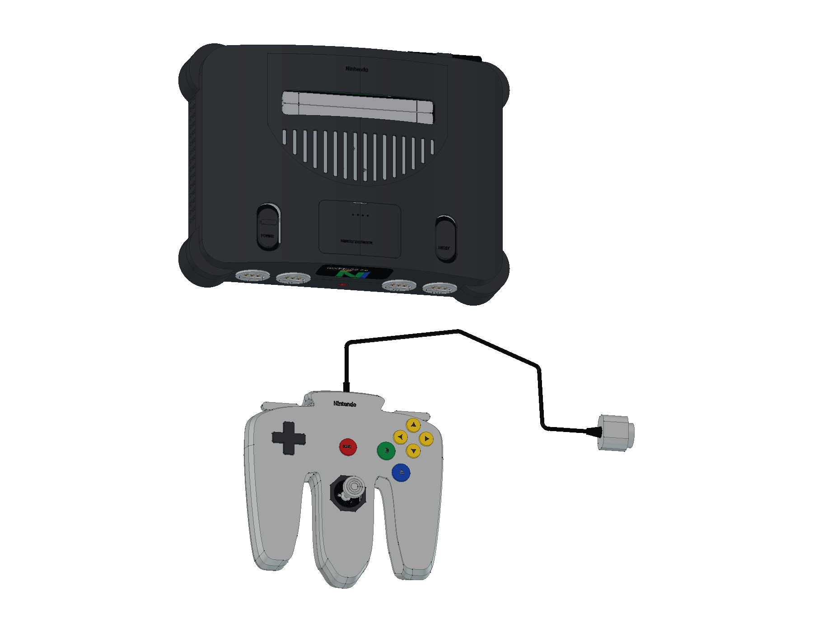
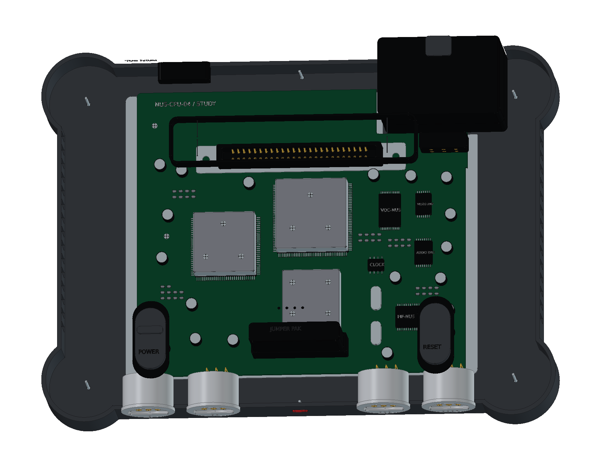

# Nintendo 64 · NUS-001

初代灰色 Nintendo 64 的 FreeCAD 学习模型，包含 **747 个组件条目、1,352 个实体与 15 轮源码**。提供主机、NUS-005 三叉手柄、原始 Jumper Pak、空白卡带、可选 Controller Pak 和连接附件，并附 12 页 A3 图纸。

[在线 3D](https://tiansongyu.github.io/open-console-cad/?device=n64&view=assembled#viewer) · [内部结构](https://tiansongyu.github.io/open-console-cad/?device=n64&view=internal#viewer) · [光学摇杆](https://tiansongyu.github.io/open-console-cad/?device=n64&view=mechanism#viewer) · [A3 图册](output/drawings/Nintendo64_Drawings.pdf)

## 文件与使用

- [完整 FreeCAD 工程](output/Nintendo64_Complete.FCStd) · [爆炸装配](output/Nintendo64_Exploded.FCStd)
- [12 页 A3 PDF](output/drawings/Nintendo64_Drawings.pdf) · [原生图纸](output/Nintendo64_Drawings.FCStd) · [SVG 与排版源码](output/drawings/)
- [整套 STEP](output/Nintendo64_FullKit.step) · [主机与手柄 STEP](output/Nintendo64_Console.step) · [爆炸 STEP](output/Nintendo64_Exploded.step)
- [组件清单](output/COMPONENTS.csv) · [逐轮记录](ITERATIONS.md) · [资料来源](references/SOURCES.md)

使用 FreeCAD 1.1.3 打开工程，或运行 [Open_Nintendo64.FCMacro](Open_Nintendo64.FCMacro) 同时打开整机、爆炸装配和图纸。[Rebuild_Nintendo64.FCMacro](Rebuild_Nintendo64.FCMacro) 执行全部源码并生成 CAD 与 STEP，结果写入 `output/rebuilt/`，保留正式文件。请保留完整仓库结构。

模型保留原生剖面草图、凸台、放样、圆角及布尔加工历史。局部轮廓和内构主要由源码控制，参数表记录主体参考尺寸。修改后需重新检查装配，并同步导出图纸与网页网格。

## 模型内容

主机包含拱形空心上盖、四角低台、四个三路手柄接口、对开卡槽防尘门、内存扩展盖、椭圆 POWER/RESET、Multi Out 和可拆电源模块。内部参考 NUS-CPU-04，表示 CPU、RCP、两片 RDRAM、音视频和接口封装，以及上下屏蔽、三个导热块与折弯横梁。

手柄保留三叉曲线壳、十字键、红色 START、蓝 A 绿 B、四颗黄色 C 键、八角摇杆导向、肩键和背部 Z 键。光学模块含回中弹簧、交叉支承、开槽编码轮与独立光电元件，另外提供主板、硅胶接点、32 位扩展接口、三芯连接线与六芯模块线束。

Jumper Pak 按原始终端模块制作，未混入后期扩展 RAM。学习附件包括弧顶空白 Game Pak、带备份电池与 SRAM 示意的可选 Controller Pak、固定 AC 线和立体声 Multi Out 转三 RCA 线。卡带标签由项目原创，不包含游戏封面或数据。

网页提供十五种视图，可分别观察主机、手柄内部、光学摇杆、主板、终端模块、卡槽、电源、媒体和完整附件。每个网格节点保留对应的原生组件编号与分层位移。

## 尺寸与版本边界

任天堂官方主体参考为 **260 × 190 × 73 mm**。当前主机模型包含表面标识的包络约 **260 × 190 × 73.07 mm**，独立控制器、外伸线缆与附件另计。孔位、壁厚、曲面和内部尺寸均为学习近似，不作为原厂制造尺寸使用。

原始外壳系列包含多个板件版本，NUS-CPU-04 的拆机照片用于内部布局参考，不宣称复刻首批电路。电子封装、电源、光学机构与硅胶接点只表示结构，不定义可制造电路、动态性能、材料牌号或公差。线缆长度为收纳展示长度。

## 验证记录

- [完整源码重建](output/reports/rebuild_verification.json)：从新工程执行 15 轮，747 个组件的有效性、实体数、包围盒和体积逐项一致。
- [严格实体检查](output/reports/strict_bop_audit.json)：全部物理组件通过严格 BRep 检查。
- [整套装配求交](output/reports/final_interference_audit.json)：1,882 对候选组件检查完成，无超过 0.000001 mm³ 的干涉。
- [原生与 STEP 回读](output/reports/export_roundtrip_audit.json)：两份原生装配和三份 STEP 通过，实体逐一匹配，数值积分差异另经双向布尔差集核对。
- [图纸尺寸](output/reports/drawing_checks.json) · [原生图页](output/reports/native_drawings_audit.json) · [保存后重开](output/reports/native_drawings_reload.json)：12 页与 14 个原生尺寸引用。
- [图册视觉验收](output/reports/visual_acceptance.json) · [独立复核](output/reports/independent_pdf_review.json) · [网页预览检查](output/reports/web_preview_checks.json)。

部分曲面加工保留分段边界，以避免自动合并产生无效曲线。早期记录保留当时发现的问题，交付以最终报告为准。图纸是当前模型的版本快照，修改几何后需要重新生成。

原创代码和有权许可的模型内容采用根目录 MIT 协议。第三方名称、产品设计、字体和资料保留各自权利，见 [第三方声明](../../THIRD_PARTY_NOTICES.md)。
