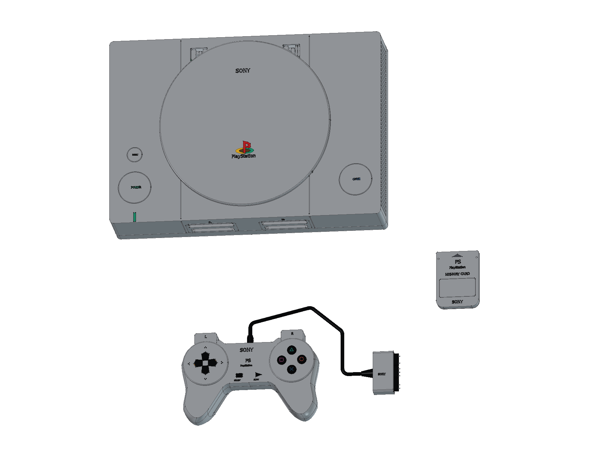
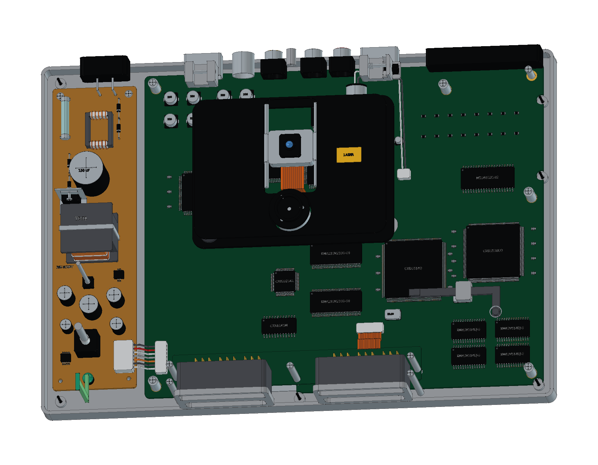

# Sony PlayStation — SCPH-1000

初代日版灰色 PlayStation 的 FreeCAD 结构学习模型，包含 **SCPH-1010 数字手柄、SCPH-1020 记忆卡、电源线、AV视频线和空白 12 cm 光盘**。提供完整工程、分层爆炸、彩色 STEP、12 页 A3 图纸和十八种交互视图。

模型包含 **929 个组件条目、4,149 个实体与 25 轮建模源码**。组件条目与实体数量分开统计；一个组件可以包含多枚触点、引脚或文字实体。

[在线 3D](https://tiansongyu.github.io/open-console-cad/?device=ps1&view=assembled#viewer) · [读取机构](https://tiansongyu.github.io/open-console-cad/?device=ps1&view=optical#viewer) · [原版数字手柄](https://tiansongyu.github.io/open-console-cad/?device=ps1&view=controller#viewer) · [A3 图册](output/drawings/PlayStation_Drawings.pdf)

## 交付文件

- [完整 FreeCAD 工程](output/PlayStation_Complete.FCStd) · [爆炸装配](output/PlayStation_Exploded.FCStd)
- [12 页 A3 PDF](output/drawings/PlayStation_Drawings.pdf) · [原生图纸](output/PlayStation_Drawings.FCStd) · [SVG 与排版源码](output/drawings/)
- [整套 STEP](output/PlayStation_FullKit.step) · [主机、手柄与记忆卡 STEP](output/PlayStation_Console.step) · [爆炸 STEP](output/PlayStation_Exploded.step)
- [组件清单](output/COMPONENTS.csv) · [逐轮记录](ITERATIONS.md) · [资料来源](references/SOURCES.md)

## 版本与尺寸依据

外观选择初代日版 **SCPH-1000**：灰色侧翼外壳、圆形光驱盖、独立 POWER / RESET / OPEN，以及原版前后接口。手柄选择紧凑的 **SCPH-1010 数字控制器**，保留分离方向键、四色符号面键、SELECT / START、双层肩键和八处后壳固定。

Sony 官方说明书中的 **270 × 188 × 60 mm** 对应后期 **SCPH-5500 家族规格**，本项目将其作为 SCPH-1000 的近似包络参考。当前主机包含外伸接口和标识的模型包络约 **270 × 188.9 × 60.043 mm**；手柄、记忆卡与连接线另计。图纸中的局部数字均为当前模型测量值。

- **前后接口**：双层记忆卡与手柄接口、独立防尘门及转轴，保留 8 接点卡槽、9 位置手柄插座，以及 S-Video、三路 RCA、RFU DC、串口、AV MULTI、68 接点并口和非极性 AC 输入。
- **圆盖与开盖机构**：原生圆盖、一体轴耳和锁钩、钢轴、回位弹簧、单侧齿扇、旋转阻力件与 OPEN 释放滑块。
- **读取机构**：三点橡胶悬挂、主轴与夹盘球、双导轨光头、进给电机、蜗杆、减速齿轮、齿条和软排线。
- **PU-7 双面主板**：CPU、GPU、SPU、主内存、显存、音视频转换、CD 控制与伺服相关封装，配有独立引脚、焊盘、滤波和接口器件。
- **供电与固定**：独立电源板、玻璃保险管、输入磁芯与线圈、变压器、整流和输出滤波、七芯供电线束；分层屏蔽、绝缘支承、六处非对称机壳固定和底部通风。
- **数字手柄**：原生曲线草图与空心放样壳、按键传动柱、硅胶膜、分离碳膜接点、方向键导架、两块肩键小板及分层线束。九位置插头保留数字手柄使用的七个接点。
- **记忆卡与连接附件**：SCPH-1020 滑动后盖、两处固定、八枚金手指及大板家族内构；日式两片电源插头、八字设备端、十二位置 AV MULTI 转三 RCA 线，以及不含游戏数据的空白 CD。

主板参考实物 PU-7 `1-655-322-13A`。SCPH-1020 的同一型号存在不同大小的 PCB，本模型选择大板作为内部参考，其生产日期未作确定归属。手柄与记忆卡尺寸、孔位、壁厚、引脚、电子器件及线束均为学习近似，不复现制造公差或生产电路，也不执行机械运动、光学读写或电气仿真。详见 [SOURCES.md](references/SOURCES.md)。

## 查看与重建

使用 FreeCAD 1.1.3 打开工程，或运行 [Open_PlayStation.FCMacro](Open_PlayStation.FCMacro) 打开完整装配、爆炸模型和原生图纸。通过装配分组切换可见性，并查看原生草图、凸台、圆角、放样与布尔历史。

保留仓库结构，运行 [Rebuild_PlayStation.FCMacro](Rebuild_PlayStation.FCMacro)，可按 25 轮源码重新生成 CAD / STEP，结果写入 `output/rebuilt/`。图纸和网页网格按仓库 [README](../../README.md) 的交付流程另行更新。主要源码为 [ps1.py](../../tools/cadlib/ps1.py)。

## 验证范围

- [完整源码重建](output/reports/rebuild_verification.json)：新工程执行全部源码，逐组件核对有效性、实体数量、边界和体积；数值积分差异使用双向布尔差集确认。
- [严格 BRep](output/reports/strict_bop_audit.json) · [装配求交](output/reports/final_interference_audit.json)：检查保存模型的实体与装配间隙。
- [原生与 STEP 回读](output/reports/export_roundtrip_audit.json)：两份原生装配、三份 STEP 逐实体匹配，并核对彩色实体记录。
- [图纸尺寸](output/reports/drawing_checks.json) · [原生图页](output/reports/native_drawings_audit.json) · [保存后重开](output/reports/native_drawings_reload.json)。
- [图册视觉检查](output/reports/visual_acceptance.json) · [独立复核](output/reports/independent_pdf_review.json) · [网页预览检查](output/reports/web_preview_checks.json)。

检查结果对应当前保存的交付文件；历史阶段报告保留修正过程。建模通过 neka-nat/freecad-mcp 在 FreeCAD 主线程执行，网页网格直接由组件 BRep 导出；修改几何后需重新生成并核对交付文件。

本设备随仓库采用 [MIT 许可证](../../LICENSE)。本项目为非官方学习项目，第三方名称与标识归相应权利人所有。
