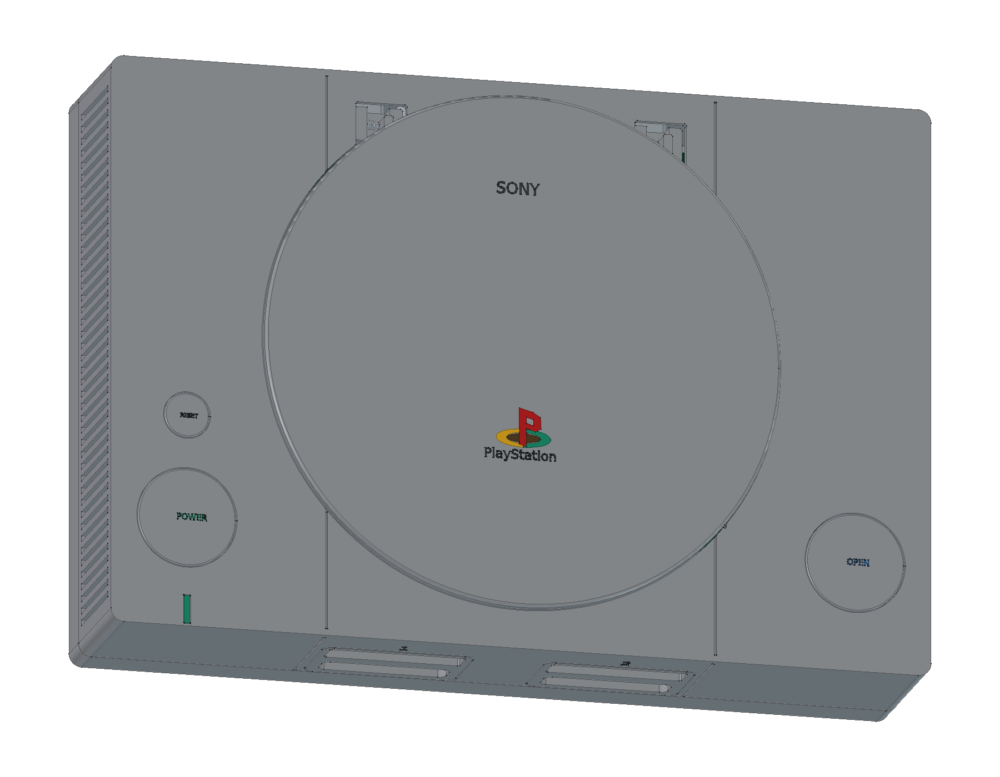
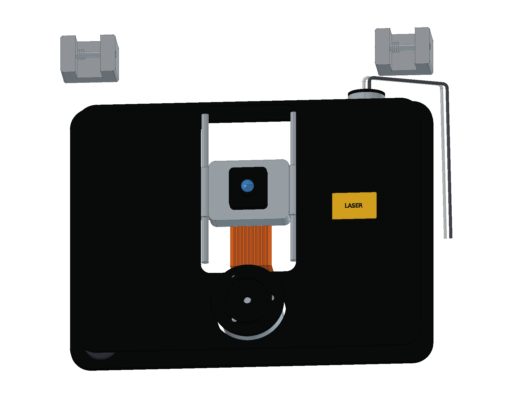
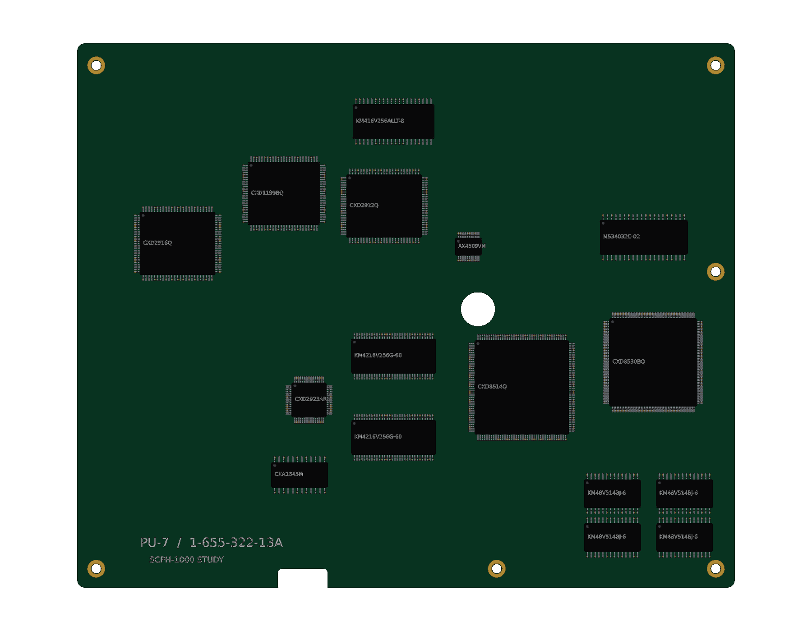

# Sony PlayStation · SCPH-1000

初代日版灰色 PlayStation 的建模进行中。当前完成 **8 轮建模、379 个组件条目**，涵盖外壳与操作键、双手柄/记忆卡接口、初代后部接口、光驱及主要 PU-7 电路封装。

- [当前阶段 FreeCAD 工程](output/PlayStation_Study.FCStd)
- [从源码重建当前阶段](Rebuild_PlayStation.FCMacro) · [逐轮记录](ITERATIONS.md)
- [第八轮装配检查](output/reports/stage08_interference.json) · [前八轮源码重建核对](output/reports/stage08_rebuild.json)
- [参考来源与版本边界](references/SOURCES.md)

使用 FreeCAD 1.1.3 打开工程。原生模型保留草图、凸台、圆角、布尔加工及盖板轴耳的融合历史。重建宏将输出写入 `output/rebuilt/`；需保留完整仓库结构。

## 当前模型内容

- **前后接口**：两个独立记忆卡防尘门、8 接点卡槽、9 接点手柄插座，以及日版初代的 S-Video、RCA、RFU DC、串口、AV Multi、68 接点并口与非极性 AC 输入。
- **光盘机构**：圆盖、锁钩、OPEN 联动滑块、铰链与回位弹簧；三点橡胶悬挂光驱、主轴、夹盘球、双导轨激光头、进给电机、蜗杆、减速轮、齿条和软排线。
- **PU-7 主板**：CPU、GPU、SPU、四片主内存、双显存、音视频转换及 CD 芯片；底面保留 CD 控制器、缓冲 RAM 与电机/伺服驱动。20 个主要封装均带独立引脚、焊盘及标识。

第八轮装配检查覆盖 718 对候选组件；前期发现的轴座、锁钩、夹盘球、齿轮和线束干涉已在后续轮次修正。历史报告保留当时的结果，当前版本以最新检查为准。

主机包络以同系列 SCPH-5500 官方说明书的 270 × 188 × 60 mm 为参考；尚未取得 SCPH-1000 原厂尺寸图，所有尺寸均为学习近似，外伸接口和标识另计。当前仍需补齐电源板、分立元件、屏蔽和紧固结构、原始数字手柄及附件，并完成最终 STEP、图册和网页交付。

原创代码和有权许可的模型内容采用根目录 MIT 协议。第三方名称、设计与参考材料保留各自权利，见 [第三方声明](../../THIRD_PARTY_NOTICES.md)。
