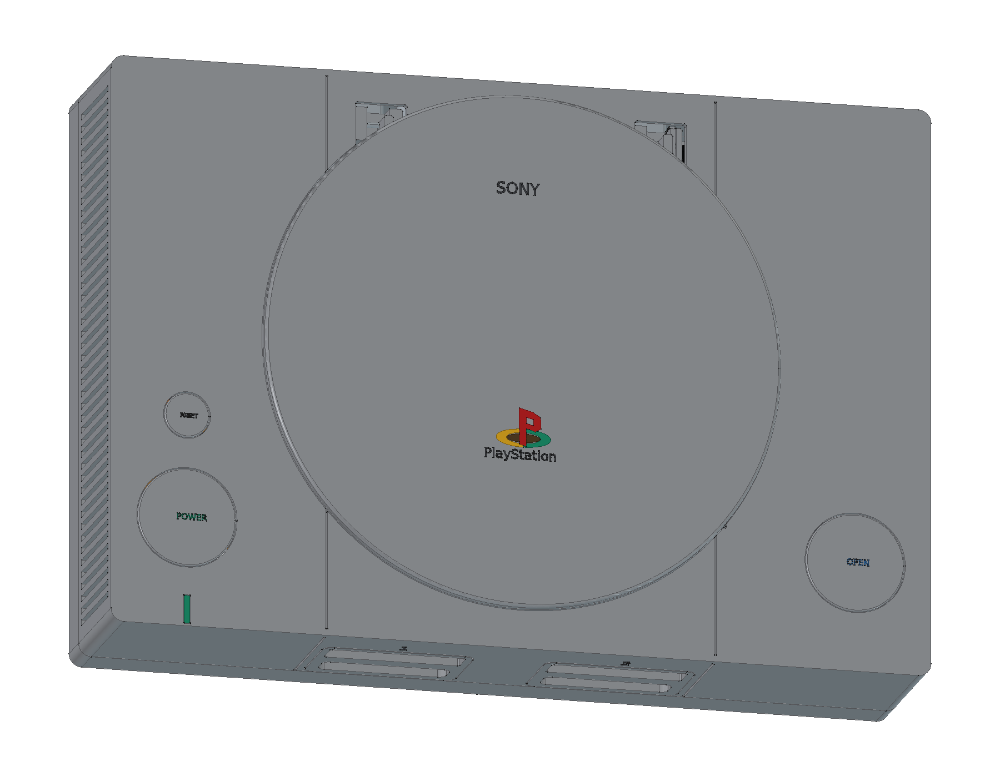
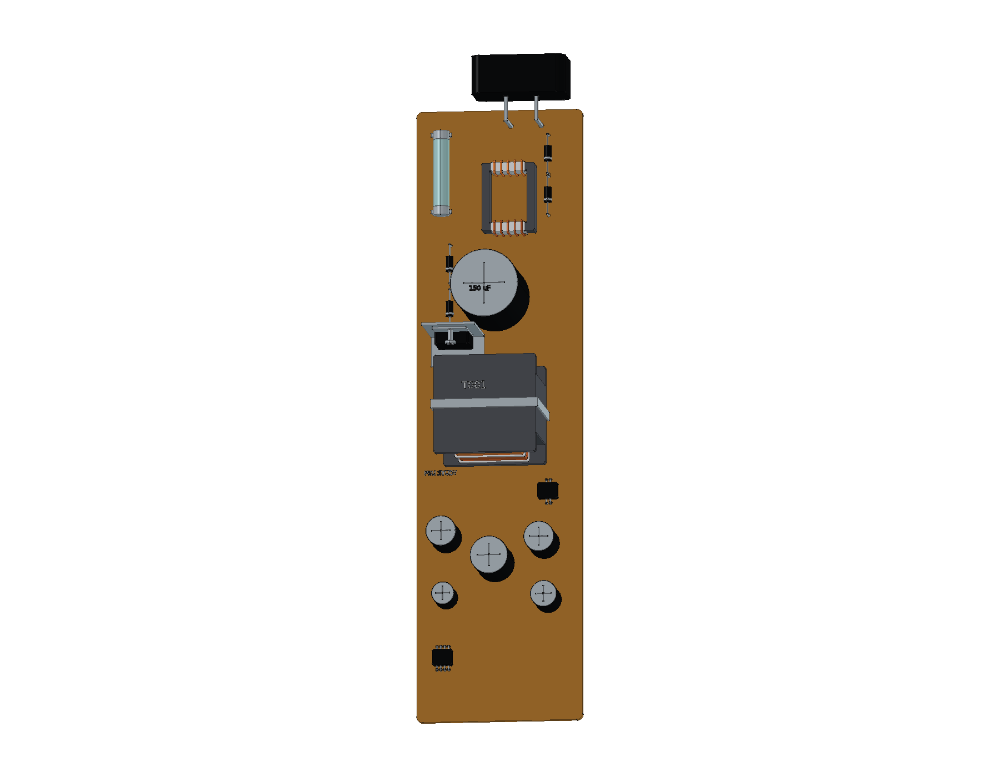
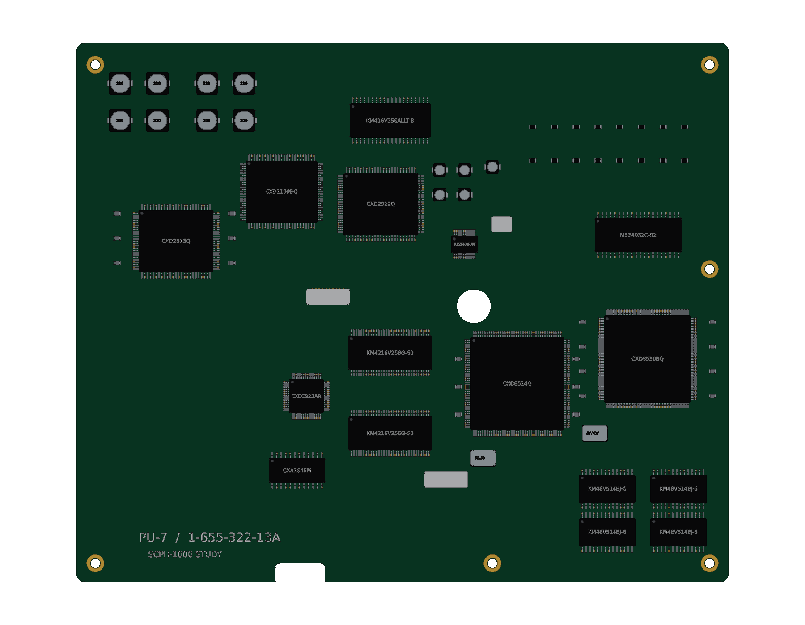
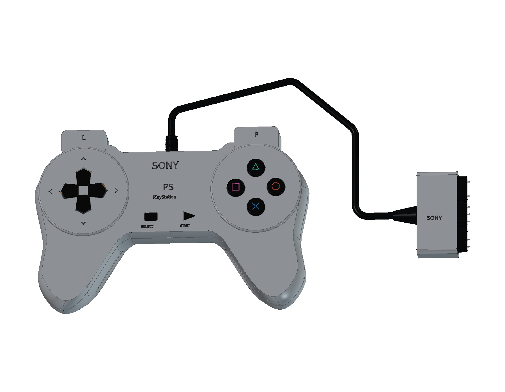

# Sony PlayStation · SCPH-1000

初代日版灰色 PlayStation 的建模进行中。当前保留 **19 轮源码、843 个组件条目、3,879 个实体**。主机前十五轮已通过验证，新增 SCPH-1010 数字手柄处于装配修正阶段。

- [当前阶段 FreeCAD 工程](output/PlayStation_Study.FCStd)
- [从源码重建当前阶段](Rebuild_PlayStation.FCMacro) · [逐轮记录](ITERATIONS.md)
- [前十五轮主机装配检查](output/reports/stage15_interference.json) · [前十五轮源码重建核对](output/reports/stage15_rebuild.json)
- [参考来源与版本边界](references/SOURCES.md)

使用 FreeCAD 1.1.3 打开工程。原生模型保留草图、凸台、圆角、布尔加工及盖板轴耳的融合历史。重建宏将输出写入 `output/rebuilt/`；需保留完整仓库结构。

## 当前模型内容

- **前后接口**：两个独立记忆卡防尘门、8 接点卡槽、9 接点手柄插座，以及日版初代的 S-Video、RCA、RFU DC、串口、AV Multi、68 接点并口与非极性 AC 输入。
- **光盘机构**：圆盖、锁钩、OPEN 联动滑块、铰链与回位弹簧；三点橡胶悬挂光驱、主轴、夹盘球、双导轨激光头、进给电机、蜗杆、减速轮、齿条和软排线。
- **PU-7 主板**：CPU、GPU、SPU、四片主内存、双显存、音视频转换及 CD 芯片；底面保留 CD 控制器、缓冲 RAM 与电机/伺服驱动。20 个主要封装均带独立引脚、焊盘及标识。
- **分立元件与供电**：主板滤波、去耦与接口电阻，独立电源 PCB、保险管、矩形磁芯输入滤波、变压器、整流及输出滤波；七芯线束、两端插座与 POWER/RESET 传动。
- **机械固定**：上下屏蔽、电源隔板、前接口罩、绝缘支撑与固定螺钉；底壳保留六处非对称沉孔、四组通风槽、矩形脚垫与学习铭牌，盖板增加单侧齿扇和旋转阻力机构。

前十五轮主机完成 **2,213 对装配候选的求交检查**，该阶段无剩余干涉；前十五轮在新工程中完整重建，726 个组件的实体数量、边界和体积逐项一致。同类固定柱采用批量构造以减少重建开销。历史报告保留轴座、锁钩、齿轮、线束和屏蔽配合的修正过程，该记录不覆盖第十六轮之后新增的手柄。

主机包络以同系列 SCPH-5500 官方说明书的 270 × 188 × 60 mm 为参考；尚未取得 SCPH-1000 原厂尺寸图，所有尺寸均为学习近似，外伸接口和标识另计。SCPH-1010 手柄已包含曲面上下壳、方向键、四色符号键、肩键、PCB 与硅胶接点、八处螺钉、七芯线束和插头。[第十九轮诊断](output/reports/stage19_controller_diagnostic.json) 发现 31 处手柄局部干涉，仍需修正按键、板边和肩键线束。记忆卡等附件及最终 STEP、图册和网页交付尚未完成。

原创代码和有权许可的模型内容采用根目录 MIT 协议。第三方名称、设计与参考材料保留各自权利，见 [第三方声明](../../THIRD_PARTY_NOTICES.md)。
