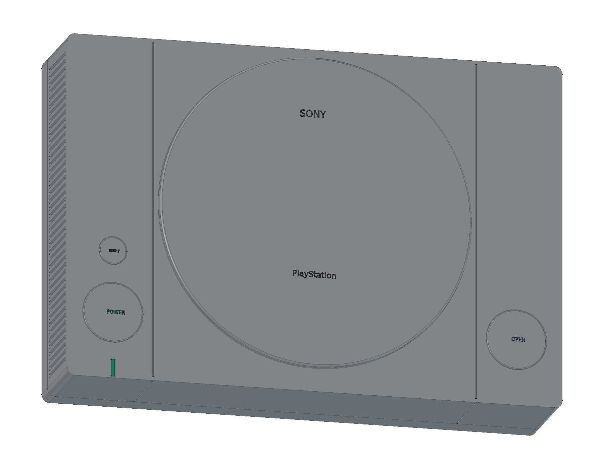

# Sony PlayStation · SCPH-1000

初代日版灰色 PlayStation 的建模进行中。当前完成前两轮：上下空心壳、侧翼分界、圆形光盘盖、POWER/RESET/OPEN 按键、电源灯和两侧贯穿散热槽，共 **16 个组件条目**。

- [当前阶段 FreeCAD 工程](output/PlayStation_Study.FCStd)
- [从源码重建当前阶段](Rebuild_PlayStation.FCMacro) · [逐轮记录](ITERATIONS.md)
- [装配检查](output/reports/stage02_interference.json) · [独立工程源码重建核对](output/reports/stage02_rebuild.json)
- [参考来源与版本边界](references/SOURCES.md)

使用 FreeCAD 1.1.3 打开工程。原生模型保留三组草图、凸台、圆角和布尔加工历史。重建宏将输出写入 `output/rebuilt/`；需保留完整仓库结构。

主机包络以同系列 SCPH-5500 官方说明书的 270 × 188 × 60 mm 为参考；尚未取得 SCPH-1000 原厂尺寸图，所有尺寸均为学习近似。当前尚未完成前后接口、光驱机构、内部电路、原始数字手柄与附件，也尚未交付最终 STEP、图册或在线模型。

原创代码和有权许可的模型内容采用根目录 MIT 协议。第三方名称、设计与参考材料保留各自权利，见 [第三方声明](../../THIRD_PARTY_NOTICES.md)。
