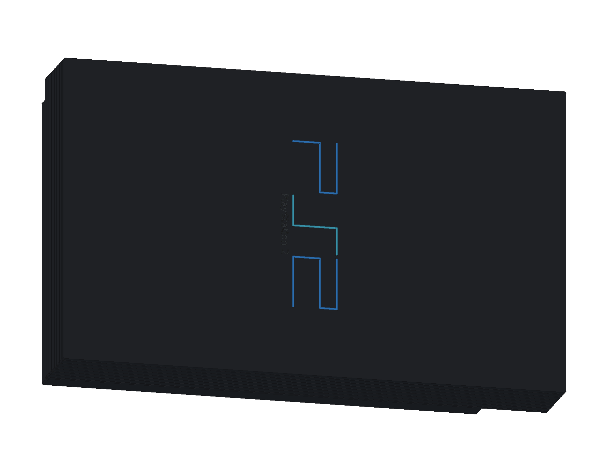
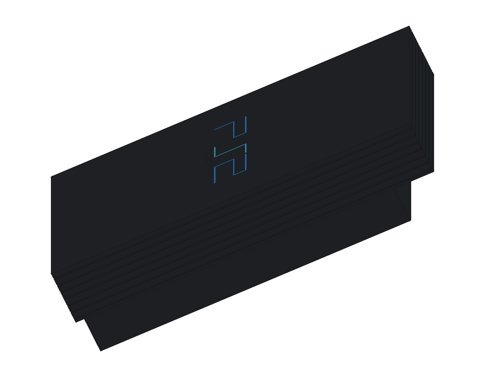

# Sony PlayStation 2 · SCPH-10000

初代日版 PlayStation 2 正在建模。当前完成 **1 轮源码、10 个组件条目与 22 个实体**，包括原生上下空心壳、非对称底部阶梯、横向沟槽、四个脚垫和顶面标识。

- [当前 FreeCAD 工程](output/PlayStation2_Study.FCStd)
- [重建当前阶段](Rebuild_PlayStation2.FCMacro) · [逐轮记录](ITERATIONS.md)
- [首轮重建核对](output/reports/stage01_rebuild.json) · [首轮装配检查](output/reports/stage01_interference.json)
- [官方资料与建模边界](references/SOURCES.md)

使用 FreeCAD 1.1.3 打开工程。原生草图、凸台、圆角与布尔加工保留在模型树中，重建宏将生成文件写入 `output/rebuilt/`。

版本依据为 Sony SCPH-10000 官方说明书中的 **301 × 182 × 78 mm** 主体包络，选择带 PC CARD 的初代日版。底壳阶梯、壁厚、沟槽、标识和显示材料为照片指导的学习近似。后续将补充双层卡槽与手柄接口、USB / i.LINK、光驱、PC CARD、GH-001 主板、独立供电、散热、DualShock 2 与配套附件。

当前首轮实体检查与新工程重建通过。完整 CAD / STEP、12 页图册和网页预览在完成后续建模及交付验证后加入模型库。

本设备随仓库采用 [MIT 许可证](../../LICENSE)，第三方名称与标识归相应权利人所有。
