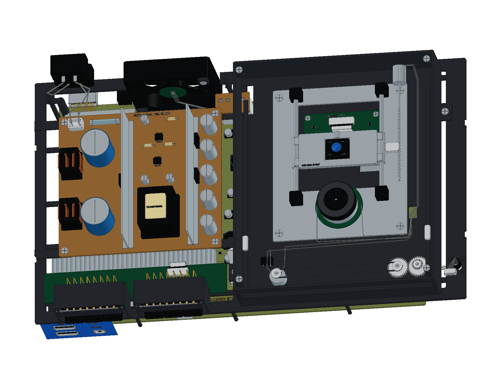
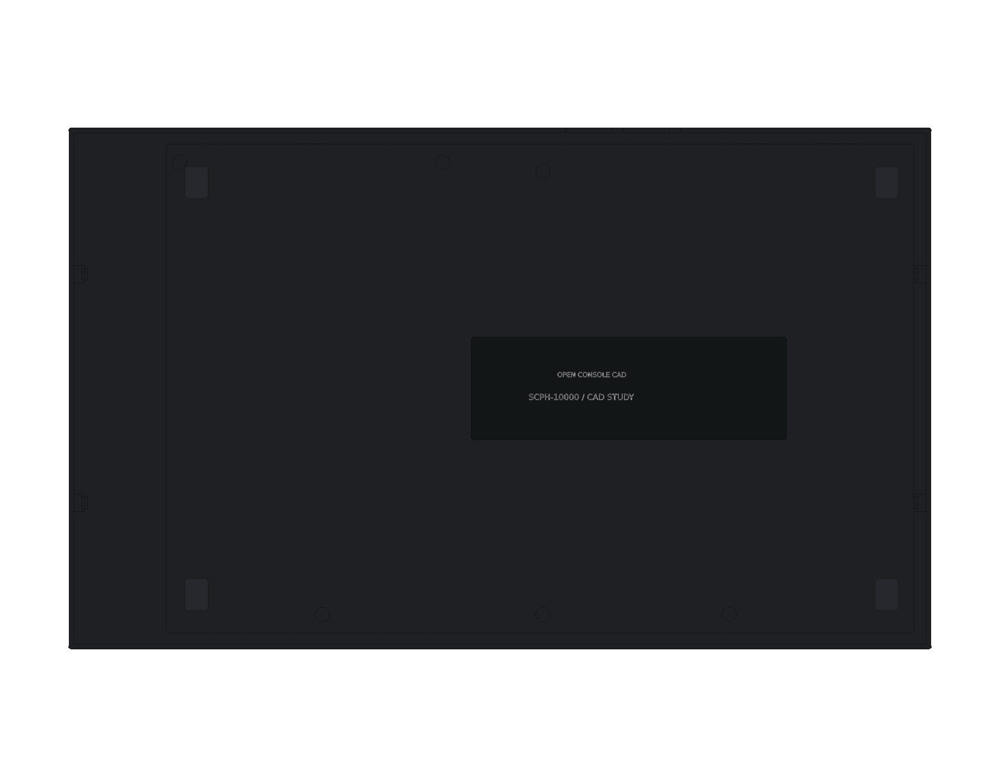
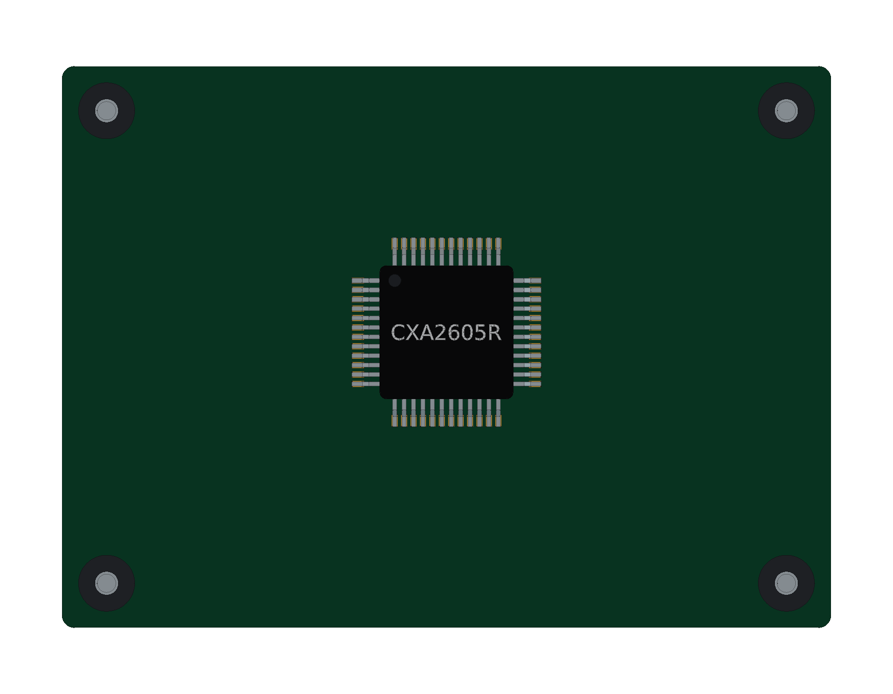

# Sony PlayStation 2 · SCPH-10000

初代日版 PlayStation 2 正在建模。当前完成 **24 轮源码、1,059 个组件条目与 6,204 个实体**，包括原生阶梯外壳、前后接口、盘托与控制键、双面主板、屏蔽、中框、散热、内部电源板、初代光驱内构、线束与机壳固定件。DualShock 2 与配套附件继续制作。

<table>
<tr>
<td align="center" width="33%"> 主机内构</td>
<td align="center" width="33%"> 底壳细节</td>
<td align="center" width="33%"> 光驱 RF 板</td>
</tr>
</table>

- [当前 FreeCAD 工程](output/PlayStation2_Study.FCStd)
- [重建当前阶段](Rebuild_PlayStation2.FCMacro) · [逐轮记录](ITERATIONS.md)
- [二十四轮完整重建](output/reports/stage24_rebuild.json) · [严格实体检查](output/reports/stage24_strict_bop.json) · [装配检查](output/reports/stage24_interference.json)
- [官方资料与建模边界](references/SOURCES.md)

可在 FreeCAD 的 Python 环境中运行 [实体几何比对工具](../../tools/cadlib/compare_native.py)，比较当前工程与宏重建的工程；该工具对不相同的 BRep 做双向布尔差集检查，避免仅比较体积和包络而漏掉孔位变化。

使用 FreeCAD 1.1.3 打开工程。原生草图、凸台、圆角与布尔加工保留在模型树中，重建宏将生成文件写入 `output/rebuilt/`。

版本依据为 Sony SCPH-10000 官方说明书中的 **301 × 182 × 78 mm** 主体包络，选择带 PC CARD 的初代日版。底壳阶梯、壁厚、沟槽、标识和显示材料为照片指导的学习近似。当前含外伸接口和标识的模型包络约 301 × 185.45 × 78.043 mm。

## 已建结构

- 两组原版卡槽与手柄插座：带轴耳的防尘门、钢轴、回位弹簧、共享 PCB、八接点卡槽和九位置手柄接口，端子带穿板脚。
- 蓝色双 USB / i.LINK 面板：独立金属套、绝缘舌片、接点与下部贯通进风栅格。
- 原生盘托与独立前盖：12 cm 媒体凹槽、主轴开口、连接舌片、复位和出仓按键、传动柱、小控制板与状态灯。
- 原始后部接口：十二位置 AV MULTI、光纤输出、非极性 AC 输入、倾斜主电源翘板和跨阶梯外壳的风扇栅格。
- PC CARD Type III：金属导向笼、两排 68 接点、保护盖及导向臂、弹出按钮、推杆、杠杆与枢轴。
- GH-001 主板：原生板体、独立接口穿板孔和接地环；EE / GS 金属顶盖、双 RDRAM、IOP 与音频区域、供电调节器、电感、滤波电容及 CR2032 电池座。
- 背面电子结构：七组描述性逻辑封装、三处导热垫、阻容元件、五组排线插座、三位置风扇连接器和时钟罐体。
- 下部屏蔽结构：原生板料、周边折起接触指、排线检修开口、浅压凸区和四组支座与盲孔螺钉。

- 原生中框：电源和光驱分区、九组主板支柱与固定螺钉、PC CARD 支撑件及电源板安装台。
- 散热系统：芯片导热界面、金属均热板、成对弯曲热管、鳍片组、七叶后排风扇与固定结构。
- 内部电源板：独立原生 PCB、输入扼流圈、变压器、滤波电容、玻璃保险丝、功率器件、输入和主板耦合接点。

- 初代光驱：长开口盘托、纵向导轨与齿条、皮带及减速传动、主轴电机、KHS-400A 结构示意光头、进给丝杆、四组隔振安装件、网格上盖和磁性夹盘。
- 独立光驱板：GM-038 系列板体、底面 CXA2605R 示意封装、热窗口、排线插座及安装件。

- 内部布线：风扇、电源、按键与电机线束，手柄接口与光驱排线；独立绝缘插头、磁环、导向柱和真实穿线路径。
- 机壳固定：十组底部固定件、四个原始脚垫位置、六个螺钉盖、上壳卡扣及中框避让槽；底部标签明确标注 CAD STUDY。

主板的局部尺寸、器件选择和封装引脚排布为照片指导的结构示意。背面无法确认的芯片使用描述性标识，右下角 ROM 的识别保留来源中的不确定性；模型不含电气网络或可用于维修的 PCB 设计。

全部 1,059 个组件的严格 BRep 检查、4,183 对装配候选和二十四轮源码重建通过；重建比对使用 BRep 一致性或双向布尔差集验证，记录见上方报告。完整 CAD / STEP、12 页图册和网页预览在完成其余结构及最终交付验证后加入模型库。机构目前只表示静态装配关系。

本设备随仓库采用 [MIT 许可证](../../LICENSE)，第三方名称与标识归相应权利人所有。
