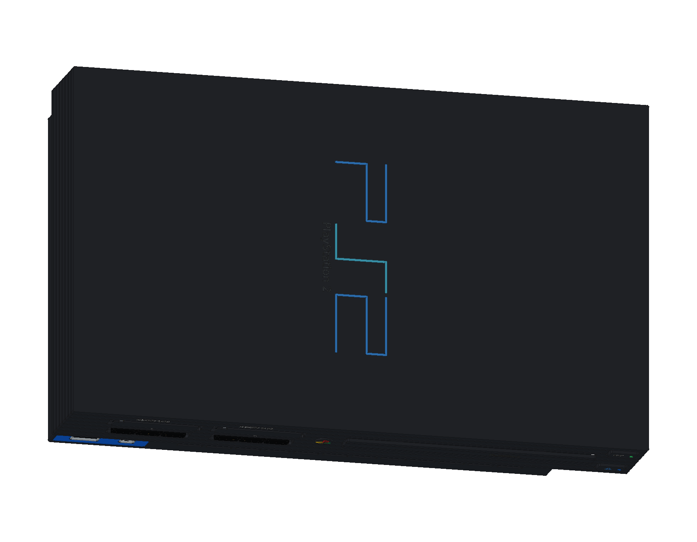
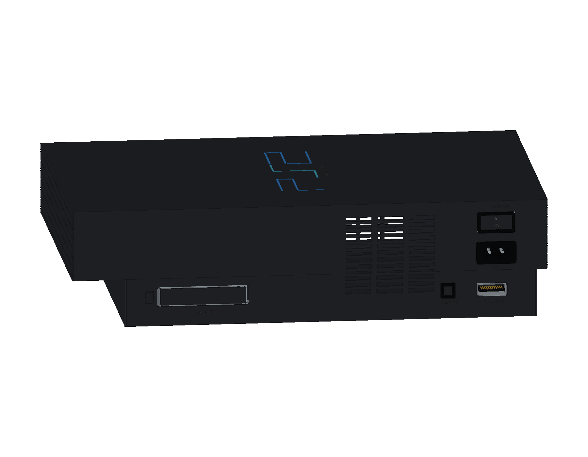

# Sony PlayStation 2 · SCPH-10000

初代日版 PlayStation 2 正在建模。当前完成 **6 轮源码、216 个组件条目与 314 个实体**，已包括原生阶梯外壳、前后接口、盘托与控制键，以及 PC CARD 槽和弹出机构。主板、散热、光驱内构、DualShock 2 与配套附件继续制作。

- [当前 FreeCAD 工程](output/PlayStation2_Study.FCStd)
- [重建当前阶段](Rebuild_PlayStation2.FCMacro) · [逐轮记录](ITERATIONS.md)
- [六轮完整重建](output/reports/stage06_rebuild.json) · [严格实体检查](output/reports/stage06_strict_bop.json) · [装配检查](output/reports/stage06_interference.json)
- [官方资料与建模边界](references/SOURCES.md)

使用 FreeCAD 1.1.3 打开工程。原生草图、凸台、圆角与布尔加工保留在模型树中，重建宏将生成文件写入 `output/rebuilt/`。

版本依据为 Sony SCPH-10000 官方说明书中的 **301 × 182 × 78 mm** 主体包络，选择带 PC CARD 的初代日版。底壳阶梯、壁厚、沟槽、标识和显示材料为照片指导的学习近似。当前含外伸接口和标识的模型包络约 301 × 185.45 × 78.043 mm。

## 已建结构

- 两组原版卡槽与手柄插座：带轴耳的防尘门、钢轴、回位弹簧、共享 PCB、八接点卡槽和九位置手柄接口，端子带穿板脚。
- 蓝色双 USB / i.LINK 面板：独立金属套、绝缘舌片、接点与下部贯通进风栅格。
- 原生盘托与独立前盖：12 cm 媒体凹槽、主轴开口、连接舌片、复位和出仓按键、传动柱、小控制板与状态灯。
- 原始后部接口：十二位置 AV MULTI、光纤输出、非极性 AC 输入、倾斜主电源翘板和跨阶梯外壳的风扇栅格。
- PC CARD Type III：金属导向笼、两排 68 接点、保护盖及导向臂、弹出按钮、推杆、杠杆与枢轴。

216 个组件的严格 BRep 检查、全部 611 对装配候选和六轮新工程重建通过。完整 CAD / STEP、12 页图册和网页预览在完成其余结构及最终交付验证后加入模型库。机构目前只表示静态装配关系。

本设备随仓库采用 [MIT 许可证](../../LICENSE)，第三方名称与标识归相应权利人所有。
