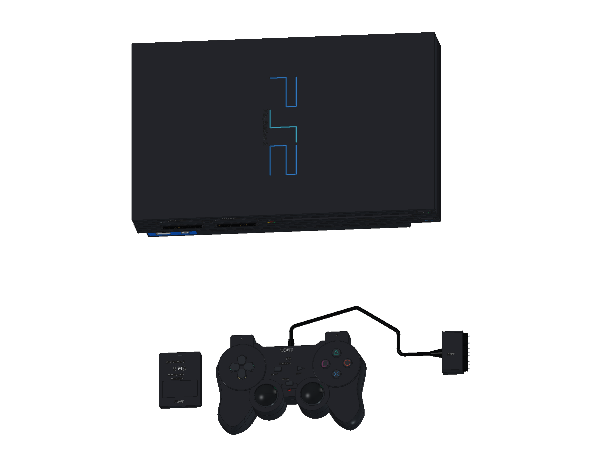
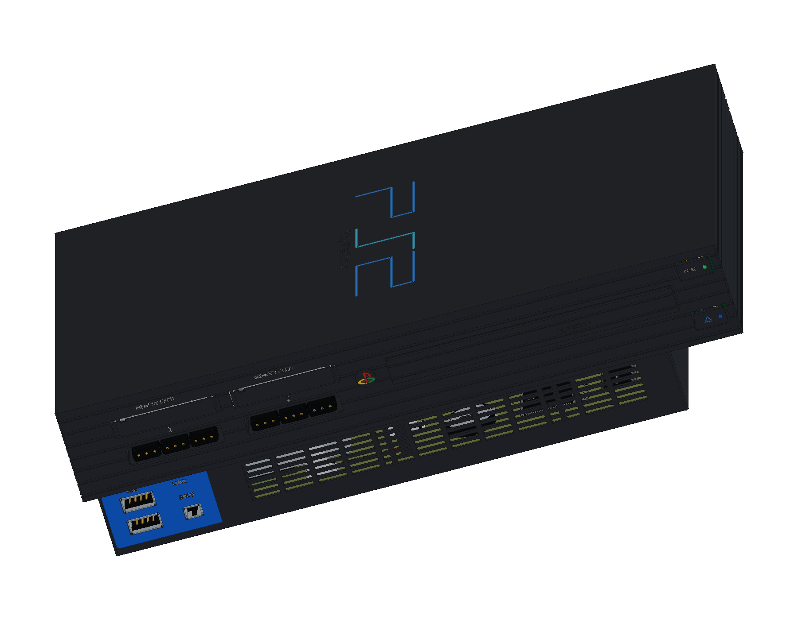
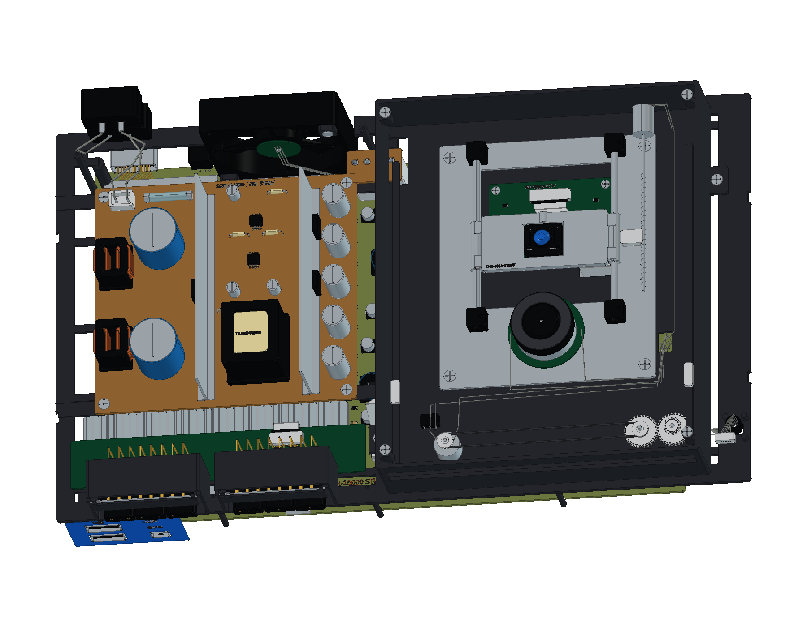
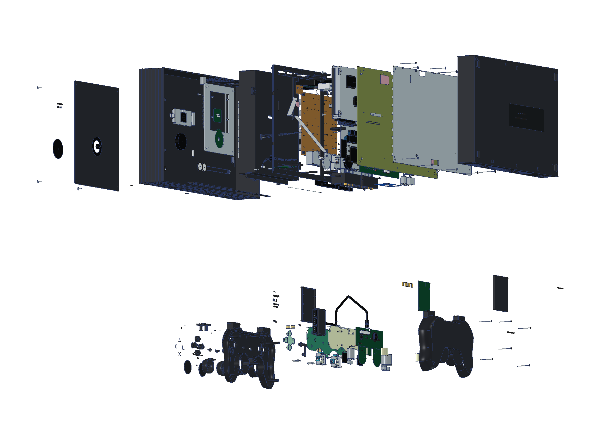
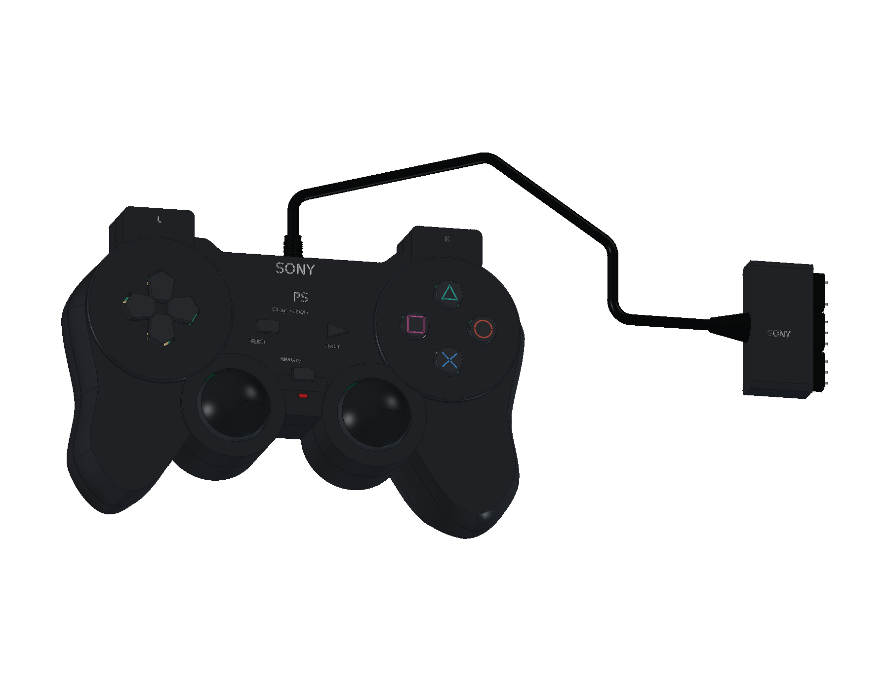
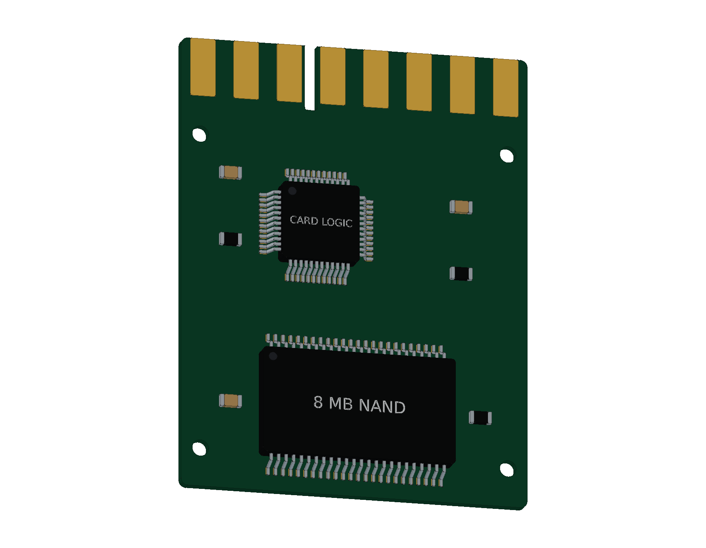

# Sony PlayStation 2 · SCPH-10000

初代日版 PlayStation 2 已完成 **34 轮源码、1,352 个组件条目与 6,992 个实体**，包括主机、DualShock 2、8 MB 记忆卡、电源与 AV 连接线及空白介质。提供原生整机与爆炸工程、三份彩色 STEP、12 页 A3 PDF / SVG / 原生图纸，以及 21 个交互式网页视图。

<table>
<tr>
<td align="center" width="33%"> 主机、手柄与记忆卡</td>
<td align="center" width="33%"> 初代阶梯外观</td>
<td align="center" width="33%"> 主机内部结构</td>
</tr>
<tr>
<td align="center" width="33%"> 分层爆炸装配</td>
<td align="center" width="33%"> DualShock 2</td>
<td align="center" width="33%"> 记忆卡内部</td>
</tr>
</table>

- [在线 3D 预览](https://tiansongyu.github.io/open-console-cad/?device=ps2&view=assembled#viewer)
- [整套 FreeCAD 工程](output/PlayStation2_Complete.FCStd) · [爆炸工程](output/PlayStation2_Exploded.FCStd) · [打开宏](Open_PlayStation2.FCMacro)
- [整套 STEP](output/PlayStation2_FullKit.step) · [主机与原配 STEP](output/PlayStation2_Console.step) · [爆炸 STEP](output/PlayStation2_Exploded.step)
- [12 页 A3 PDF](output/drawings/PlayStation2_Drawings.pdf) · [HTML 图册](output/drawings/PlayStation2_Drawings.html) · [SVG 图纸目录](output/drawings/) · [FreeCAD 原生图纸](output/PlayStation2_Drawings.FCStd)
- [组件清单](output/COMPONENTS.csv) · [模型清单](output/reports/final_manifest.json)
- [完整重建宏](Rebuild_PlayStation2.FCMacro) · [逐轮记录](ITERATIONS.md)
- [三十四轮完整重建](output/reports/stage34_rebuild.json) · [严格实体检查](output/reports/stage34_strict_bop.json) · [装配检查](output/reports/stage34_interference.json)
- [官方资料与建模边界](references/SOURCES.md) · [完整交付检查](output/reports/completion_audit.json) · [独立图册审阅](output/reports/independent_pdf_review.json) · [网页检查](output/reports/web_preview_checks.json)

可在 FreeCAD 的 Python 环境中运行 [实体几何比对工具](../../tools/cadlib/compare_native.py)，比较当前工程与宏重建的工程；该工具对不相同的 BRep 做双向布尔差集检查，避免仅比较体积和包络而漏掉孔位变化。

使用 FreeCAD 1.1.3 打开工程。原生草图、凸台、圆角与布尔加工保留在模型树中，重建宏将生成文件写入 `output/rebuilt/`。

版本依据为 Sony SCPH-10000 官方说明书中的 **301 × 182 × 78 mm** 主体包络，选择带 PC CARD 的初代日版。底壳阶梯、壁厚、沟槽、标识和显示材料为照片指导的学习近似。当前含外伸接口和标识的模型包络约 301 × 185.45 × 78.043 mm。

## 已建结构

- 两组原版卡槽与手柄插座：带轴耳的防尘门、钢轴、回位弹簧、共享 PCB、八接点卡槽和九位置手柄接口，端子带穿板脚。
- 蓝色双 USB / i.LINK 面板：独立金属套、绝缘舌片、接点与下部贯通进风栅格。
- 原生盘托与独立前盖：12 cm 媒体凹槽、主轴开口、连接舌片、复位和出仓按键、传动柱、小控制板与状态灯。
- 原始后部接口：十二位置 AV MULTI、光纤输出、非极性 AC 输入、倾斜主电源翘板和跨阶梯外壳的风扇栅格。
- PC CARD Type III：金属导向笼、两排 68 接点、保护盖及导向臂、弹出按钮、推杆、杠杆与枢轴。
- GH-001 主板：原生板体、独立接口穿板孔和接地环；EE / GS 金属顶盖、双 RDRAM、IOP 与音频区域、供电调节器、电感、滤波电容及 CR2032 电池座。
- 背面电子结构：七组描述性逻辑封装、三处导热垫、阻容元件、五组排线插座、三位置风扇连接器和时钟罐体。
- 下部屏蔽结构：原生板料、周边折起接触指、排线检修开口、浅压凸区和四组支座与盲孔螺钉。

- 原生中框：电源和光驱分区、九组主板支柱与固定螺钉、PC CARD 支撑件及电源板安装台。
- 散热系统：芯片导热界面、金属均热板、成对弯曲热管、鳍片组、七叶后排风扇与固定结构。
- 内部电源板：独立原生 PCB、输入扼流圈、变压器、滤波电容、玻璃保险丝、功率器件、输入和主板耦合接点。

- 初代光驱：长开口盘托、纵向导轨与齿条、皮带及减速传动、主轴电机、KHS-400A 结构示意光头、进给丝杆、四组隔振安装件、网格上盖和磁性夹盘。
- 独立光驱板：GM-038 系列板体、底面 CXA2605R 示意封装、热窗口、排线插座及安装件。

- 内部布线：风扇、电源、按键与电机线束，手柄接口与光驱排线；独立绝缘插头、磁环、导向柱和真实穿线路径。
- 机壳固定：十组底部固定件、四个原始脚垫位置、六个螺钉盖、上壳卡扣及中框避让槽；底部标签明确标注 CAD STUDY。

## DualShock 2 与套装附件

- 原生曲线放样上下壳、双摇杆杯形舱、六组后部固定件及对应的主板与接点膜避让孔。
- 联动方向键、四色符号面键、SELECT / START / ANALOG、模式灯、两层肩键、独立硅胶膜与碳接点。
- 双轴万向支架、金属框架、电位器、电阻轨道、触点、L3 / R3 按下机构和凸面摇杆胶帽。
- 两种尺寸的振动电机、独立偏心配重、支座与分层引线；控制器线缆、应力释放套和九位置八接点插头。
- 黑色 SCPH-10020 家族记忆卡：分体原生外壳、卡扣、定位柱、带键槽主板、八枚金手指、NAND 与控制封装。
- 日式两片 AC 插头、八字设备端、AV MULTI 转三 RCA 连接线，以及不含软件或光盘图案的空白介质。

[控制器外观](output/previews/32_ds2_review.png) · [后壳固定件](output/previews/32_ds2_bottom.png) · [记忆卡](output/previews/33_memory_card_review.png) · [记忆卡内部](output/previews/33_memory_card_internal.png) · [连接附件](output/previews/34_accessories_review.png)

控制器和记忆卡内部参考后期同型号家族的拆解，不能据此确定首发批次的板型。其外形、壁厚、孔位、元件封装、走线和机构尺寸均为学习近似；电机、摇杆和压力输入不进行功能或运动仿真。

主板的局部尺寸、器件选择和封装引脚排布为照片指导的结构示意。背面无法确认的芯片使用描述性标识，右下角 ROM 的识别保留来源中的不确定性；模型不含电气网络或可用于维修的 PCB 设计。

几何验收覆盖全部 1,352 个组件、5,049 组装配候选和三份 STEP 回读；完整源码重建使用 BRep 一致性或双向布尔差集验证。尺寸图保留 11 个原生端点引用，重新打开后核对测量值。机构只表示静态装配关系。

[Study 到交付工程的几何比对](output/reports/delivery_geometry_audit.json) · [STEP 回读](output/reports/export_roundtrip_audit.json) · [参数修改测试](output/reports/parameter_edit_test.json) · [原生图纸检查](output/reports/native_drawings_audit.json) · [图纸重载](output/reports/native_drawings_reload.json)

重新生成图册时，在 FreeCAD Python 环境运行 `scripts/drawing_geometry.py`，然后设置 `KAMI_HOME` 并运行仓库 `tools/cadlib/build_book.py devices/ps2`。按照 Kami 流程检查内容、字体及全部页面，最后通过 FreeCAD MCP 运行 `cadlib.native_sheets.create_native_sheets(model)` 同步原生图纸。网页需重新导出 GLB 并同步压缩哈希，不能直接读取改过的 FCStd。

本设备随仓库采用 [MIT 许可证](../../LICENSE)，第三方名称与标识归相应权利人所有。
