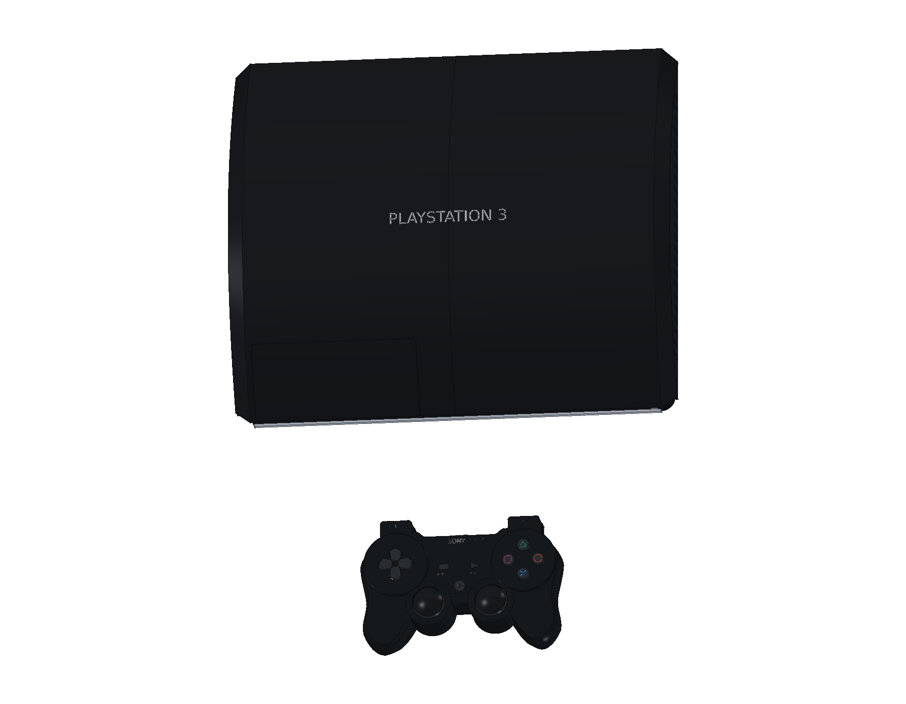
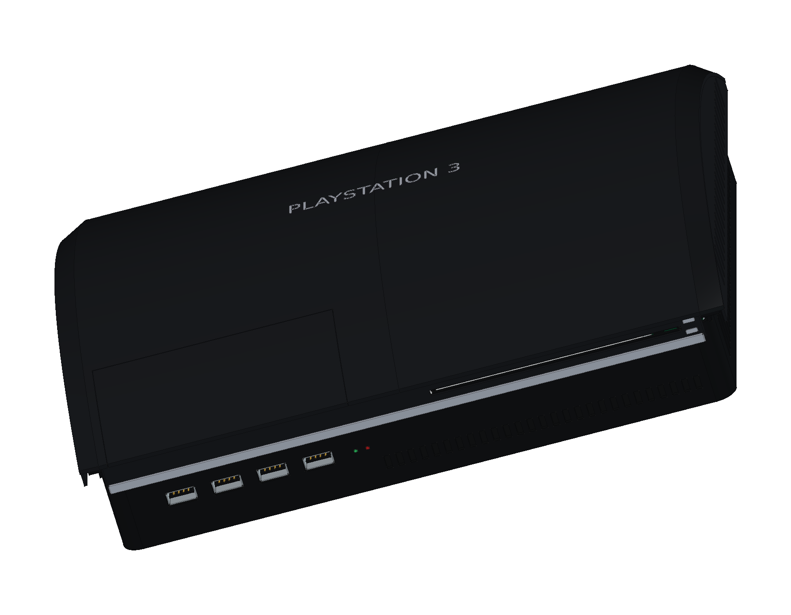
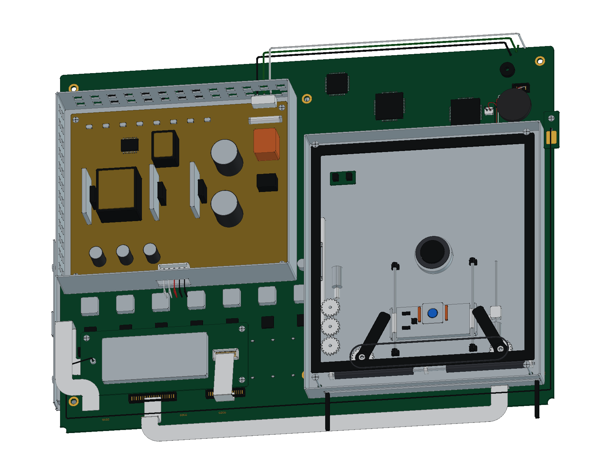
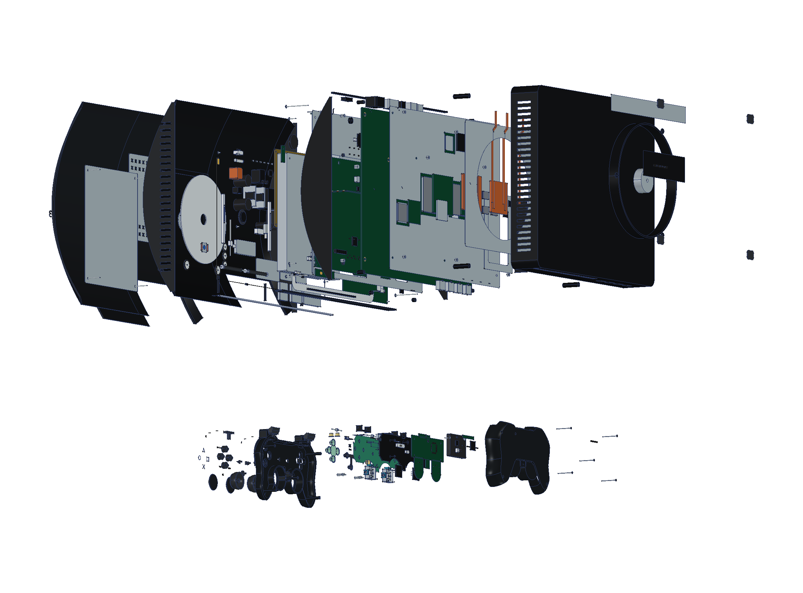
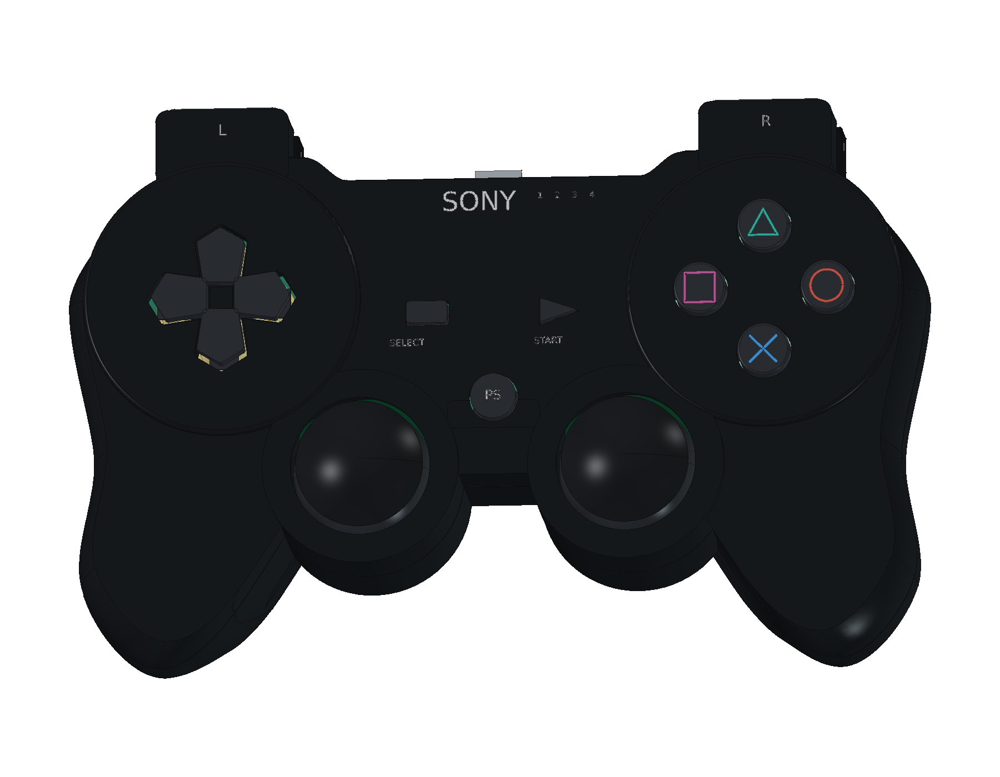
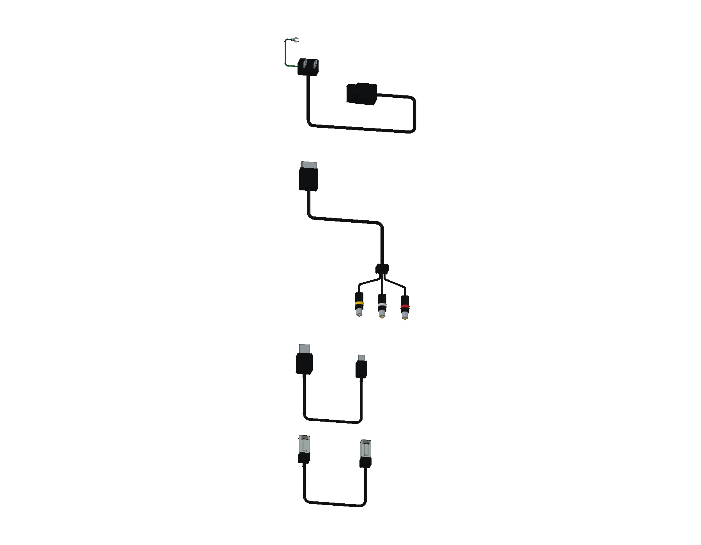

# Sony PlayStation 3 · CECHA00

日本首发 60 GB 结构学习模型包含 **30 轮源码、1,592 个组件条目与 1,676 个实体**：原版拱形亮面主机、早期无振动 SIXAXIS，以及 AC / AV / USB / LAN 四组连接线。提供完整与爆炸原生工程、三份彩色 STEP、12 页 A3 PDF / SVG / 原生图纸及 21 个网页视图。

<table>
<tr>
<td align="center" width="33%"> 原版主机与 SIXAXIS</td>
<td align="center" width="33%"> 拱形外壳与原版接口</td>
<td align="center" width="33%"> 主机内部结构</td>
</tr>
<tr>
<td align="center" width="33%"> 分层爆炸装配</td>
<td align="center" width="33%"> 早期无振动 SIXAXIS</td>
<td align="center" width="33%"> 日本原配四组连接线</td>
</tr>
</table>

- [在线 3D 预览](https://tiansongyu.github.io/open-console-cad/?device=ps3&view=assembled#viewer)
- [完整 FreeCAD 工程](output/PlayStation3_Complete.FCStd) · [爆炸工程](output/PlayStation3_Exploded.FCStd) · [打开宏](Open_PlayStation3.FCMacro)
- [整套 STEP](output/PlayStation3_FullKit.step) · [主机与手柄 STEP](output/PlayStation3_Console.step) · [爆炸 STEP](output/PlayStation3_Exploded.step)
- [12 页 A3 PDF](output/drawings/PlayStation3_Drawings.pdf) · [HTML 图册](output/drawings/PlayStation3_Drawings.html) · [SVG 目录](output/drawings/) · [原生图纸](output/PlayStation3_Drawings.FCStd)
- [组件清单](output/COMPONENTS.csv) · [模型清单](output/reports/final_manifest.json)
- [完整重建宏](Rebuild_PlayStation3.FCMacro) · [逐轮记录](ITERATIONS.md) · [建模源码](../../tools/cadlib/ps3.py)
- [源码重建比对](output/reports/rebuild_verification.json) · [严格实体检查](output/reports/strict_saved_native.json) · [装配检查](output/reports/assembly_interference.json)
- [STEP 回读检查](output/reports/export_roundtrip_audit.json) · [参数编辑复原](output/reports/parameter_edit_test.json) · [资料与建模边界](references/SOURCES.md)

使用 FreeCAD 1.1.3 打开工程。原生草图、曲面放样和布尔历史保留修改入口。重建宏从空文档执行全部三十轮，生成 `output/rebuilt/`，可用[几何比对工具](../../tools/cadlib/compare_native.py)逐件核对。

Sony 日本原版手册给出主体约 **325 × 274 × 98 mm**（宽、深、高，不含最大突出部）。外观以 CECHA00 为依据，内部布局参考 Sony CECHA00/A01 维修资料及同代 CECHA01 实机拆解。局部曲率、孔位、壁厚、板件及机构尺寸均为学习近似，不对应制造图。

主机保留四组 USB、三格式读卡区域、原版后部 AV MULTI / HDMI / LAN / 光纤 / AC 接口及侧抽硬盘。内部包括双面 COK-001 布局、早期兼容芯片、无线及触控板、十九叶风扇示意、热管与独立鳍片、金属罩电源、吸入式光驱、上下屏蔽和独立线束。风扇叶数不代表所有首发实机配置。

控制器采用早期无振动 SIXAXIS 结构，含独立三线运动传感板、610 mAh / 3.7 V 电池包络、五组壳体固定、复位延长件、Mini-B、按键膜、双轴摇杆、电位器和弹簧回位 L2/R2。未混入后期 DualShock 3 的振动电机。

日本原配 AC 电源线保留双片插头及独立接地尾线；另有 AV MULTI 至三 RCA、USB-A 至 Mini-B 和八接点 LAN 线。所有线长缩短展示，电路、接点和传动间隙为非功能性示意。

1,592 个组件已从空文档重建并逐件比对，严格实体检查、4,339 对装配候选求交、参数修改复原及三份 STEP 回读通过。STEP 的数值边界差异保留在报告中，使用逐实体匹配、布尔或采样确认，不仅比较总量。

本地交付核验通过：[交付记录](output/reports/completion_audit.json)、[独立图册审阅](output/reports/independent_pdf_review.json)、[网页视图与布局](output/reports/web_preview_checks.json)。公开发布的文件和交互另行核对。
