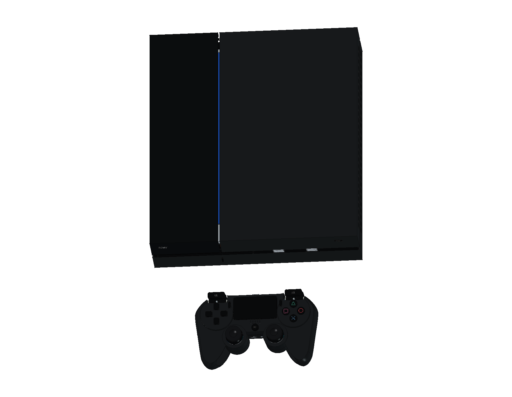
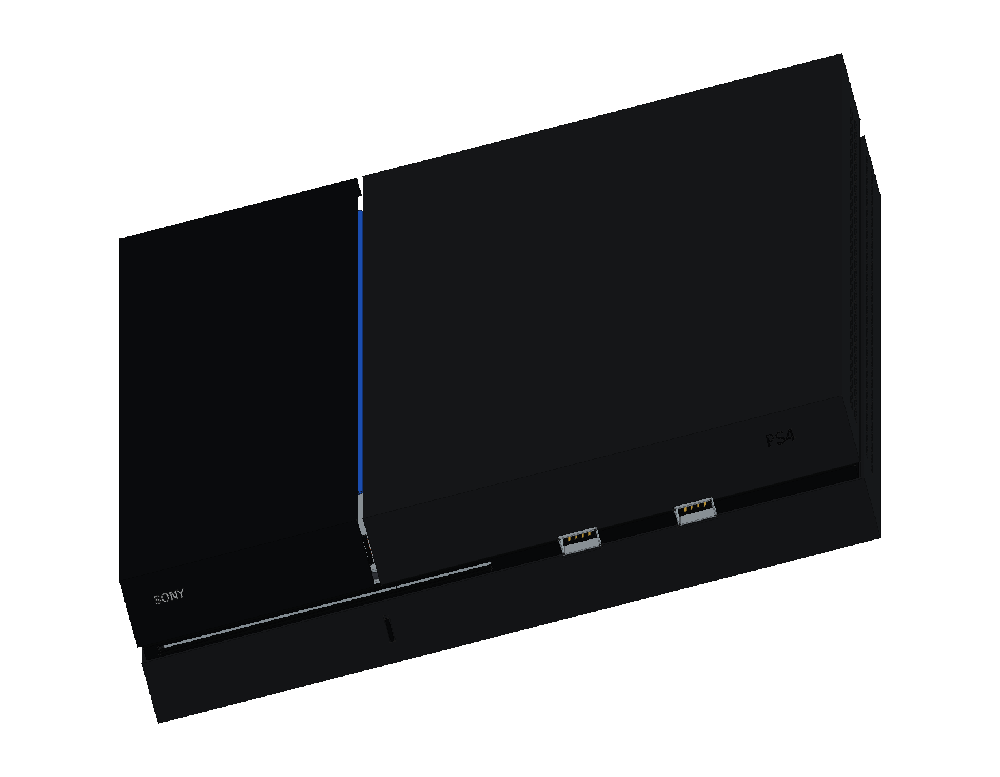
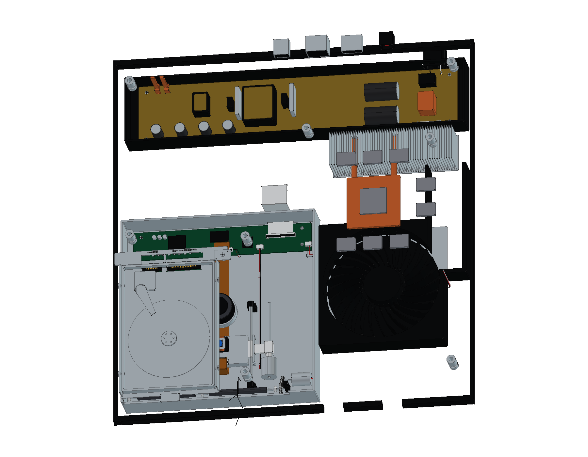
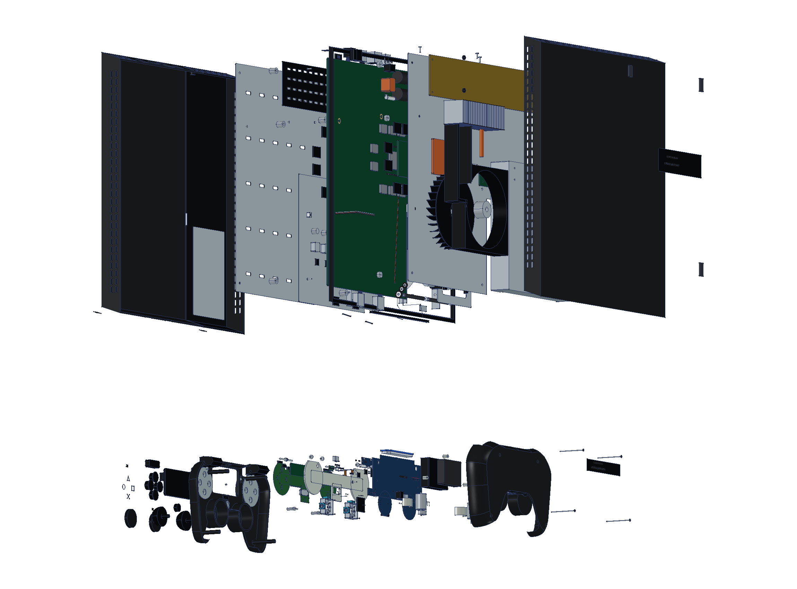
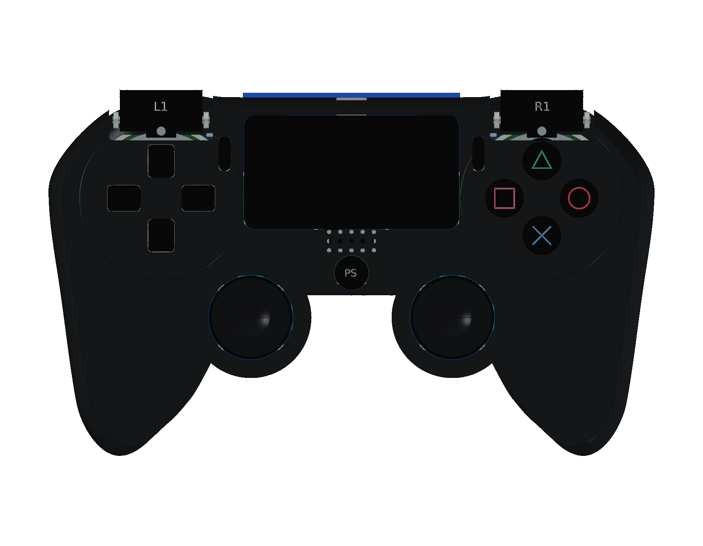
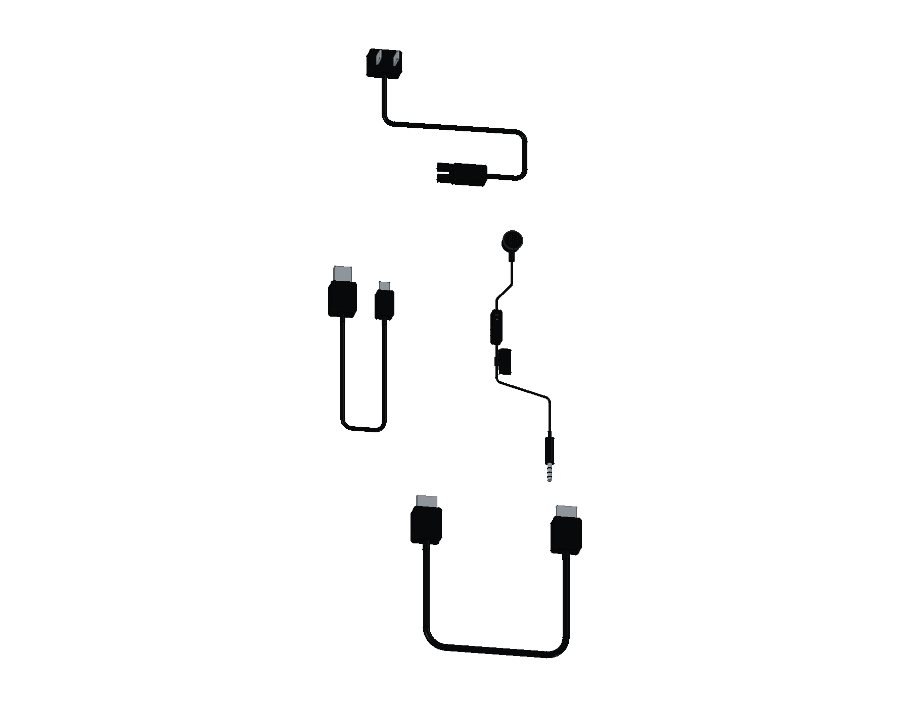

# Sony PlayStation 4 · CUH-1000A

初代黑色 PlayStation 4 完成 **29 轮源码、1,039 个组件条目与 1,133 个实体**，包括主机、可抽取硬盘、初代 DualShock 4、AC / HDMI / USB 线和单耳耳机。提供原生整机与爆炸工程、三份彩色 STEP、12 页 A3 PDF / SVG / 原生图纸及 20 个交互式网页视图。

<table>
<tr>
<td align="center" width="33%"> 初代主机与手柄</td>
<td align="center" width="33%"> 斜面外观与接口</td>
<td align="center" width="33%"> 主机内部结构</td>
</tr>
<tr>
<td align="center" width="33%"> 分层爆炸装配</td>
<td align="center" width="33%"> 初代 DualShock 4</td>
<td align="center" width="33%"> 原配线缆与耳机</td>
</tr>
</table>

- [在线 3D 预览](https://tiansongyu.github.io/open-console-cad/?device=ps4&view=assembled#viewer)
- [整套 FreeCAD 工程](output/PlayStation4_Complete.FCStd) · [爆炸工程](output/PlayStation4_Exploded.FCStd) · [打开宏](Open_PlayStation4.FCMacro)
- [整套 STEP](output/PlayStation4_FullKit.step) · [主机与手柄 STEP](output/PlayStation4_Console.step) · [爆炸 STEP](output/PlayStation4_Exploded.step)
- [12 页 A3 PDF](output/drawings/PlayStation4_Drawings.pdf) · [HTML 图册](output/drawings/PlayStation4_Drawings.html) · [SVG 目录](output/drawings/) · [FreeCAD 原生图纸](output/PlayStation4_Drawings.FCStd)
- [组件清单](output/COMPONENTS.csv) · [模型清单](output/reports/final_manifest.json)
- [完整重建宏](Rebuild_PlayStation4.FCMacro) · [逐轮记录](ITERATIONS.md)
- [完整重建比对](output/reports/rebuild_verification.json) · [严格实体检查](output/reports/strict_saved_native.json) · [装配检查](output/reports/assembly_interference.json)
- [官方资料与建模边界](references/SOURCES.md) · [完整交付检查](output/reports/completion_audit.json) · [独立图册审阅](output/reports/independent_pdf_review.json) · [网页检查](output/reports/web_preview_checks.json)

使用 FreeCAD 1.1.3 打开工程。原生草图、凸台、放样、圆角和布尔历史保留在模型树中；重建宏将输出写入 `output/rebuilt/`。可用[实体几何比对工具](../../tools/cadlib/compare_native.py)逐件比较重建结果，非相同 BRep 采用双向布尔差集确认。

Sony 2013 发布规格给出主体约 **275 × 305 × 53 mm**（宽、深、高），原文注明暂定且不含最大突出部。本模型选择初代外观，不混用 Slim / Pro。斜面角度、分割位置、局部尺寸和内部结构均为照片指导的学习近似。

已建结构包括原生斜面上下壳、独立亮面硬盘盖、腰线中框、开放通风栅格；前部盘口、双 USB 3.0 和触控条；后部 HDMI、光纤、LAN、AUX 及 AC 入口。硬盘具有独立托架、固定件、盘片及读写臂示意和 SATA 主板插座。

L 形主板包含 APU、双面十六枚显存、主要桥接及电源封装、时钟电池、独立端子与板料通道。上下屏蔽、热界面、离心风扇、风道、双热管和鳍片分别建模。内置电源保留板件、滤波、变压器、保险丝与通风盖；吸入光驱含装载滚轮、电机及齿轮、光头导杆、进给轴系、独立控制板和排线。

CUH-ZCT1 控制器包括原生曲面壳、初代不透光触摸板、凹面摇杆帽、方向键、符号键、双层肩键和后灯条。内部具有 JDM-001 布局主板、双轴摇杆与电位器、胶膜和接点膜、1000 mAh 电池示意、大小不同的振动电机、充电板、Micro-USB / 耳机 / EXT 口、排线、引线及四组壳体固定件。

原配清单依据 2013 年官方 FAQ。线缆使用缩短展示路径；单耳耳机的 MIC 开关及独立衣夹布局参考后期同系列官方指南，内部构造为学习近似，不据此推断首发耳机内部版本。空白光盘仅表示光驱介质，不包含软件。模型不提供可通电电路、制造公差或经过验证的运动性能。

STEP 回读中，控制器后壳的解析包围盒出现约 0.858 mm 的计算差异。双向布尔差集均为空，0.01 / 0.005 mm 两档离散网格的六个边界也一致；完整差异与核对结果保存在 [STEP 回读报告](output/reports/export_roundtrip_audit.json)。[回归验证脚本](scripts/verify_step_bounds.py)同时确认位移和缺料几何会被拒绝。
