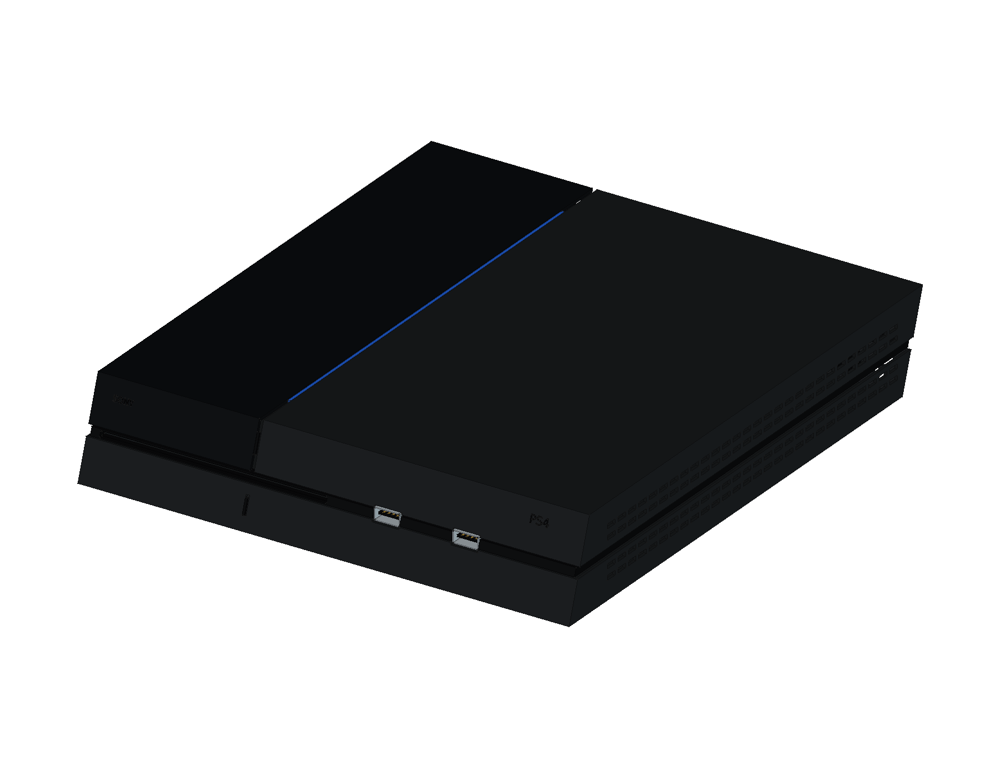

# Sony PlayStation 4 · CUH-1000A

新增批次第 1 款，已完成 8 轮、374 个组件，建模仍在进行中。选择 2013 年初代黑色机身和 CUH-ZCT1 DualShock 4。

[来源与建模边界](references/SOURCES.md) · [参数](profile.json) · [逐轮记录](ITERATIONS.md)

采用约 275 × 305 × 53 mm 主体包络，保留斜面、亮面硬盘盖、磨砂顶壳和分层接缝。所有局部尺寸均为照片指导的近似；当前工程尚未通过完整交付验收，不加入正式网页目录。

后续依次完成接口、存储、主板、屏蔽与散热、光驱、电源及布线、控制器和原配附件，再执行完整重建、干涉、STEP、图纸与网页验证。

[当前原生工程](output/PlayStation4_Study.FCStd) · [打开宏](Open_PlayStation4.FCMacro) · [重建宏](Rebuild_PlayStation4.FCMacro)

