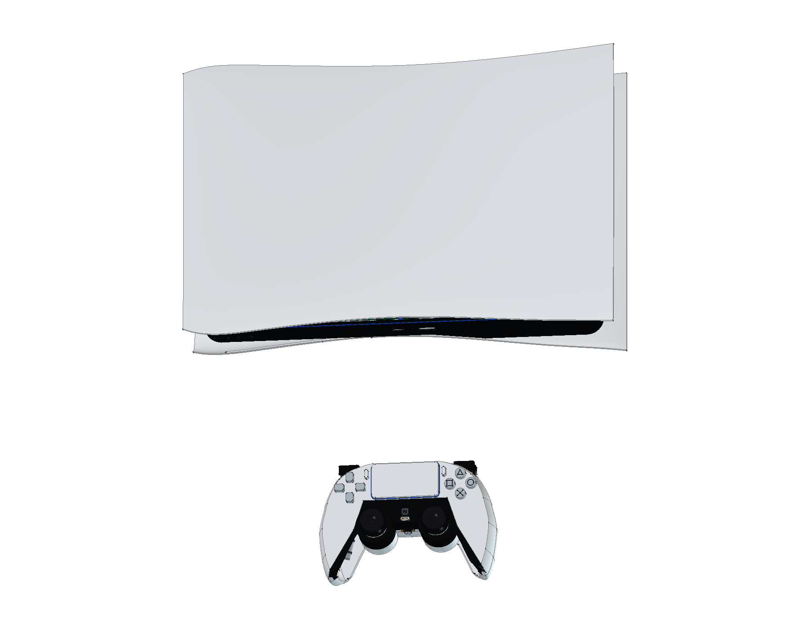
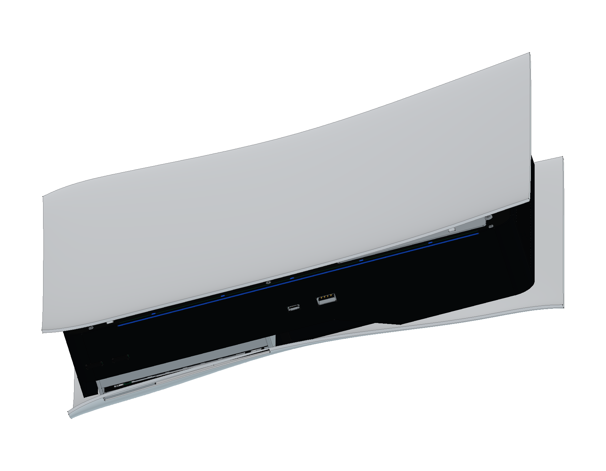
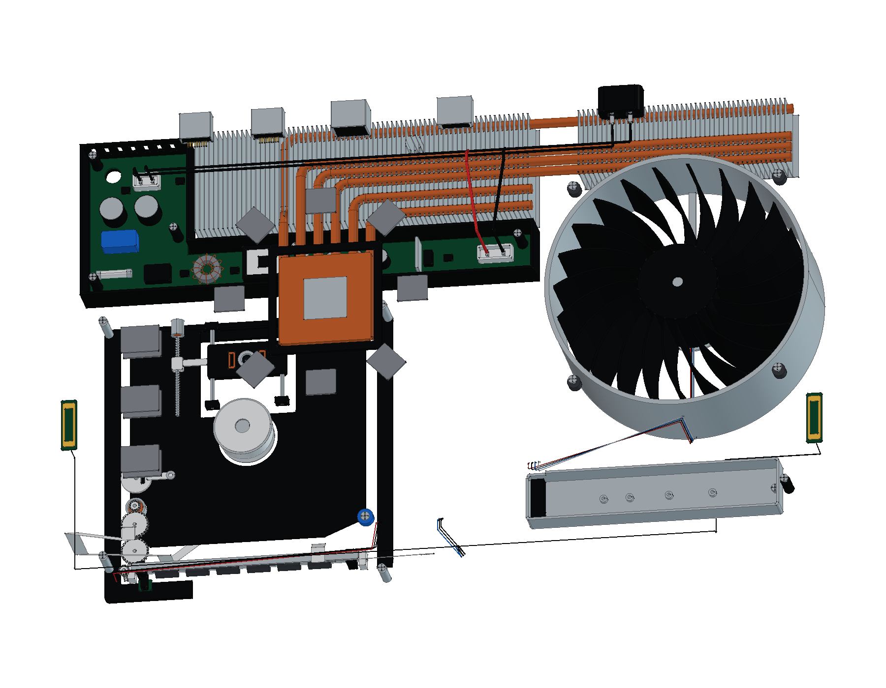
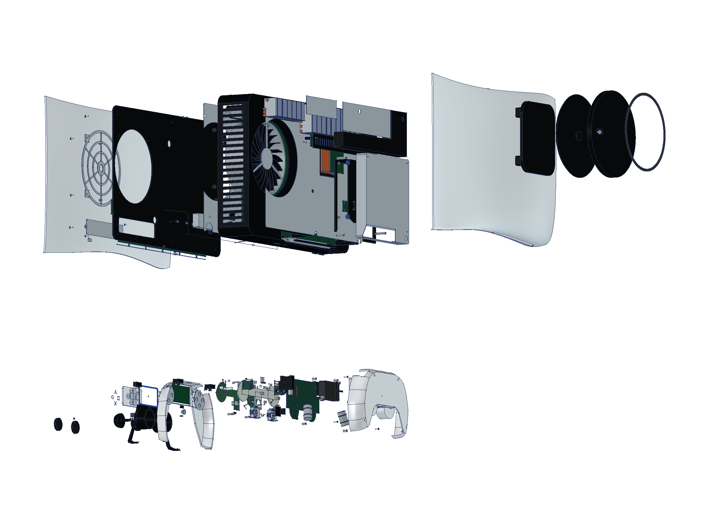
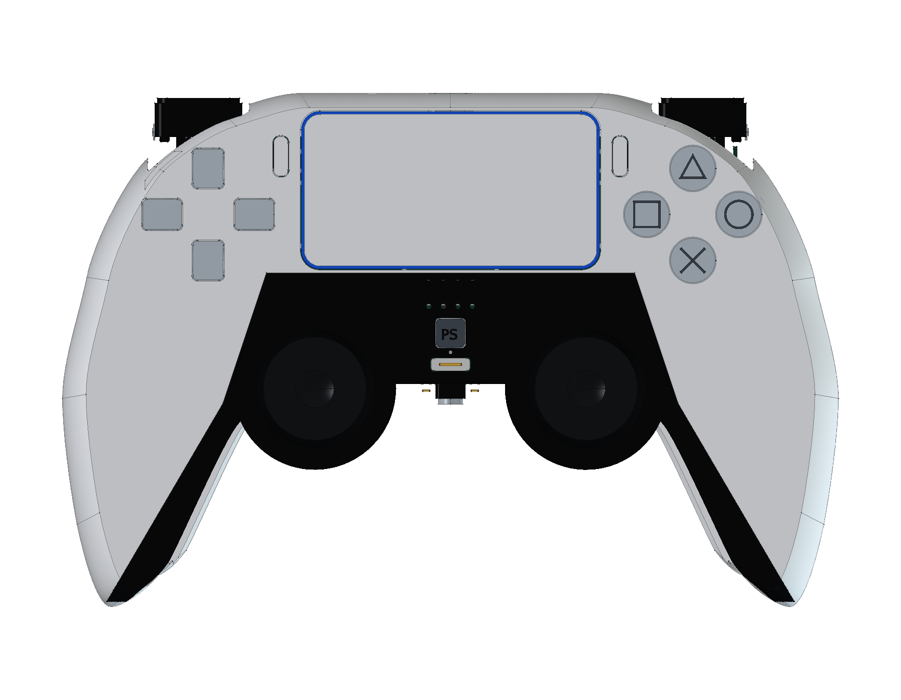
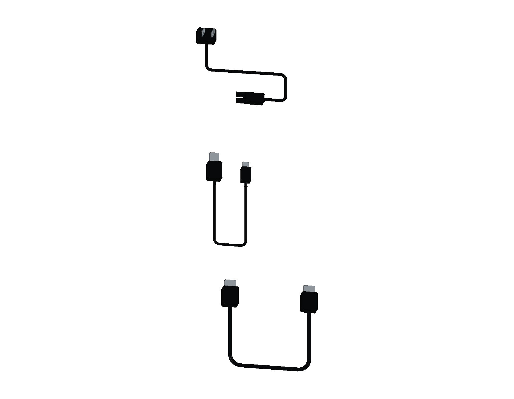

# Sony PlayStation 5 · 原版光驱机

首发 CFI-1000A 系列结构学习模型完成 **34 轮源码、1,635 个组件条目与 1,709 个实体**，包含横置主机、原版旋转底座、初代 DualSense 和 AC / HDMI / USB-A 至 USB-C 线。提供完整与爆炸原生工程、三份彩色 STEP、12 页 A3 PDF / SVG / 原生图纸及 21 个网页视图。

<table>
<tr>
<td align="center" width="33%"> 原版主机、底座与 DualSense</td>
<td align="center" width="33%"> 曲面白罩与原版接口</td>
<td align="center" width="33%"> 主机内部结构</td>
</tr>
<tr>
<td align="center" width="33%"> 分层爆炸装配</td>
<td align="center" width="33%"> 初代 DualSense</td>
<td align="center" width="33%"> 原配三组连接线</td>
</tr>
</table>

- [在线 3D 预览](https://tiansongyu.github.io/open-console-cad/?device=ps5&view=assembled#viewer)
- [完整 FreeCAD 工程](output/PlayStation5_Complete.FCStd) · [爆炸工程](output/PlayStation5_Exploded.FCStd) · [打开宏](Open_PlayStation5.FCMacro)
- [整套 STEP](output/PlayStation5_FullKit.step) · [主机、底座与手柄 STEP](output/PlayStation5_Console.step) · [爆炸 STEP](output/PlayStation5_Exploded.step)
- [12 页 A3 PDF](output/drawings/PlayStation5_Drawings.pdf) · [HTML 图册](output/drawings/PlayStation5_Drawings.html) · [SVG 目录](output/drawings/) · [原生图纸](output/PlayStation5_Drawings.FCStd)
- [组件清单](output/COMPONENTS.csv) · [模型清单](output/reports/final_manifest.json)
- [完整重建宏](Rebuild_PlayStation5.FCMacro) · [逐轮记录](ITERATIONS.md)
- [源码重建比对](output/reports/rebuild_verification.json) · [严格实体检查](output/reports/strict_saved_native.json) · [装配检查](output/reports/assembly_interference.json)
- [资料与建模边界](references/SOURCES.md) · [交付检查](output/reports/completion_audit.json) · [独立图册审阅](output/reports/independent_pdf_review.json) · [网页检查](output/reports/web_preview_checks.json)

使用 FreeCAD 1.1.3 打开工程。原生草图、曲面放样、凸台、圆角和布尔历史保留修改入口。重建宏从空文档生成 `output/rebuilt/`，可用[几何比对工具](../../tools/cadlib/compare_native.py)逐件核对；不同 BRep 使用双向布尔差集确认。

Sony 首发 FAQ 给出主体约 **390 × 260 × 104 mm**（宽、深、高，不含底座）。当前曲面模型测得约 **390 × 260 × 103.93 mm**。局部曲率、孔位、壁厚和内部结构按拆解照片作学习近似，不对应原厂制造图。

主机保留双曲面白罩、光驱侧非对称起伏、黑色中框、吸入盘口、蓝色状态导光、首发前后接口和通风开口。原版底座含旋转盘、后缘双钩、橡胶支承及螺丝收纳。M.2 仓保持未加装 SSD 的状态，具有独立盖板、带键连接器和 67 个触点。

内部包含双面主板、下侧 APU 和液金接触层、八枚显存、双面 NAND、供电和控制封装、上下屏蔽及导热垫；双面进风风扇、23 片独立叶片、六根热管和两组散热鳍片；靴形电源、板件、变压器、电容、磁芯和插座；光驱加载电机与齿轮、进盘辊、凸轮、主轴、聚焦部件、连续螺旋进给轴和控制板。主机与控制器的排线、线束及接插件分别建模。

DualSense 具有独立白壳与黑色饰板、白色触摸板、浅灰表示的透明方向和符号键、凹面摇杆、PS / 静音键和边缘导光。内部包括双轴摇杆、电位器、接点膜、回弹胶膜、扬声器、1500 mAh 电池包络、两组音圈反馈机构、带电机和蜗杆的自适应扳机、传感器板、USB-C 成形端子、耳机插座和双麦克风。

原版套装附件依据 Sony 首发资料，仅包含所示底座、手柄和三组线缆，不包含耳机。线缆采用缩短展示路径；电路、磁路和传动间隙为非功能性示意，不承诺可通电运行、制造公差或动态性能。

STEP 导出保留曲面修剪参数曲线。两片管路切口鳍片的重合面布尔求差出现无效数值结果，因此另行记录原始诊断，并核对逐件体积、边界、面数、面积及两个离散精度下的双向曲面距离；这是采样验证，不作为精确布尔等价证明。详见 [STEP 曲面核验](output/reports/step_geometry_validation.json)。

已发布版本 `7c3ea1c`：14 份线上文件哈希、21 个视图及桌面 / 平板 / 手机布局、滑块键盘操作和设备切换核对通过。见 [线上文件核验](output/reports/live_delivery_audit.json) 与 [线上交互核验](output/reports/live_ui_checks.json)。
