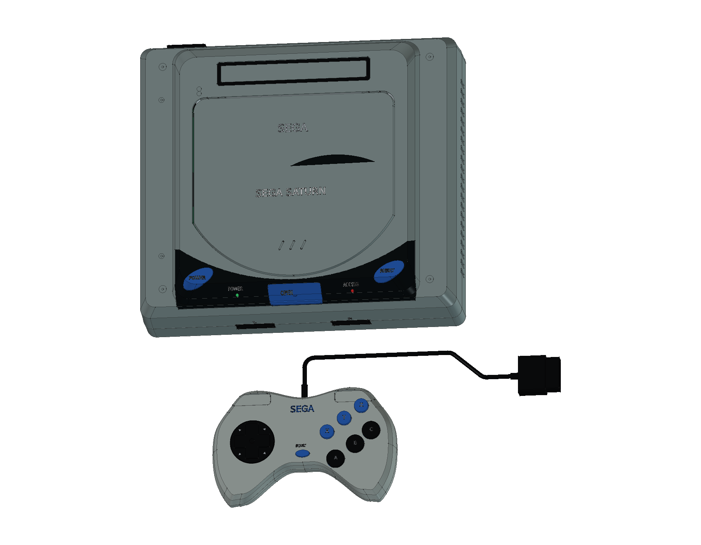
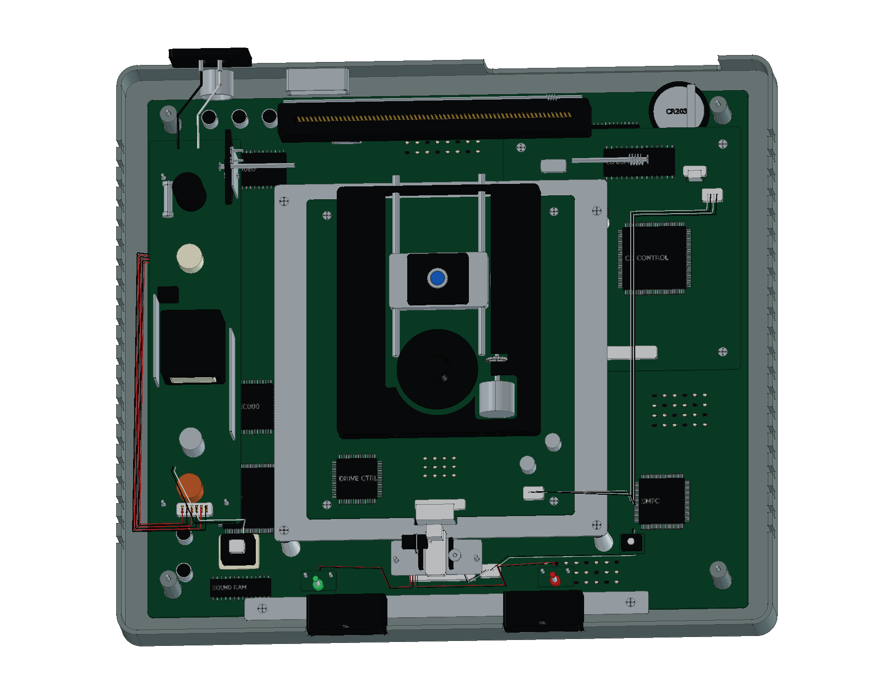

# Sega Saturn — HST-3200

日版初代灰色 Sega Saturn 的 FreeCAD 结构学习模型，包含 **原版 HSS-0101 六键手柄、电源线、AV 连接线和空白 12 cm 光盘**。提供完整工程、分层爆炸、彩色 STEP、12 页 A3 图纸和十六种交互视图。

模型包含 **715 个组件条目、2,558 个实体与 22 轮建模源码**。组件条目与实体数量分开统计；一个组件可包含多枚触点或文字实体。

[在线 3D](https://tiansongyu.github.io/open-console-cad/?device=saturn&view=assembled#viewer) · [光驱机构](https://tiansongyu.github.io/open-console-cad/?device=saturn&view=optical#viewer) · [原版手柄](https://tiansongyu.github.io/open-console-cad/?device=saturn&view=controller#viewer) · [A3 图册](output/drawings/Saturn_Drawings.pdf)

## 交付文件

- [完整 FreeCAD 工程](output/Saturn_Complete.FCStd) · [爆炸装配](output/Saturn_Exploded.FCStd)
- [12 页 A3 PDF](output/drawings/Saturn_Drawings.pdf) · [原生图纸](output/Saturn_Drawings.FCStd) · [SVG 与排版源码](output/drawings/)
- [整套 STEP](output/Saturn_FullKit.step) · [主机与手柄 STEP](output/Saturn_Console.step) · [爆炸 STEP](output/Saturn_Exploded.step)
- [组件清单](output/COMPONENTS.csv) · [逐轮记录](ITERATIONS.md) · [资料来源](references/SOURCES.md)

## 版本与尺寸依据

外观选择初代日版灰色 **HST-3200**：灰色斜肩外壳、弧形前缘光驱盖、深色控制面板、蓝色椭圆 POWER / RESET 和中央 OPEN 键。手柄选择原始灰色 **HSS-0101**，采用黑色 ABC、蓝色 XYZ / START 与左右肩键。

世嘉官方页面的 **260 × 230 × 83 mm** 对应 **HST-3210 家族规格**，本项目仅将其作为 HST-3200 的近似包络参考。当前主机含外伸控制件和标识的模型包络约 **260 × 230.298 × 83.35 mm**；手柄与线缆另计。图纸中的局部数字均为当前模型测量值。

- **外壳与接口**：原生草图、截面放样、圆角与布尔加工；双手柄端口、上壳电源座、AV 与通信接口、后部电池扩展盖和通风槽。
- **主板与光驱控制**：MAIN VA0.5 拆解布局参考、双 SH-2、图形与音频器件、分区存储、独立 CD 子系统与缓存。
- **读取与盖板机构**：白色长支座、光驱控制板、主轴与定位台、导轨光头和螺旋进给；一体轴耳、回位弹簧、扇形齿轮、释放锁扣与整片卡槽防尘门。
- **上壳电源**：变压器、滤波与散热器件、锁定开关、原生支柱和内部线束，保留初代的上壳安装方式。
- **原版手柄**：原生曲面壳、浮动圆盘十字键、六键与肩键、三组硅胶膜、碳膜接点、控制板、五处固定以及九芯线与矩形插头。
- **连接附件**：日式两片插头、八字设备端头、十接点 AV 插头与三 RCA 线，以及不含游戏数据的空白光盘。

主板与手柄内构依据实物照片作学习近似，其中手柄内构照片包含后期浅色家族版本，外观以原始灰色照片为准。孔位、壁厚、引脚、器件和线束不复现生产电路或制造公差；模型不执行机械运动、光学读写或电气仿真。详见 [SOURCES.md](references/SOURCES.md)。

## 查看与重建

使用 FreeCAD 1.1.3 打开工程，或运行 [Open_Saturn.FCMacro](Open_Saturn.FCMacro) 打开完整装配、爆炸模型和原生图纸。通过装配分组切换可见性，并查看原生草图和加工历史。

保留仓库结构，运行 [Rebuild_Saturn.FCMacro](Rebuild_Saturn.FCMacro)，可按 22 轮源码重新生成 CAD / STEP，结果写入 `output/rebuilt/`。图纸和网页网格按仓库 [README](../../README.md) 的交付流程另行更新。主要源码为 [saturn.py](../../tools/cadlib/saturn.py)。

## 验证范围

- [完整源码重建](output/reports/rebuild_verification.json)：新工程执行全部源码，并逐组件核对有效性、实体数量、边界和体积。
- [严格 BRep](output/reports/strict_bop_audit.json) · [装配求交](output/reports/final_interference_audit.json)：检查当前学习模型的实体及装配间隙。
- [原生与 STEP 回读](output/reports/export_roundtrip_audit.json)：两份原生装配、三份 STEP 逐实体匹配，数值积分差异经双向布尔差集确认。
- [图纸尺寸](output/reports/drawing_checks.json) · [原生图页](output/reports/native_drawings_audit.json) · [保存后重开](output/reports/native_drawings_reload.json)。
- [图册视觉检查](output/reports/visual_acceptance.json) · [独立复核](output/reports/independent_pdf_review.json) · [网页预览检查](output/reports/web_preview_checks.json)。

检查结果对应当前保存的模型与交付文件；修改几何后需重新生成并检查。建模通过 neka-nat/freecad-mcp 在 FreeCAD 主线程执行，网页网格直接由组件 BRep 导出。

本设备随仓库采用 [MIT 许可证](../../LICENSE)。本项目为非官方学习项目，产品名称与标识归相应权利人所有。
