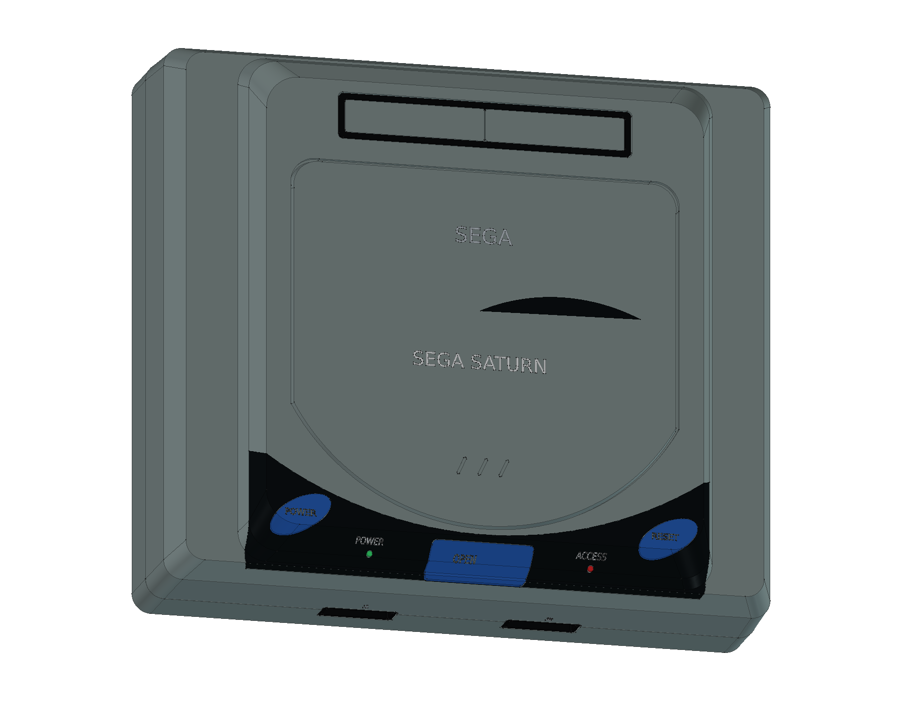
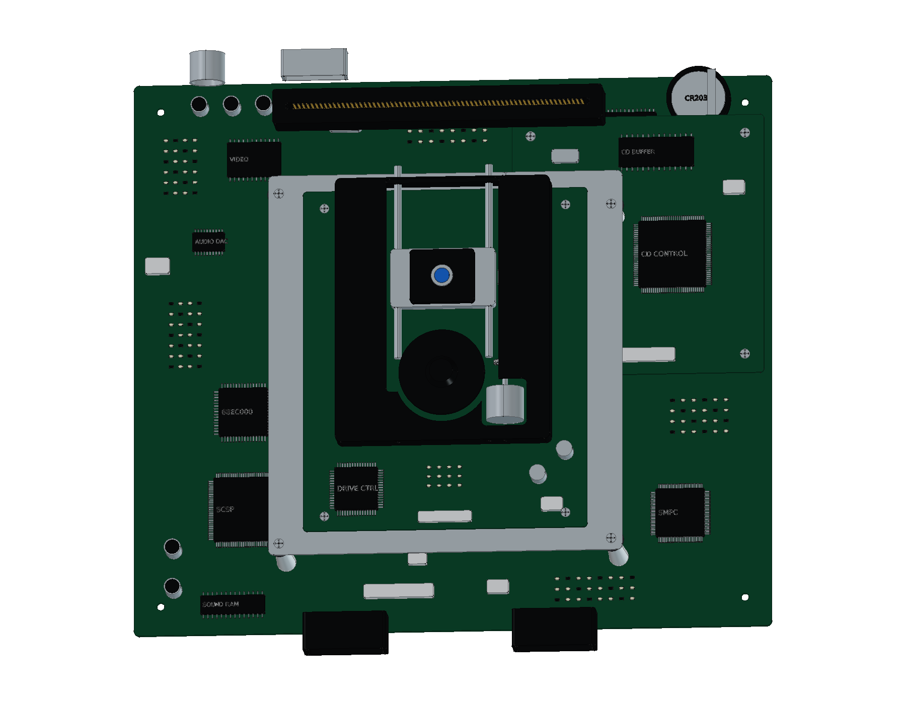

# Sega Saturn — HST-3200

**绘制中。** 选择初代日版灰色 HST-3200，蓝色椭圆 POWER / RESET 与中央 OPEN 控制键。当前 10 轮源码、481 个组件已建立上下空心壳、倾斜侧肩、弧形前缘光驱盖、光盘仓、后部卡槽、曲面深色控制面板、双手柄端口和后侧接口，以及双 SH-2 主板、独立 CD 子系统板、后部电池、卡槽触点与导轨光驱。

[当前 FreeCAD 工程](output/Saturn_Study.FCStd) · [建模过程](ITERATIONS.md) · [资料来源](references/SOURCES.md) · [源码](../../tools/cadlib/saturn.py)

260 × 230 × 83 mm 来自世嘉对 HST-3210 的家族规格表，只作为本 HST-3200 学习模型的近似包络。局部尺寸、触点和内部机构为原创学习几何。

当前已建部分通过 [481 个组件严格实体检查](output/reports/stage10_strict_bop.json) 和 [616 组装配求交](output/reports/stage10_interference.json)。完整源码重建与最终交付检查尚未完成。

上壳电源、屏蔽与固定、盖板联动机构、HSS-0101 六键手柄及连接附件仍在继续绘制；完整验证、STEP、12 页 A3 图纸和网页交付完成后加入公开模型库。
