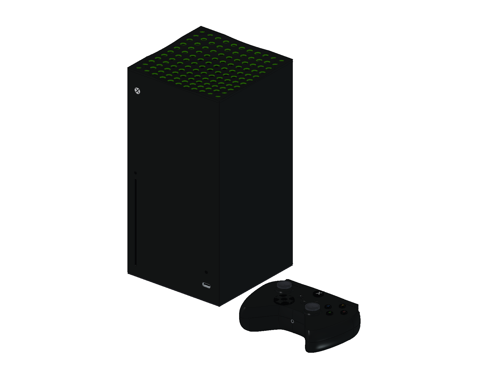
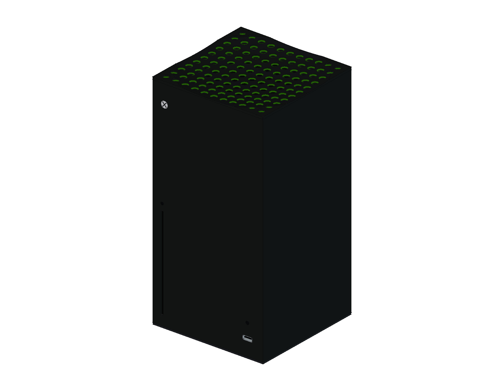
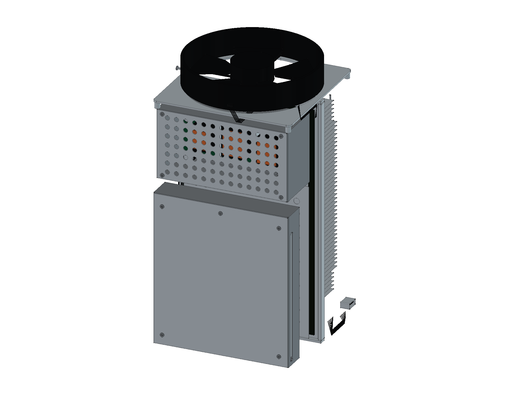
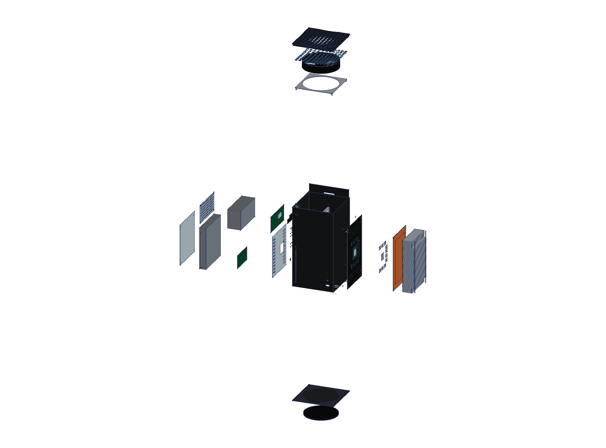
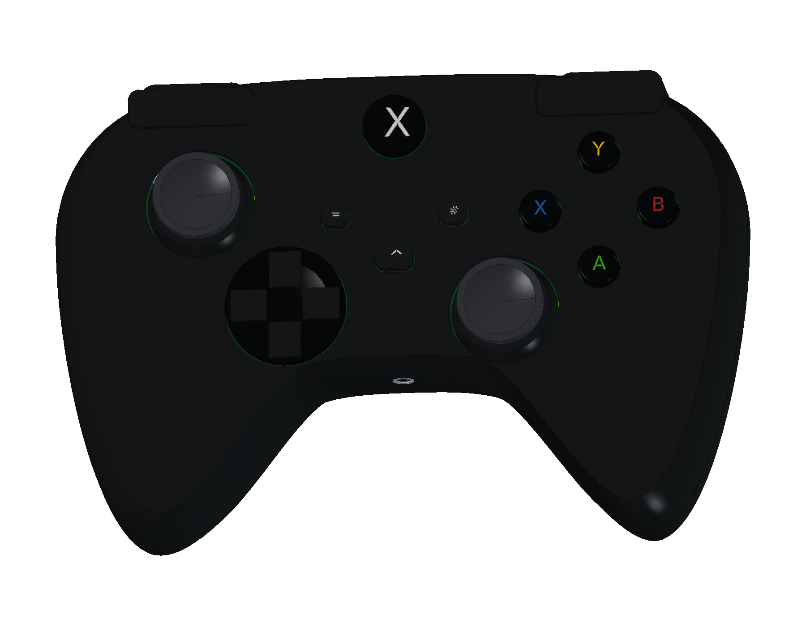
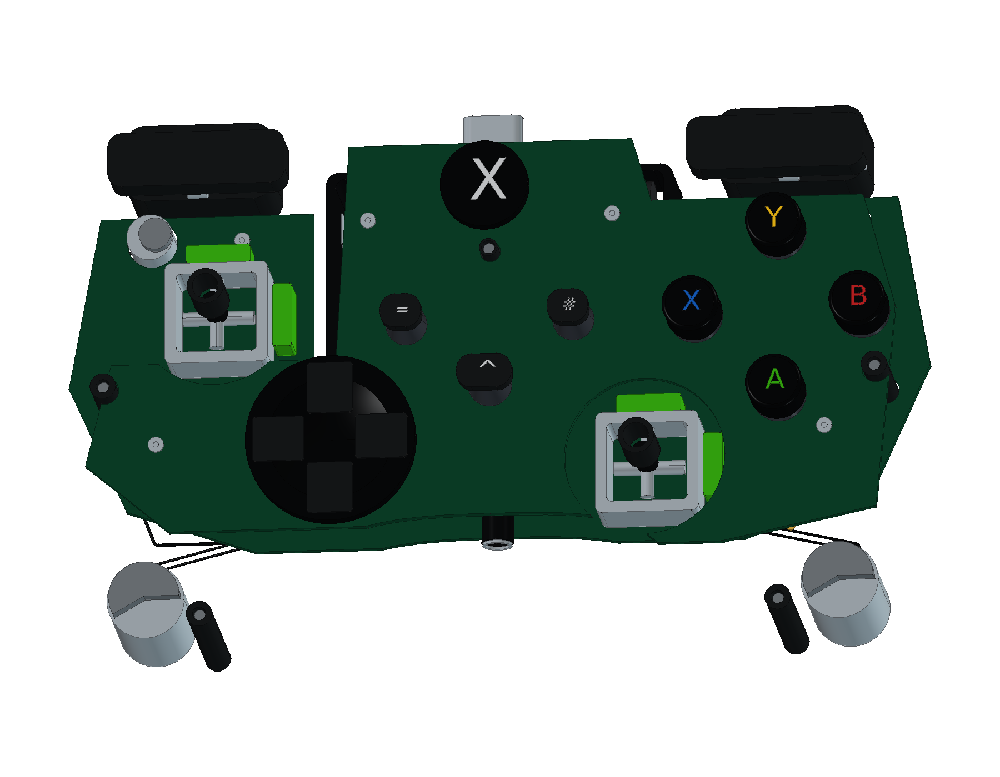

# Microsoft Xbox Series X · 原版光驱机

2020 年黑色 1 TB 原版光驱主机与 Series 控制器结构学习模型，包含 **19 轮源码、1047 个组件条目和 1067 个实体**：方塔壳、凹面通孔格栅、双主板、中框、APU 与十枚显存、M.2 2230 固态盘、铜均热板与 48 片鳍片、五叶风扇、光驱、电源、内部线束、双板手柄、双 AA 与四组电机。提供完整和爆炸原生工程、三份 STEP、十二页 A3 图册及二十二个网页视图。

<table>
<tr>
<td align="center" width="33%"> 原版主机与 Series 控制器</td>
<td align="center" width="33%"> 方塔、凹面格栅与固定底座</td>
<td align="center" width="33%"> 中框、双板、光驱与电源</td>
</tr>
<tr>
<td align="center" width="33%"> 主机分层爆炸</td>
<td align="center" width="33%"> Series 原版操作布局</td>
<td align="center" width="33%"> 双板、摇杆与独立线束</td>
</tr>
</table>

- [在线 3D 预览](https://tiansongyu.github.io/open-console-cad/?device=seriesx&view=assembled#viewer)
- [完整工程](output/XboxSeriesX_Complete.FCStd) · [爆炸工程](output/XboxSeriesX_Exploded.FCStd) · [打开宏](Open_XboxSeriesX.FCMacro)
- [全套 STEP](output/XboxSeriesX_FullKit.step) · [主机与手柄 STEP](output/XboxSeriesX_Console.step) · [爆炸 STEP](output/XboxSeriesX_Exploded.step)
- [12 页 A3 PDF](output/drawings/XboxSeriesX_Drawings.pdf) · [HTML 图册](output/drawings/XboxSeriesX_Drawings.html) · [SVG 目录](output/drawings/) · [原生图纸](output/XboxSeriesX_Drawings.FCStd)
- [组件清单](output/COMPONENTS.csv) · [模型清单](output/reports/final_manifest.json) · [逐轮记录](ITERATIONS.md)
- [完整重建宏](Rebuild_XboxSeriesX.FCMacro) · [建模源码](../../tools/cadlib/seriesx.py) · [资料与边界](references/SOURCES.md)
- [源码重建比对](output/reports/rebuild_verification.json) · [严格实体检查](output/reports/strict_saved_native.json) · [装配求交](output/reports/assembly_interference.json)
- [STEP 回读](output/reports/export_roundtrip_audit.json) · [参数修改复原](output/reports/parameter_edit_test.json) · [交付核对](output/reports/completion_audit.json)

使用 FreeCAD 1.1.3 打开工程。壳体草图、拉伸、手柄曲线放样与布尔历史保留修改入口；`Parameters.Width` 驱动主机外壳宽度约束。重建宏从空文档执行全部十九轮，输出到 `output/rebuilt/`。主机 STEP 包含主机与控制器，全套另含 HDMI 和电源线；局部元件并非一键缩放的制造设计。

主机采用微软 Disc design 官方 **151 × 151 × 301 mm** 包络；选择 2020 年原版黑色 1 TB 光驱机，不混用后期白色数字版或 2 TB 机型。内部位置依据 iFixit 原版拆解，顶部风扇按照片重构为五叶；绿色通风孔内衬不是灯光。

控制器采用 Series 原版布局，含混合圆盘方向键、非对称摇杆、Share、USB-C、3.5 mm 音频口、双 AA、两组握把电机及两组扳机电机。内部双板结构参考微软 2023 年维修手册，不保证与 2020 首发 PCB 修订完全一致。手柄曲率、局部尺寸与线路为照片指导近似。

壁厚、孔位、器件、引脚、热界面和线束仅作学习观察，不提供功能电路、制造公差、散热性能或电气认证。墙端电源插头采用通用示意形状，不指定地区插脚。十二页图册保留真实 CAD 投影、实体剖面、原生尺寸引用和来源边界。

已发布版本 `19a004f` 的 15 份线上文件哈希、22 个网页视图、三种屏幕布局、键盘滑块及设备切换均核对通过，见 [线上文件](output/reports/live_delivery_audit.json) 与 [线上交互](output/reports/live_ui_checks.json)。
