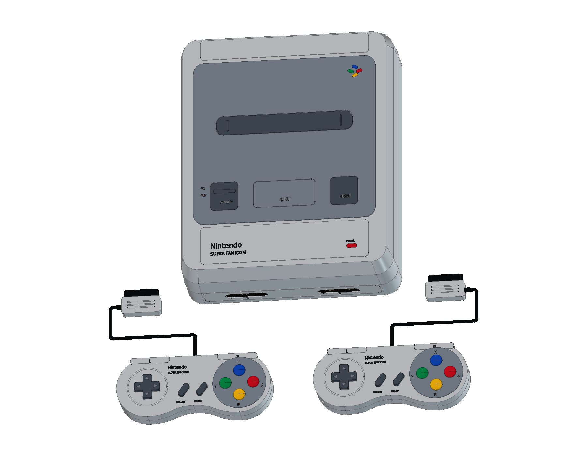
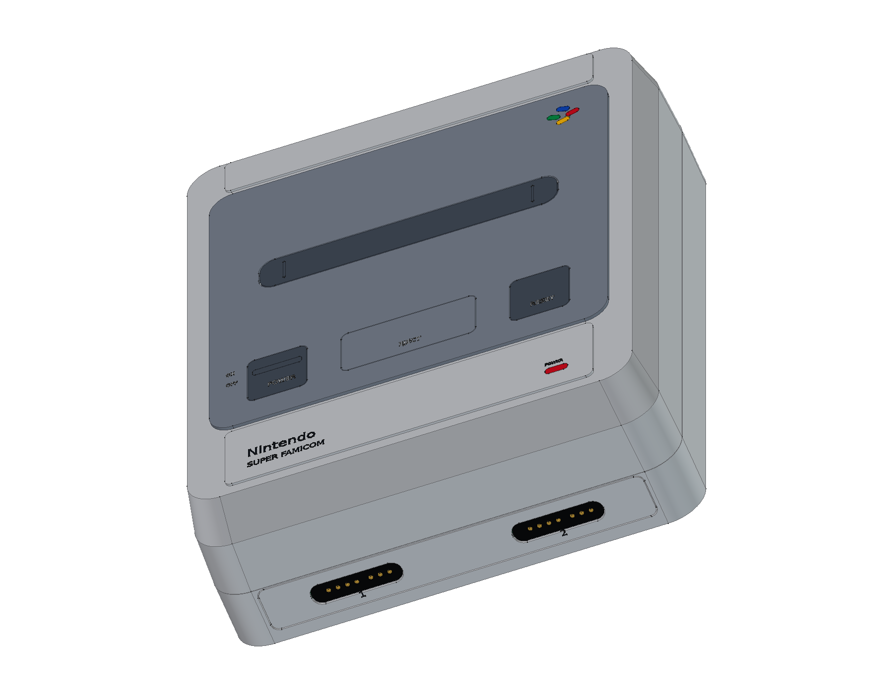
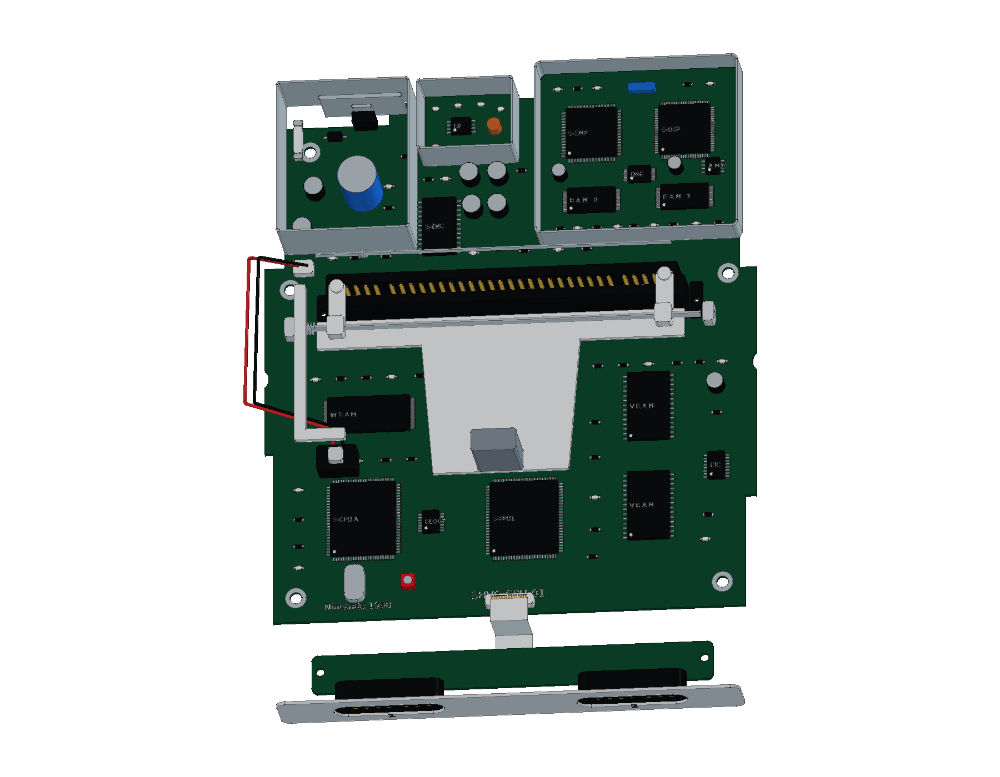
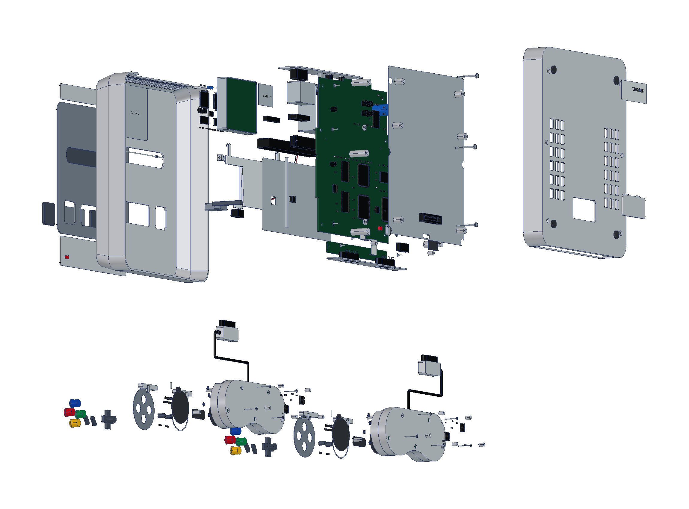
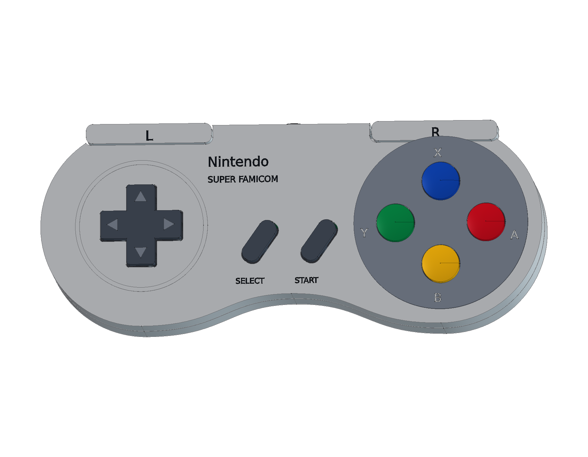
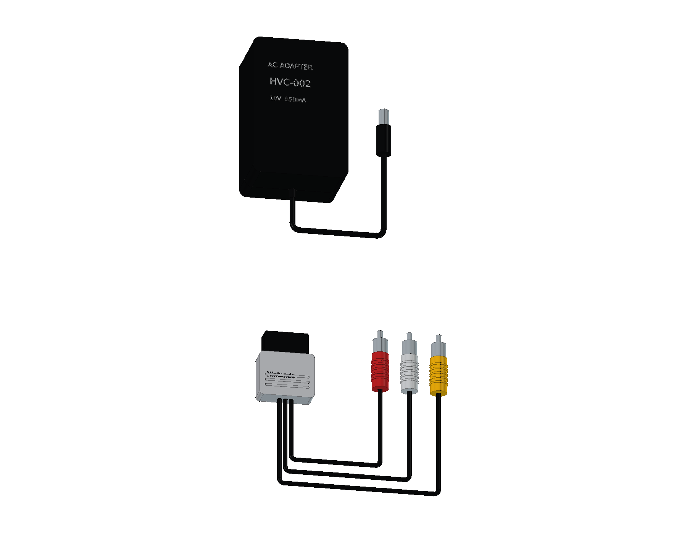

# Nintendo Super Famicom · SHVC-001

早期日版 SHVC-CPU-01 / 独立 SHVC-SOUND 结构学习模型包含 **21 轮源码、1,918 个组件条目与 2,224 个实体**：原生曲面分体外壳、主板、分立 CPU / PPU、上下 62P 卡槽连接器、独立声卡、RF 模块、屏蔽、退卡机构及前板排线；另含两只原版 SHVC-005 手柄和另售 HVC-002 / SHVC-008 学习附件。提供完整及爆炸原生工程、三份 STEP、12 页 A3 PDF / SVG / 原生图纸和 25 个网页视图。

<table>
<tr>
<td align="center" width="33%"> 日版原机与双手柄</td>
<td align="center" width="33%"> 曲面外壳与原版接口</td>
<td align="center" width="33%"> 主板、独立声卡与卡槽</td>
</tr>
<tr>
<td align="center" width="33%"> 分层爆炸装配</td>
<td align="center" width="33%"> 原版狗骨形手柄</td>
<td align="center" width="33%"> 另售 AC 适配器与 AV 线</td>
</tr>
</table>

- [在线 3D 预览](https://tiansongyu.github.io/open-console-cad/?device=sfc&view=assembled#viewer)
- [完整 FreeCAD 工程](output/SuperFamicom_Complete.FCStd) · [爆炸工程](output/SuperFamicom_Exploded.FCStd) · [打开宏](Open_SuperFamicom.FCMacro)
- [全套 STEP](output/SuperFamicom_FullKit.step) · [主机与双手柄 STEP](output/SuperFamicom_Console.step) · [爆炸 STEP](output/SuperFamicom_Exploded.step)
- [12 页 A3 PDF](output/drawings/SuperFamicom_Drawings.pdf) · [HTML 图册](output/drawings/SuperFamicom_Drawings.html) · [SVG 目录](output/drawings/) · [原生图纸](output/SuperFamicom_Drawings.FCStd)
- [组件清单](output/COMPONENTS.csv) · [模型清单](output/reports/final_manifest.json)
- [完整重建宏](Rebuild_SuperFamicom.FCMacro) · [逐轮记录](ITERATIONS.md) · [建模源码](../../tools/cadlib/sfc.py)
- [源码重建比对](output/reports/rebuild_verification.json) · [严格实体检查](output/reports/strict_saved_native.json) · [装配求交](output/reports/assembly_interference.json)
- [STEP 回读](output/reports/export_roundtrip_audit.json) · [参数编辑复原](output/reports/parameter_edit_test.json) · [资料与边界](references/SOURCES.md)

使用 FreeCAD 1.1.3 打开工程。下壳草图与拉伸、上壳分段放样、狗骨形手柄轮廓和布尔历史保留修改入口；重建宏从空文档执行全部轮次，并写入 `output/rebuilt/`。`Parameters.Width` 驱动底壳原生宽度约束；其他局部几何并非一键缩放的制造设计。

日版 SHVC-001 原使用说明书的名义包络为 **200 × 242 × 74 mm**。选择带独立声卡的早期 SHVC-CPU-01，不混用后期 1CHIP 主板或复刻迷你机。任天堂 1992 年维修手册指导上下 62P 连接器、扁平排线、磁芯、退卡机构和装配分件。

两只 SHVC-005 手柄采用实物照片所示 1992 年双移位寄存器板，保留四色凸面键、斜置 Start / Select、独立肩键和七接点插头。主机原装配置含两只手柄；HVC-002 线性 AC 适配器与 SHVC-008 AV 线另售。附件内部和缩短的展示线缆按原版实物照片表达，不混入现代替换电源。

壁厚、曲率、孔位、弹簧、导电胶、元件、走线和附件尺寸均为非功能性学习近似；不提供制造公差、工作电路或接口配合保证。原版外包络、实物结构依据与局部近似在图册和资料页中分别说明。

全部 1,918 个组件的源码重建比对、严格实体、2,638 对装配候选求交、参数复原、三份 STEP 回读及图册/网页检查通过；详细范围见各项报告。

已发布版本 `efc601d` 的 14 份线上文件哈希、25 个网页视图、三种屏幕布局、键盘滑块及设备切换均核对通过，见 [线上文件](output/reports/live_delivery_audit.json) 与 [线上交互](output/reports/live_ui_checks.json)。
