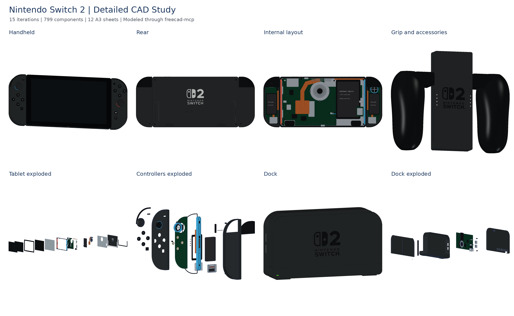

# Nintendo Switch 2 · FreeCAD 项目

[在线整机预览](https://tiansongyu.github.io/open-console-cad/?device=switch2&view=assembled#viewer) · [在线爆炸视图](https://tiansongyu.github.io/open-console-cad/?device=switch2&view=exploded#viewer) · [仓库使用说明](../../README.md)

15 轮设计，799 个组件、963 个实体。包含主机、左右手柄、底座、非充电握把与两套腕带。整体包络参考官方数据，局部尺寸和内部结构为近似示意。

## 打开文件

- [完整模型](output/Switch2_Complete.FCStd)：保留草图、凸台、圆角、布尔操作与参数表。
- [爆炸装配](output/Switch2_Exploded.FCStd)：独立组件与爆炸位移。
- [FreeCAD 图纸](output/Switch2_Drawings.FCStd)：12 页自包含图页与原生尺寸参考。
- [A3 PDF 图册](output/drawings/Switch2_Drawings.pdf)：总装、接口、剖面、爆炸和材料索引。
- [带色整套 STEP](output/Switch2_FullKit.step) · [手持整机 STEP](output/Switch2_Handheld.step) · [底座 STEP](output/Switch2_Dock.step)。
- [组件清单](output/COMPONENTS.csv) · [效果图](output/previews/) · [检查报告](output/reports/)。

在 FreeCAD 中运行 `Open_Switch2.FCMacro` 可打开主要成品；运行 `Rebuild_Switch2.FCMacro` 会将各轮结果生成到 `output/rebuilt/`，保留当前交付。已验证 FreeCAD 1.1.3。

## 源码与维护

- [逐轮源码索引](ITERATIONS.md)。历史二进制检查点不提交，可运行重建宏生成。
- 已验证参数 `Parameters.StickProjection` 的联动；其他参数修改后需检查上下游几何。
- 图纸为当前模型快照，修改模型后需要重新生成。
- 网页网格由实际 FCStd 导出，详细维护方法见 [维护指南](../../docs/MAINTAINING.md)。
- 公开尺寸、局部近似和参考链接见 [SOURCES.md](references/SOURCES.md)。

## 许可

原创内容按仓库 [MIT](../../LICENSE) 授权；第三方名称、标识、字体与参考资料见 [第三方声明](../../THIRD_PARTY_NOTICES.md)。
