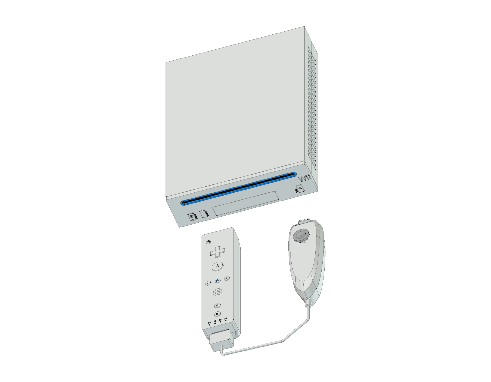
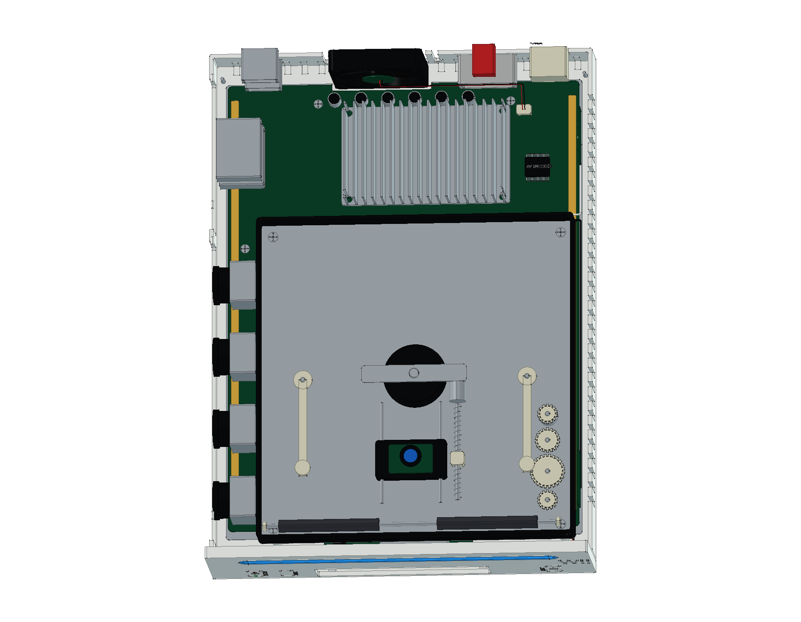

# Nintendo Wii — RVL-001

初代白色 Wii 的 FreeCAD 结构学习模型，包含原版 **RVL-003 遥控器、RVL-004 双节棍、感应条、支架与连接附件**。提供完整工程、爆炸装配、彩色 STEP、12 页 A3 图纸与十七种网页视图。

当前模型包含 **654 个组件条目、883 个实体与 15 轮建模源码**。同一组件可包含多枚触点或文字实体，组件数量与实体数量分别统计。

[在线 3D](https://tiansongyu.github.io/open-console-cad/?device=wii&view=assembled#viewer) · [光驱机构](https://tiansongyu.github.io/open-console-cad/?device=wii&view=optical#viewer) · [遥控器内部](https://tiansongyu.github.io/open-console-cad/?device=wii&view=remote-internal#viewer) · [A3 图册](output/drawings/Wii_Drawings.pdf)

## 交付文件

- [完整 FreeCAD 工程](output/Wii_Complete.FCStd) · [爆炸装配](output/Wii_Exploded.FCStd)
- [12 页 A3 PDF](output/drawings/Wii_Drawings.pdf) · [原生图纸](output/Wii_Drawings.FCStd) · [SVG 与排版源码](output/drawings/)
- [整套 STEP](output/Wii_FullKit.step) · [主机与控制器 STEP](output/Wii_Console.step) · [爆炸 STEP](output/Wii_Exploded.step)
- [组件清单](output/COMPONENTS.csv) · [逐轮记录](ITERATIONS.md) · [资料来源](references/SOURCES.md)

## 版本与结构

选择保留 GameCube 兼容接口的 RVL-001，采用横放姿态建模。任天堂公开主体尺寸为竖放 **44 × 157 × 215.4 mm**，在本工程中对应 **X 157、Y 215.4、Z 44 mm**，公开主体包络不包括外伸件。当前模型含表面标识的主机包络约为 **157 × 215.758 × 44 mm**，控制器和连接附件另计。

- **主机**：原生草图、拉伸、圆角和布尔加工历史；独立前面板、蓝色光盘槽、SD 门、四个 GameCube 手柄口与两个存储卡槽。
- **内部**：Broadway / Hollywood 封装、存储器、无线模块、鳍片散热器、风扇、上下屏蔽板、装配支柱与线束。
- **吸入式光驱**：双滚轮、齿轮、主轴、压盘、双导轨光头、螺旋进给件、控制板和排线。
- **原版控制器**：遥控器的红外相机、扬声器、振动机构、两节 AA 电池及弹簧触点；双节棍的曲面外壳、模拟摇杆、C/Z 键、板件与扩展线。遥控器采用 RVL-003 轮廓。
- **附件**：双五灯感应条、感应条支架、竖放支架与辅助底板、电源适配器、日式电源插头、Wii AV 转三 RCA 线，以及空白 12 cm / 8 cm 光盘。

外形包络参考官方资料。局部尺寸、壁厚、触点、线束和内部布局是原创学习近似；主板参考照片包含 RVL-CPU-40，不宣称复刻首批主板、原厂电路或制造公差。模型不包含游戏数据，机械结构不作运动或电气仿真。资料来源见 [SOURCES.md](references/SOURCES.md)。

## 查看与重建

使用 FreeCAD 1.1.3 打开工程，或运行 [Open_Wii.FCMacro](Open_Wii.FCMacro) 打开整机、爆炸装配和原生图纸。在模型树中展开装配分组，切换组件可见性并查看原生草图和加工历史。

保留仓库目录结构，运行 [Rebuild_Wii.FCMacro](Rebuild_Wii.FCMacro)，可按十五轮源码重新生成模型及 CAD / STEP 交付文件；重建结果位于 `output/rebuilt/`。图纸和网页网格需要按仓库 [README](../../README.md) 的交付流程另行更新。建模过程见 [ITERATIONS.md](ITERATIONS.md)，主要源码为 [wii.py](../../tools/cadlib/wii.py)。

## 验证范围

- [源码重建](output/reports/rebuild_verification.json)：新工程执行十五轮源码，654 个组件的有效性、实体数量、边界与体积逐项核对。
- [严格 BRep](output/reports/strict_bop_audit.json)：所有物理组件通过严格实体检查。
- [装配求交](output/reports/final_interference_audit.json)：1,350 对候选组件检查完成，无超过 0.000001 mm³ 的干涉。
- [原生与 STEP 回读](output/reports/export_roundtrip_audit.json)：两份原生装配和三份 STEP 通过逐实体匹配，数值积分差异另经双向布尔差集确认。
- [图纸尺寸](output/reports/drawing_checks.json) · [原生图页](output/reports/native_drawings_audit.json) · [保存后重开](output/reports/native_drawings_reload.json)：12 页及 16 个原生尺寸引用。
- [图册视觉检查](output/reports/visual_acceptance.json) · [独立复核](output/reports/independent_pdf_review.json) · [网页预览检查](output/reports/web_preview_checks.json)。

这些检查验证当前学习模型与交付文件的一致性；修改几何后，应重新生成并检查相关结果。

本设备属于非官方学习项目，随仓库采用 [MIT 许可证](../../LICENSE)。相关产品名称和标识归各自权利人所有。
