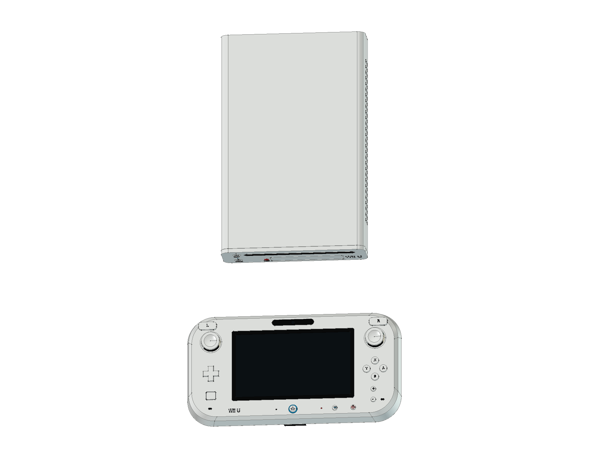
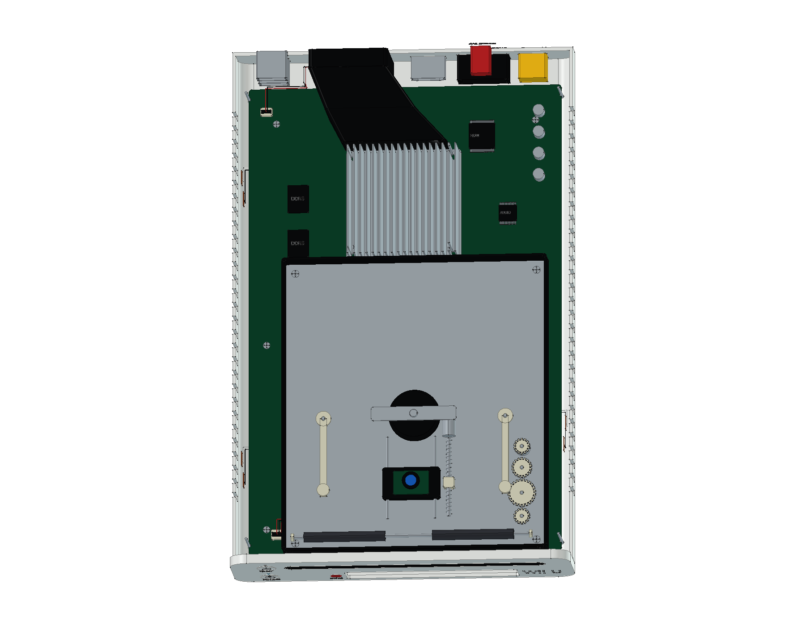

# Nintendo Wii U — WUP-001 Basic

首发白色 Wii U Basic 的 FreeCAD 结构学习模型，包含 **8 GB 主机、原版 WUP-010 GamePad、触控笔、两块电源和 HDMI 线**。提供完整工程、分层爆炸、彩色 STEP、12 页 A3 图纸与十六种网页视图。

当前模型包含 **707 个组件条目、1,039 个实体与 22 轮建模源码**。同一组件可包含多枚触点或文字实体，组件数量与实体数量分别统计。

[在线 3D](https://tiansongyu.github.io/open-console-cad/?device=wiiu&view=assembled#viewer) · [GamePad 内部](https://tiansongyu.github.io/open-console-cad/?device=wiiu&view=gamepad-internal#viewer) · [光驱机构](https://tiansongyu.github.io/open-console-cad/?device=wiiu&view=optical#viewer) · [A3 图册](output/drawings/WiiU_Drawings.pdf)

## 交付文件

- [完整 FreeCAD 工程](output/WiiU_Complete.FCStd) · [爆炸装配](output/WiiU_Exploded.FCStd)
- [12 页 A3 PDF](output/drawings/WiiU_Drawings.pdf) · [原生图纸](output/WiiU_Drawings.FCStd) · [SVG 与排版源码](output/drawings/)
- [整套 STEP](output/WiiU_FullKit.step) · [主机与 GamePad STEP](output/WiiU_Console.step) · [爆炸 STEP](output/WiiU_Exploded.step)
- [组件清单](output/COMPONENTS.csv) · [逐轮记录](ITERATIONS.md) · [资料来源](references/SOURCES.md)

## 版本与结构

选择 2012 年首发白色 **WUP-001 Basic 8 GB**，以及原版 **WUP-010 GamePad / 1500 mAh 电池**。任天堂公开塑料主体尺寸分别为主机 **172 × 268.5 × 46 mm**、GamePad **255.4 × 133.4 × 41 mm**，不含外伸件。本模型含脚垫和标识的主机包络约 **172 × 268.778 × 47.2 mm**，GamePad 与线缆另计。

- **主机外壳**：原生圆角截面、长向拉伸、空心壳及上下分件，独立前面板、光盘槽、SD / USB 盖板、后排风口和两侧通风槽。
- **主机内部**：CPU / GPU 共用载板与散热盖、四枚 DDR3L、8 GB eMMC、兼容模式存储器、三块无线模块、共用鳍片散热器与偏置风道。
- **吸入式光驱**：双滚轮、齿轮、主轴、压盘、双导轨光头、螺旋进给件、控制板、软排线和独立供电线。
- **GamePad**：原生曲面前后壳和双握柄，显示与触摸层、双摇杆、ABXY、十字键、肩键、HOME / TV 控制、相机、NFC 与立体声扬声器。
- **GamePad 内部**：主板、独立按键板、无线板、NFC 板、镂空显示支承、电池、回中弹簧与电位器、振动器、软排线及细线束。
- **Basic 附件**：WUP-002 主机电源、WUP-011 GamePad 电源、日式两片插头、专用 DC 端头、两端十九接点 HDMI 与 WUP-015 触控笔。

主体包络参考官方资料；壁厚、孔位、触点、线数、机构、适配器尺寸与内部器件为原创学习近似。主板参考 WUP-CPU-01 等实物照片，模型不定义原厂电路、制造公差、引脚功能或经过验证的机械运动。Basic 套装不混入 Premium 支架；触控笔以独立附件姿态展示。详细依据见 [SOURCES.md](references/SOURCES.md)。

## 查看与重建

使用 FreeCAD 1.1.3 打开工程，或运行 [Open_WiiU.FCMacro](Open_WiiU.FCMacro) 打开完整装配、爆炸模型和原生图纸。在模型树中切换装配分组及组件可见性，检查原生草图与加工历史。

保留仓库结构，运行 [Rebuild_WiiU.FCMacro](Rebuild_WiiU.FCMacro)，可按二十二轮源码重新生成 CAD / STEP，结果写入 `output/rebuilt/`。图纸与网页网格按仓库 [README](../../README.md) 的交付流程另行重建。逐轮过程见 [ITERATIONS.md](ITERATIONS.md)，主要源码为 [wiiu.py](../../tools/cadlib/wiiu.py)。

## 验证范围

- [完整源码重建](output/reports/rebuild_verification.json)：新工程执行全部 22 轮，707 个组件的有效性、实体数量、边界与体积逐项核对。
- [严格实体检查](output/reports/strict_bop_audit.json)：所有物理组件通过严格 BRep 检查。
- [装配求交](output/reports/final_interference_audit.json)：1,107 对候选组件检查完成，无超过 0.000001 mm³ 的干涉。
- [原生与 STEP 回读](output/reports/export_roundtrip_audit.json)：两份原生装配与三份 STEP 逐实体匹配；数值积分差异经双向布尔差集核对。
- [图纸尺寸](output/reports/drawing_checks.json) · [原生图页](output/reports/native_drawings_audit.json) · [重开检查](output/reports/native_drawings_reload.json)：12 页及 14 个原生尺寸引用。
- [图册视觉检查](output/reports/visual_acceptance.json) · [独立复核](output/reports/independent_pdf_review.json) · [网页检查](output/reports/web_preview_checks.json)。

检查结果对应当前模型与交付文件；修改几何后需重新生成并检查。建模通过 neka-nat/freecad-mcp 在 FreeCAD 主线程执行，网页网格直接从组件 BRep 导出。

本设备随仓库采用 [MIT 许可证](../../LICENSE)。本项目为非官方学习项目，产品名称与标识归相应权利人所有。
