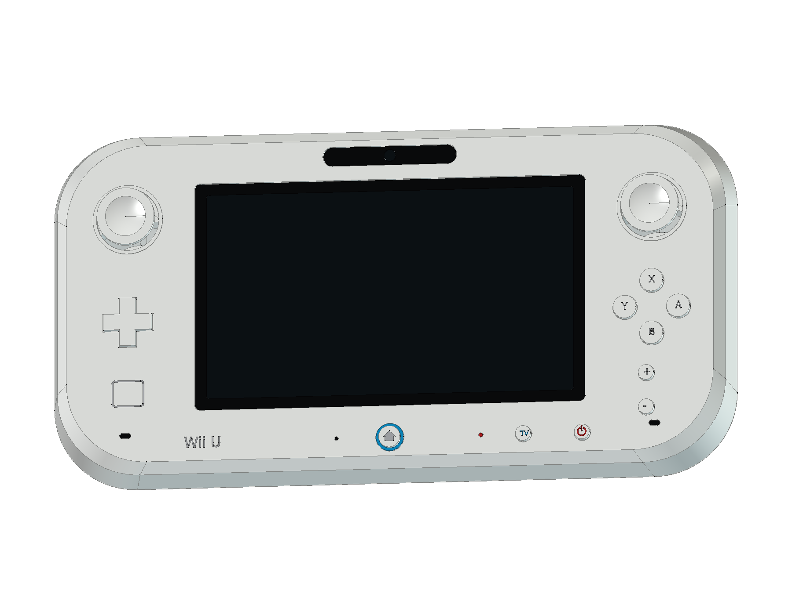

# Nintendo Wii U — WUP-001 Basic

**绘制中。** 选择 2012 年首发白色 Basic 8 GB 主机，以及原版 WUP-010 GamePad。当前已完成 16 轮源码、561 个组件；线束、配套电源与 HDMI 附件，以及最终 CAD / 图纸 / 网页交付仍在继续。

当前工程：[WiiU_Study.FCStd](output/WiiU_Study.FCStd) · [建模过程](ITERATIONS.md) · [资料来源](references/SOURCES.md) · [源码](../../tools/cadlib/wiiu.py)

已建内容包括圆角主机空心壳、前后接口、Basic 主板、CPU/GPU 多芯片封装、四片 DDR3L、三块无线模块、散热器与风道、吸入式光驱、屏蔽与固定件；GamePad 包含曲面外壳、握柄、显示与触摸层、双摇杆、按键、肩键、主板、NFC、无线模块、原版电池、扬声器和触控笔。

公开主体尺寸分别为主机 **172 × 268.5 × 46 mm**、GamePad **255.4 × 133.4 × 41 mm**，不含外伸控制件。局部尺寸、接点和内部机构为原创学习近似，不是原厂制造图、电路或运动仿真。

当前阶段已通过 [561 个组件的严格实体检查](output/reports/stage16_strict_bop.json) 和 [770 组装配求交](output/reports/stage16_interference.json)。这是当前已建部分的检查结果。补齐线束与附件、执行完整源码重建、STEP 回读、12 页 A3 图纸和浏览器检查后，再将本设备加入公开模型库。现有已发布模型仍可从仓库根目录 README 访问。
