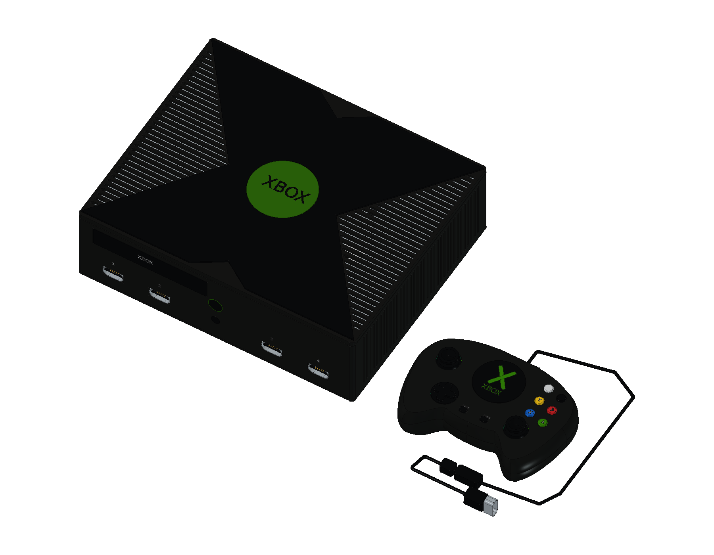
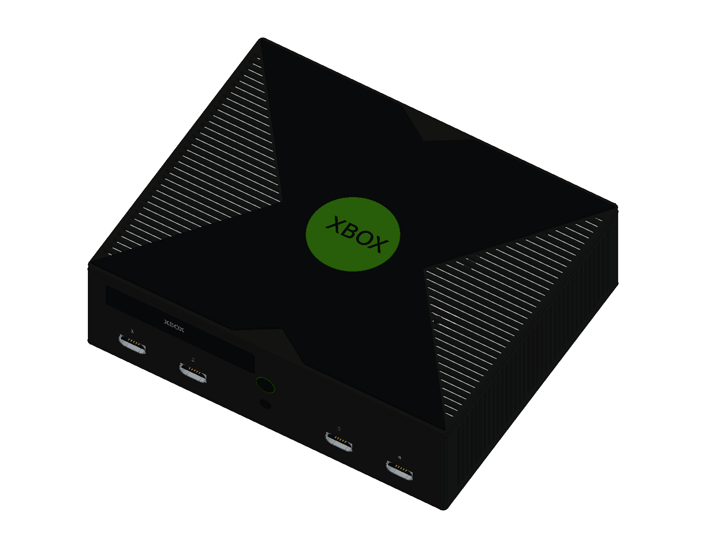
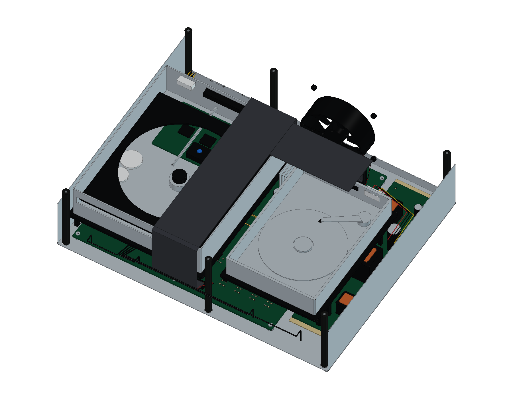
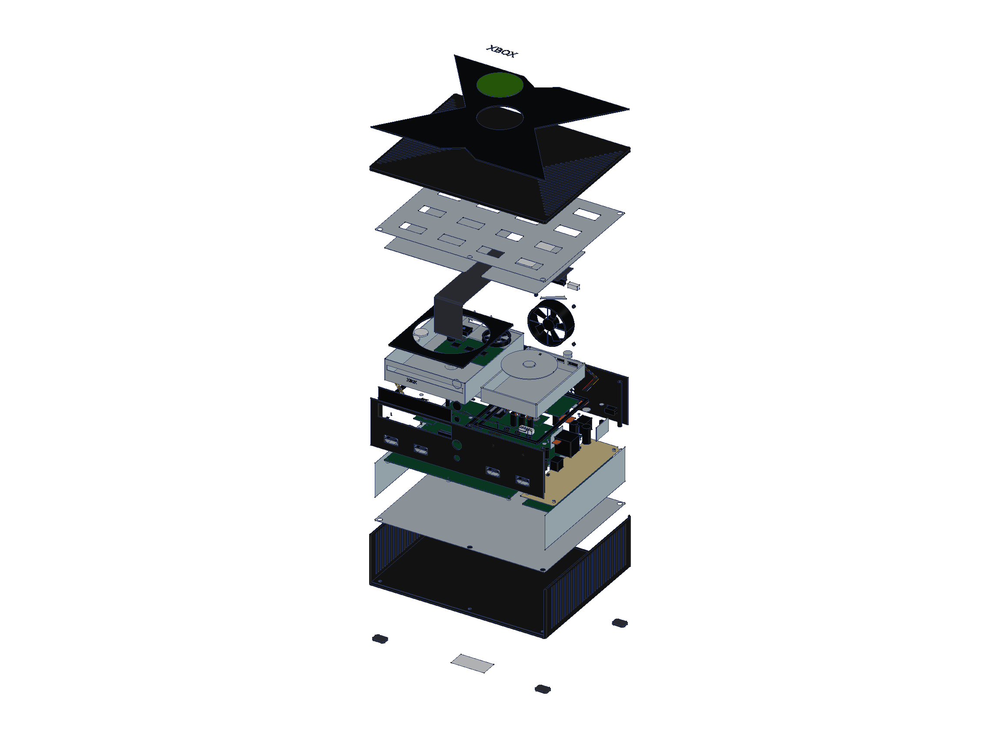
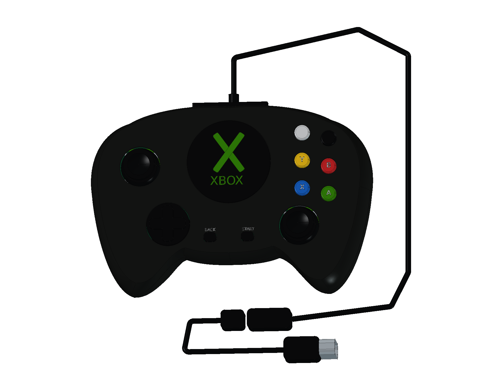
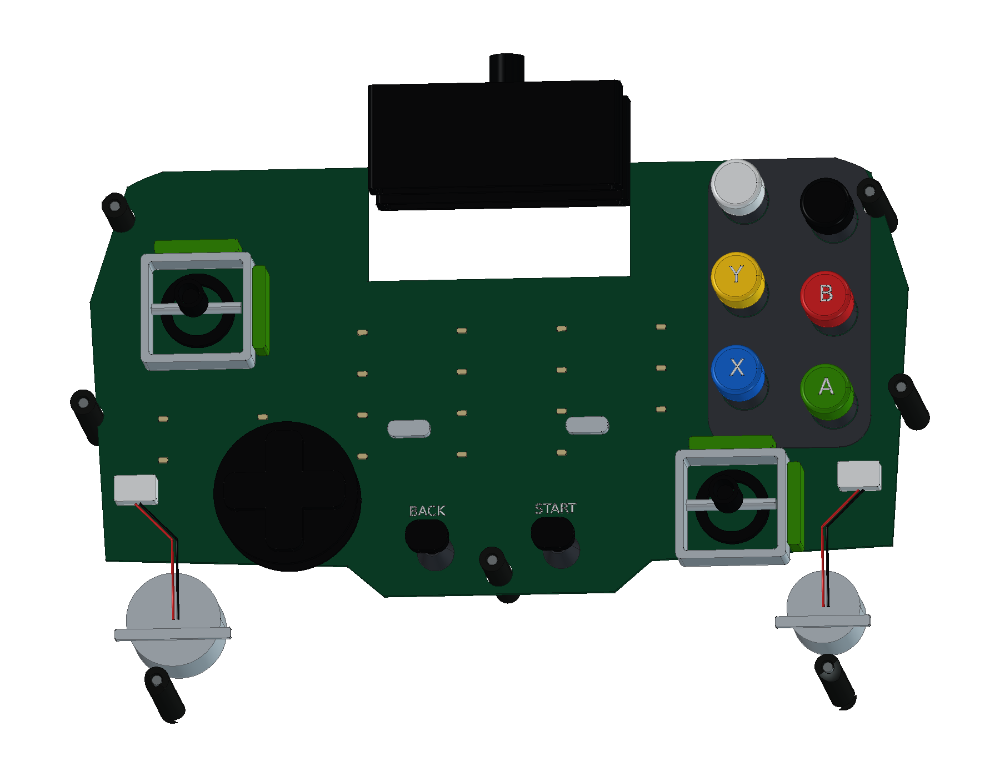

# Microsoft Xbox · 原版黑色 v1.0

2001 年原版黑色主机与有线 Duke 结构学习模型，包含 **18 轮源码、978 个组件条目和 1007 个实体**：宽 X 上盖、绿色饰牌、四个控制器口、早期双面主板、CPU 被动散热器与 GPU 主动风扇、后排风扇、托盘 DVD、3.5 英寸 IDE 硬盘、独立塑料托架、开放式电源与线束，以及原版 Duke 单主板、双振动电机、模拟扳机和快速脱离线缆。提供三份 STEP、十二页 A3 图册和二十二个网页视图。

<table>
<tr>
<td align="center" width="33%"> 2001 原版主机与有线 Duke</td>
<td align="center" width="33%"> 宽 X 上盖与四个控制器口</td>
<td align="center" width="33%"> 双驱动器、早期主板与电源</td>
</tr>
<tr>
<td align="center" width="33%"> 主机分层爆炸</td>
<td align="center" width="33%"> 原版 Duke 与快速脱离线缆</td>
<td align="center" width="33%"> 单主板、摇杆与双电机</td>
</tr>
</table>

- [在线 3D](https://tiansongyu.github.io/open-console-cad/?device=xbox&view=assembled#viewer)
- [完整工程](output/OriginalXbox_Complete.FCStd) · [爆炸工程](output/OriginalXbox_Exploded.FCStd) · [打开宏](Open_OriginalXbox.FCMacro)
- [全套 STEP](output/OriginalXbox_FullKit.step) · [主机与手柄 STEP](output/OriginalXbox_Console.step) · [爆炸 STEP](output/OriginalXbox_Exploded.step)
- [12 页 A3 PDF](output/drawings/OriginalXbox_Drawings.pdf) · [HTML 图册](output/drawings/OriginalXbox_Drawings.html) · [SVG 目录](output/drawings/) · [原生图纸](output/OriginalXbox_Drawings.FCStd)
- [组件清单](output/COMPONENTS.csv) · [模型清单](output/reports/final_manifest.json) · [逐轮记录](ITERATIONS.md)
- [重建宏](Rebuild_OriginalXbox.FCMacro) · [建模源码](../../tools/cadlib/xbox.py) · [资料与边界](references/SOURCES.md)
- [源码重建比对](output/reports/rebuild_verification.json) · [严格实体检查](output/reports/strict_saved_native.json) · [装配求交](output/reports/assembly_interference.json)
- [STEP 回读](output/reports/export_roundtrip_audit.json) · [参数修改复原](output/reports/parameter_edit_test.json) · [交付核对](output/reports/completion_audit.json)

使用 FreeCAD 1.1.3 打开工程。下壳草图和拉伸、手柄曲线放样及后续布尔历史保留修改入口；`Parameters.Width` 驱动下壳宽度。重建宏从空文档执行全部十八轮，输出到 `output/rebuilt/`。局部器件和相对位置采用固定近似值，并非可整体缩放的制造设计。

微软存档规格明确将 **320 × 100 × 260 mm** 标为 approximate，本模型按 XYZ 重排为 **320 × 260 × 100 mm**。内部采用 2001 发售期拆解的早期 v1.0 布局：主动 GPU 风扇、被动 CPU 散热器，以及分布于主板两面的四枚已安装内存。iFixit 后期样机仅用于外壳和托架参考，未混入后期被动 GPU 散热结构。硬盘表达 3.5 英寸 IDE 结构，不以盘片或外壳推断可用容量。

Duke 依据原版拆解重构，保留单主板、独立碳接点贴膜、六键硅胶层、六穹顶方向键、模拟扳机压缩弹簧和两枚不等偏心块电机。中心饰牌为静态结构，没有现代复刻版的屏幕、Share、USB-C 或电池盒。线缆长度及布线路径为展示近似。

孔位、曲率、壁厚、器件、触点和导线仅作学习观察，不提供原厂公差、功能电路、散热性能或电气认证。附件包含专用 AV 插头与三枚复合视频/左右声道 RCA、八字电源线；墙端采用通用示意，不指定地区插脚。图册保留真实 CAD 投影、实体剖面、原生尺寸引用及来源边界。
