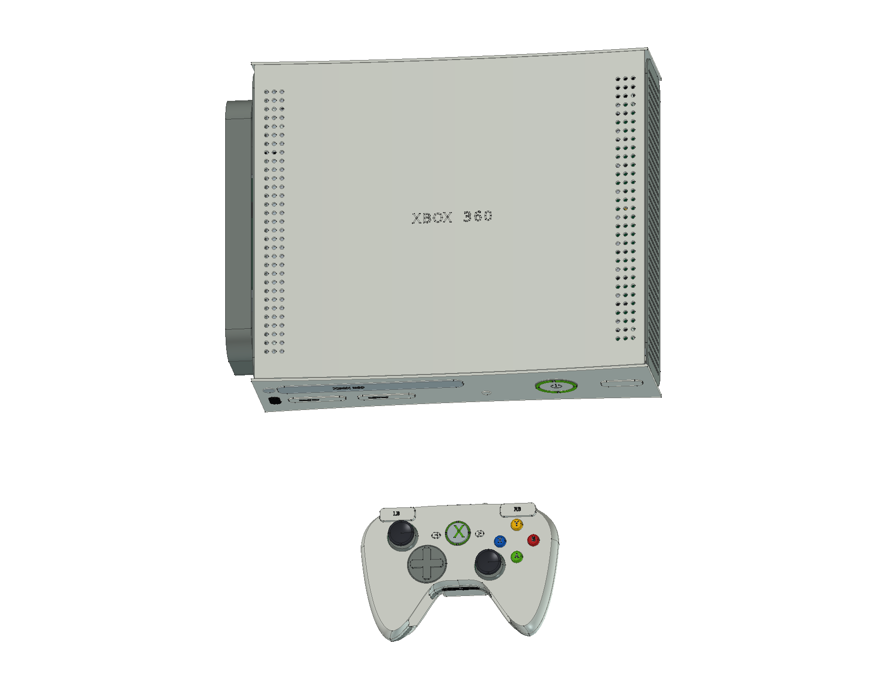
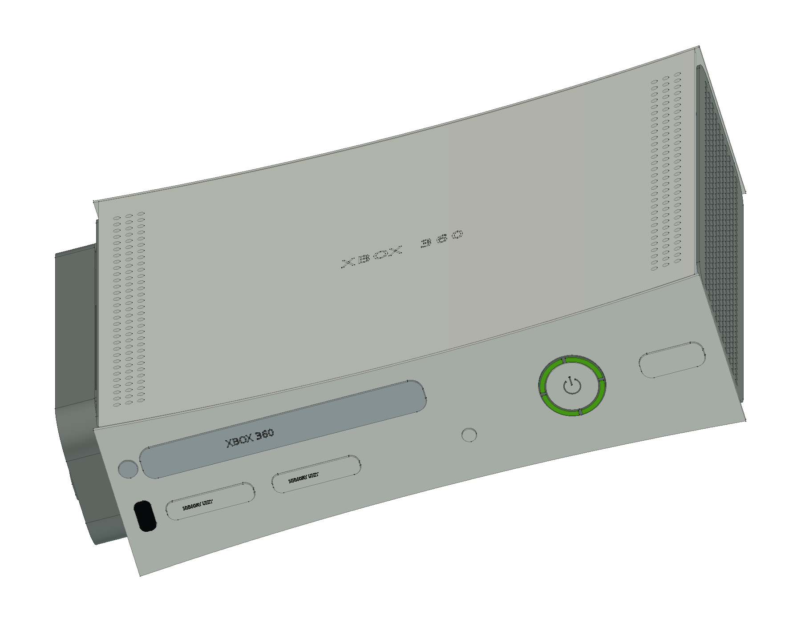
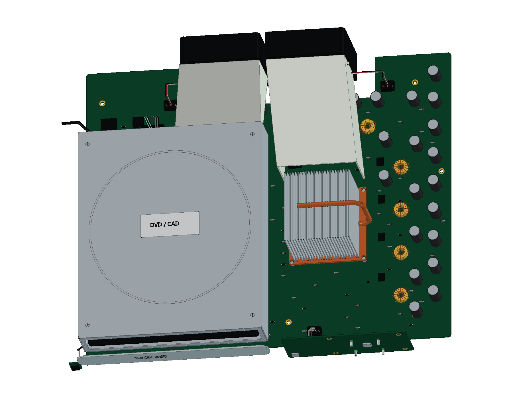
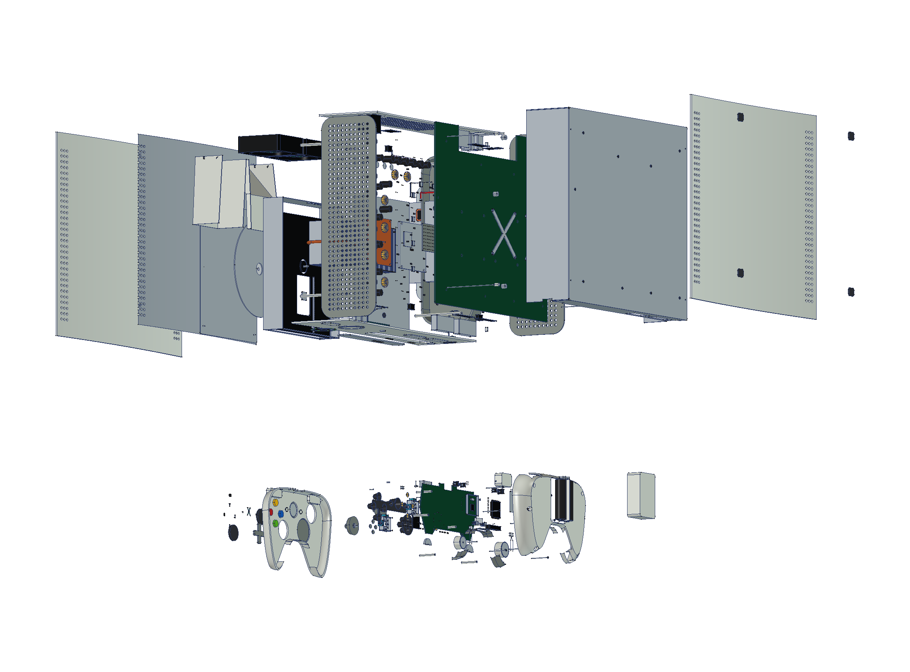
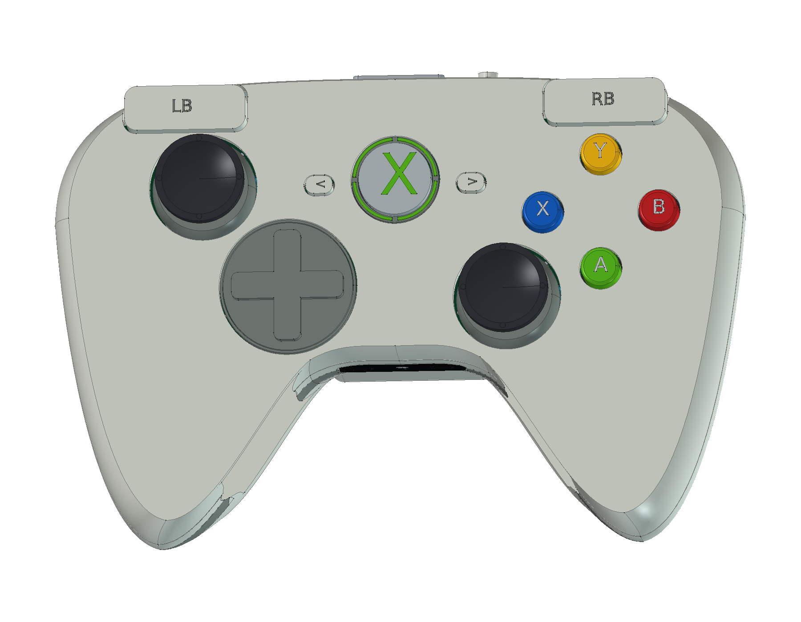
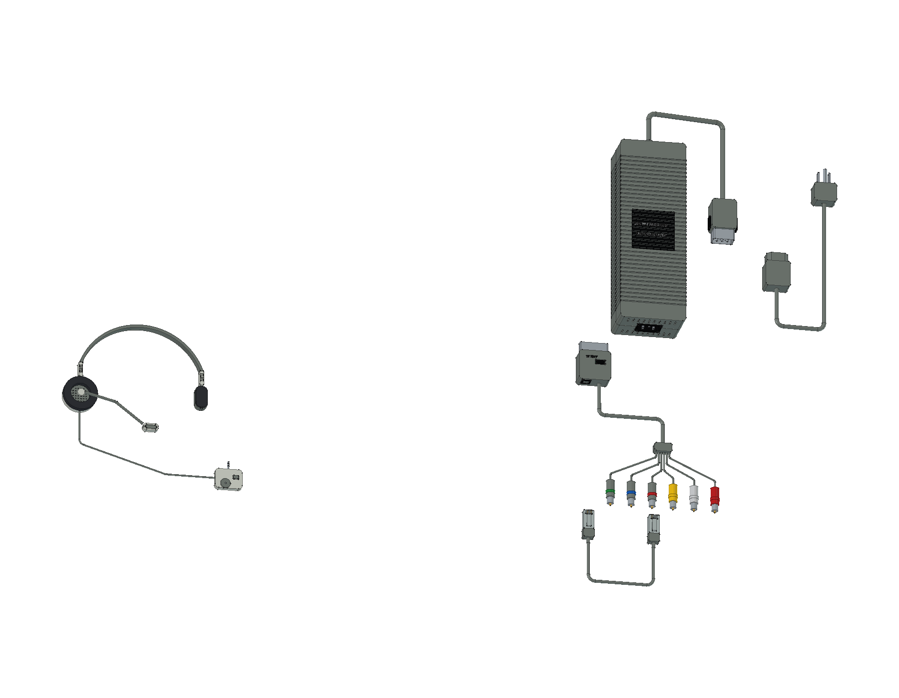

# Microsoft Xbox 360 · Xenon

原版白色 Premium 20 GB 结构学习模型包含 **35 轮源码、2,005 个组件条目与 3,141 个实体**：无 HDMI 的 Xenon 主机、原版双 AA 无线控制器、203 W 外置电源、单耳耳机、Component HD AV、网线及北美接地 AC 线。提供完整与爆炸原生工程、三份彩色 STEP、12 页 A3 PDF / SVG / 原生图纸及 23 个网页视图。

<table>
<tr>
<td align="center" width="33%"> 原版主机与无线手柄</td>
<td align="center" width="33%"> 凹曲面白壳与前置接口</td>
<td align="center" width="33%"> 主机内部结构</td>
</tr>
<tr>
<td align="center" width="33%"> 分层爆炸装配</td>
<td align="center" width="33%"> 原版双 AA 无线手柄</td>
<td align="center" width="33%"> 203 W 电源与配套附件</td>
</tr>
</table>

- [在线 3D 预览](https://tiansongyu.github.io/open-console-cad/?device=xbox360&view=assembled#viewer)
- [完整 FreeCAD 工程](output/Xbox360_Complete.FCStd) · [爆炸工程](output/Xbox360_Exploded.FCStd) · [打开宏](Open_Xbox360.FCMacro)
- [整套 STEP](output/Xbox360_FullKit.step) · [主机与手柄 STEP](output/Xbox360_Console.step) · [爆炸 STEP](output/Xbox360_Exploded.step)
- [12 页 A3 PDF](output/drawings/Xbox360_Drawings.pdf) · [HTML 图册](output/drawings/Xbox360_Drawings.html) · [SVG 目录](output/drawings/) · [原生图纸](output/Xbox360_Drawings.FCStd)
- [组件清单](output/COMPONENTS.csv) · [模型清单](output/reports/final_manifest.json)
- [完整重建宏](Rebuild_Xbox360.FCMacro) · [逐轮记录](ITERATIONS.md) · [建模源码](../../tools/cadlib/xbox360.py)
- [源码重建比对](output/reports/rebuild_verification.json) · [严格实体检查](output/reports/strict_saved_native.json) · [装配检查](output/reports/assembly_interference.json)
- [STEP 回读检查](output/reports/export_roundtrip_audit.json) · [参数编辑复原](output/reports/parameter_edit_test.json) · [资料与建模边界](references/SOURCES.md)

使用 FreeCAD 1.1.3 打开工程。原生草图、曲面放样和布尔历史保留修改入口。重建宏从空文档执行全部三十五轮，生成 `output/rebuilt/`，可用[几何比对工具](../../tools/cadlib/compare_native.py)逐件核对。热管在 STEP 导出时通过[精确 NURBS 曲面转换](../../tools/export_step_nurbs.py)处理，转换前后双向几何差为空；原生曲面保持原样。[文本整理工具](../../tools/compact_step.py)仅去除 STEP 行首缩进，使单文件低于仓库大小上限；三份整理后的文件仍须逐实体回读验证。

本体 **309 × 258 × 83 mm** 是工作近似包络，未视为厂商测绘尺寸；外置硬盘和突出部另计。原版 Microsoft 手册、Copetti 的 2005 Xenon 照片及 Ben Heck 改造前原机照片指导布局。CPU 采用高鳍片与铜热管，GPU 保留早期低散热器；不加入后期 HDMI 或延伸 GPU 热管。

无线手柄参考 2005 年 FCC 原始申请与原版手册，保留分离射频子板、引脚式主控、非对称双摇杆、导电胶、早期黑色扳机支架、两种偏心振动电机和反向安装的双 AA 电池。微软后续同家族规格仅作总体尺度参考，曲率、孔位及机构仍是近似，未混入 Windows 接收器或另售充电电池包。

北美普通套装包含原版大型手柄端耳机音量/静音适配器、六 RCA 视频线的 TV/HDTV 开关和光纤口、八接点网线及三脚接地电源线。不把限时首发遥控器或北欧 SCART 视为本套标准附件。

203 W 电源与主动风冷架构有首发样机分析依据；内部风机、磁芯、绕组、板件布局和电气端子为明确标注的非功能示意，并非特定供应商的精确测绘。所有电缆采用缩短展示路径；模型不提供电气制造、实际接线或游戏数据。

2,005 个组件从空文档重建并逐件比对，严格实体检查、3,339 对装配候选求交、参数修改复原、三份 STEP 回读与图册/网页检查通过。详细数值与几何边界见各项独立报告。
