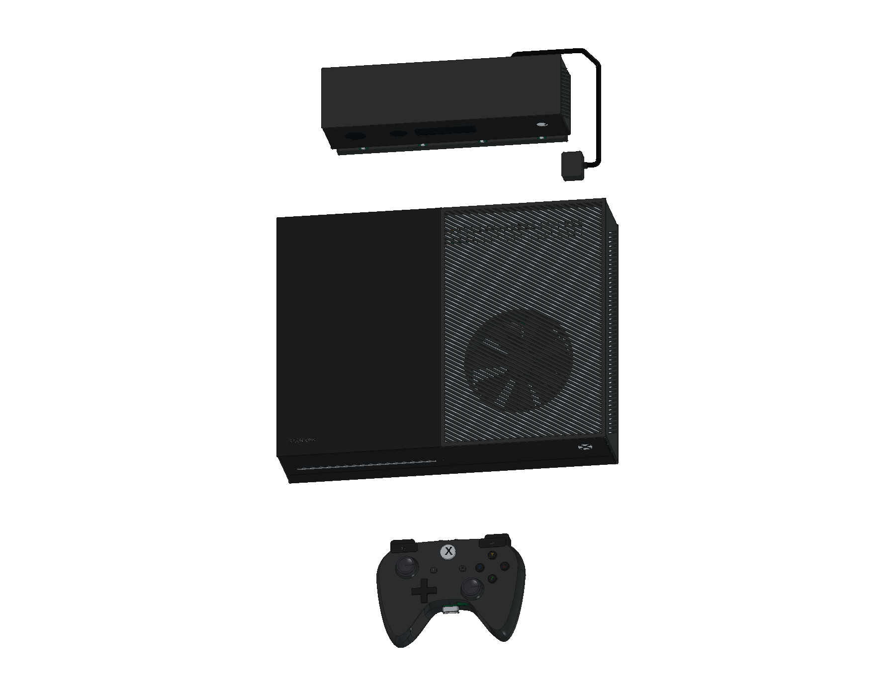
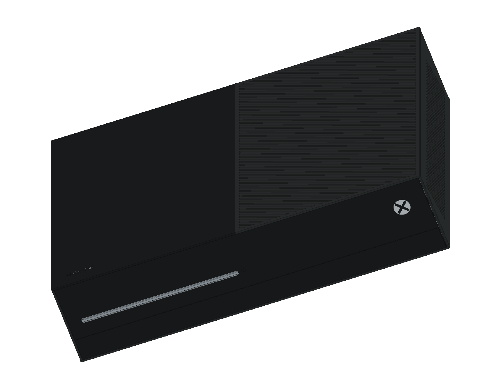
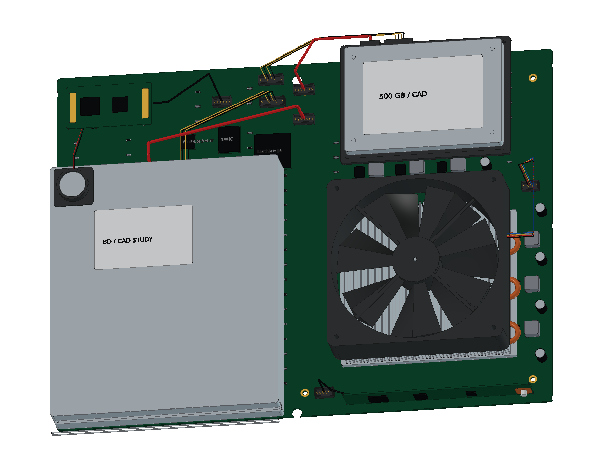
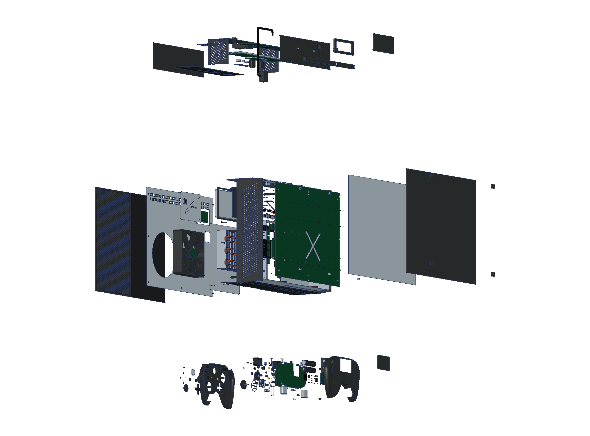
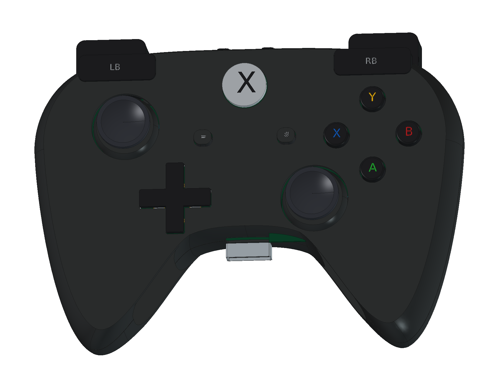
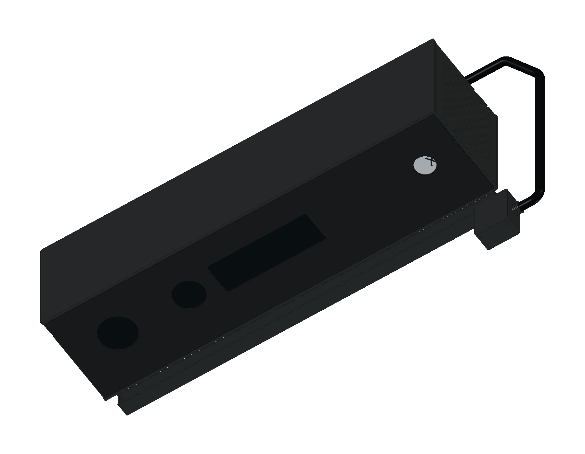

# Microsoft Xbox One · Model 1540

2013 年原版黑色 500 GB 主机结构学习模型包含 **28 轮源码、1,791 个组件条目与 1,870 个实体**：分区顶盖、对角通风格栅、原生底壳、主板、三热管散热器、112 mm 风扇、Blu-ray 光驱、硬盘和内部线束；另含原版 Model 1537 双板手柄、Kinect 2、外置电源、单耳聊天耳机与陈列线缆。提供完整及爆炸原生工程、三份 STEP、12 页 A3 PDF / SVG / 原生图纸和 24 个网页视图。

<table>
<tr>
<td align="center" width="33%"> 原版主机、手柄与 Kinect</td>
<td align="center" width="33%"> 分区顶盖与吸入式光驱</td>
<td align="center" width="33%"> 主板、冷却与存储</td>
</tr>
<tr>
<td align="center" width="33%"> 分层爆炸装配</td>
<td align="center" width="33%"> 原版 Model 1537 手柄</td>
<td align="center" width="33%"> Kinect 2 与手动俯仰支架</td>
</tr>
</table>

- [在线 3D 预览](https://tiansongyu.github.io/open-console-cad/?device=xboxone&view=assembled#viewer)
- [完整 FreeCAD 工程](output/XboxOne_Complete.FCStd) · [爆炸工程](output/XboxOne_Exploded.FCStd) · [打开宏](Open_XboxOne.FCMacro)
- [全套 STEP](output/XboxOne_FullKit.step) · [主机、手柄及 Kinect STEP](output/XboxOne_Console.step) · [爆炸 STEP](output/XboxOne_Exploded.step)
- [12 页 A3 PDF](output/drawings/XboxOne_Drawings.pdf) · [HTML 图册](output/drawings/XboxOne_Drawings.html) · [SVG 目录](output/drawings/) · [原生图纸](output/XboxOne_Drawings.FCStd)
- [组件清单](output/COMPONENTS.csv) · [模型清单](output/reports/final_manifest.json)
- [完整重建宏](Rebuild_XboxOne.FCMacro) · [逐轮记录](ITERATIONS.md) · [建模源码](../../tools/cadlib/xboxone.py)
- [源码重建比对](output/reports/rebuild_verification.json) · [严格实体检查](output/reports/strict_saved_native.json) · [装配求交](output/reports/assembly_interference.json)
- [STEP 回读](output/reports/export_roundtrip_audit.json) · [参数编辑复原](output/reports/parameter_edit_test.json) · [资料与边界](references/SOURCES.md)

使用 FreeCAD 1.1.3 打开工程。壳体草图、拉伸、控制器曲面放样和布尔历史保留修改入口；重建宏从空文档执行全部轮次，并写入 `output/rebuilt/`。`Parameters.Width` 驱动主机底壳的原生宽度约束，其他局部几何并非一键缩放的制造设计。

Microsoft 官方原版主机包络为 **343 × 263 × 80 mm**。内部布局以原版 Model 1540 拆解为依据，保留独立外置电源、DDR3 / eSRAM 架构示意、Blu-ray 与 2.5 英寸硬盘。手柄依据 Microsoft C3K1537 原版内部照片，保留双板、四枚电机、micro-USB、专用耳机扩展口和双 AA；Kinect 为手动俯仰支架、双传感器板、三分区 IR 与四麦克风结构。

外置电源内部依据早期实机拆解，包含离心风扇、屏蔽、变压器与独立元件包络；聊天耳机含音量与静音按键转接头。线缆按陈列路线缩短，地区 AC 插头作为单一学习版本。普通黑色外观不复制 Day One 铭文或特殊十字键。

附件包络、曲率、壁厚、行程、孔位、触点、弹簧、元件与走线均为非功能性近似；模型不提供制造公差、工作电路、光学标定或电气引脚定义。官方外包络、原版结构依据与学习近似在图册及资料页中分别说明。

全部 1,791 个组件重建比对、严格实体、1,818 对装配候选求交、参数复原、三份 STEP 回读和图册/网页检查通过，详细范围见各项报告。
